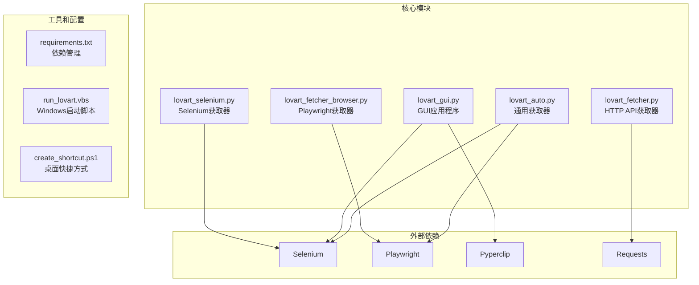
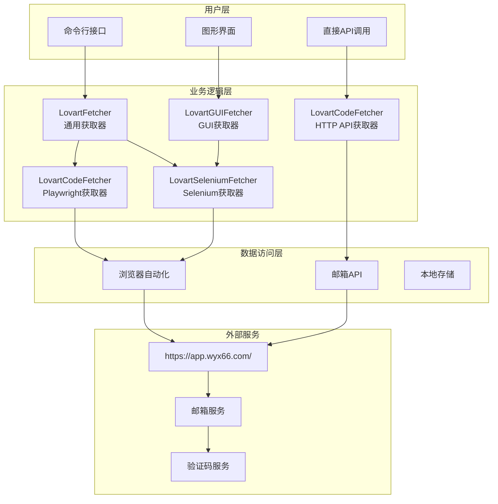
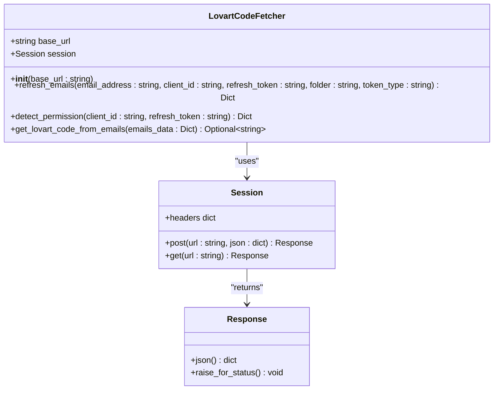
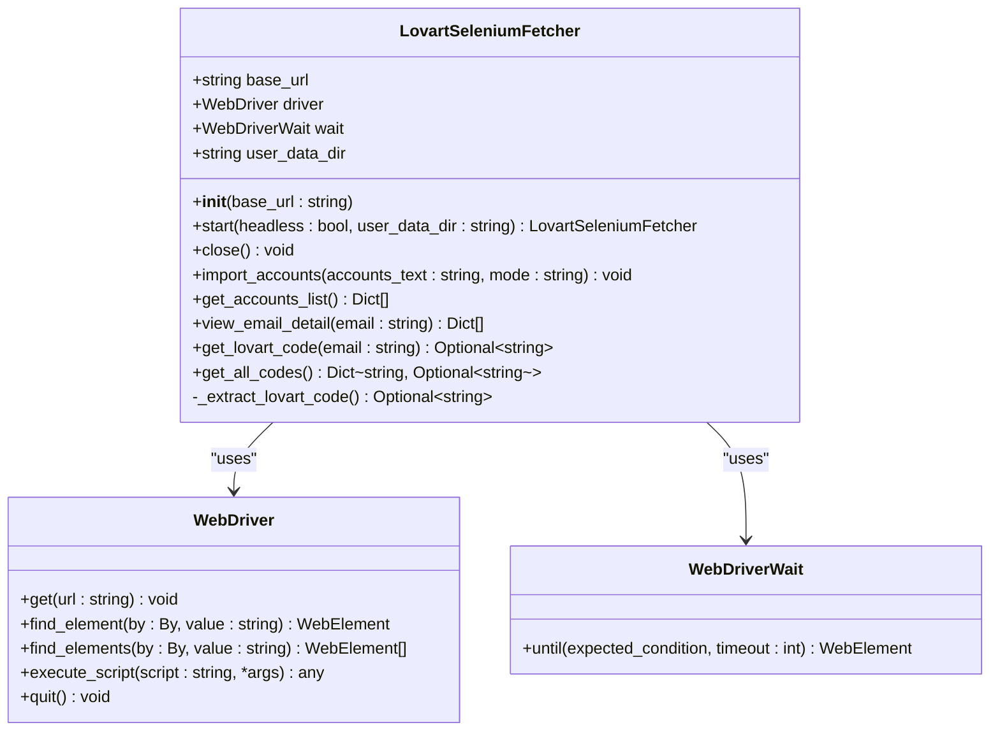
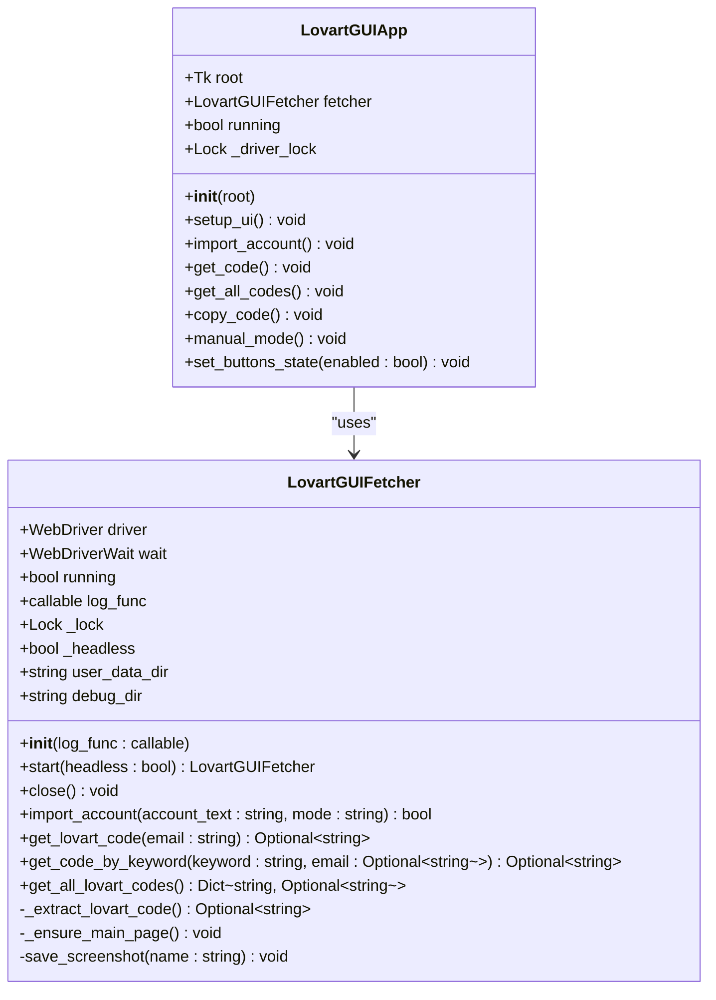
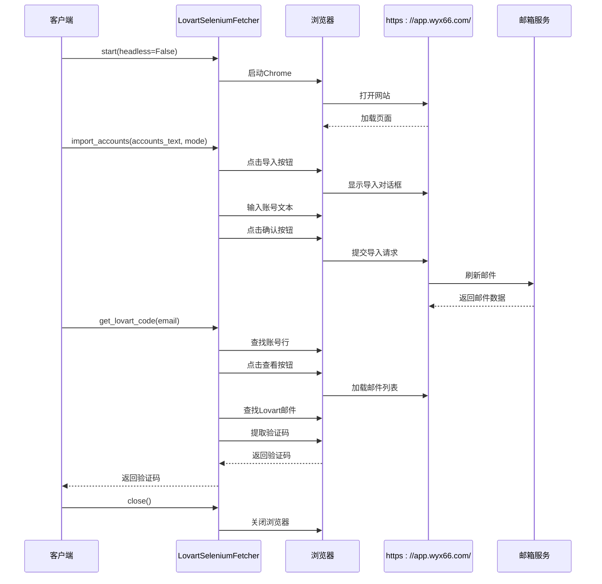
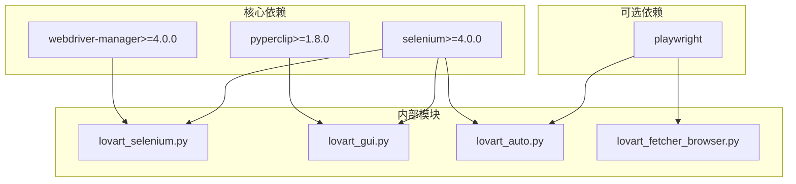
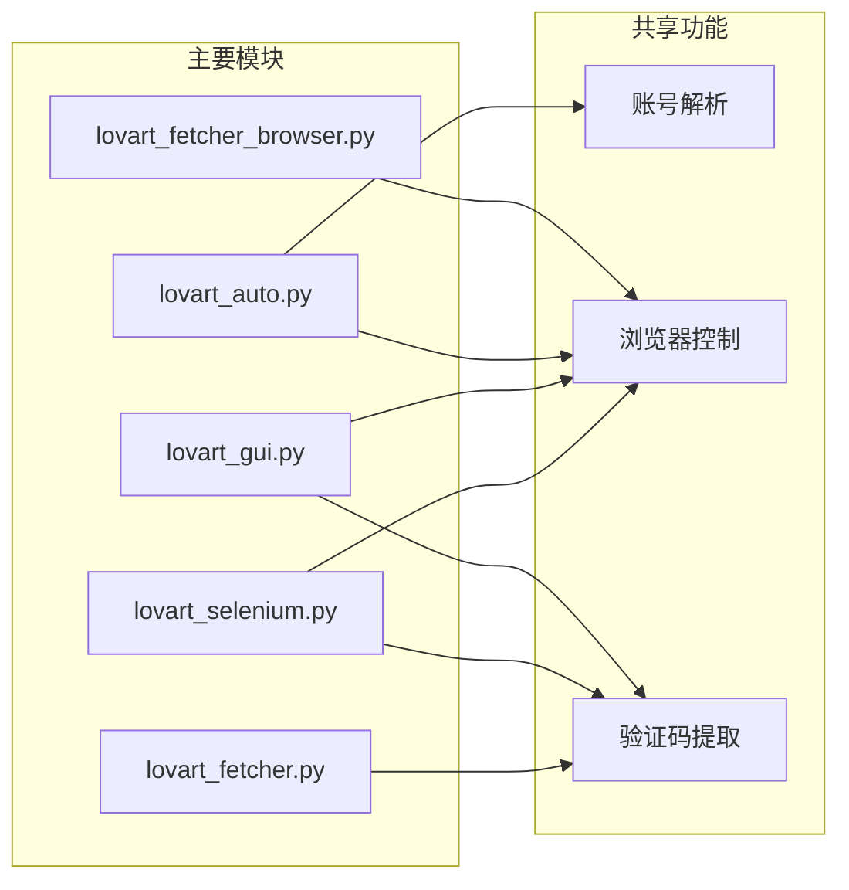

# API参考文档

<cite>
**本文档引用的文件**
- [lovart_fetcher.py](file://lovart_fetcher.py)
- [lovart_fetcher_browser.py](file://lovart_fetcher_browser.py)
- [lovart_selenium.py](file://lovart_selenium.py)
- [lovart_gui.py](file://lovart_gui.py)
- [lovart_auto.py](file://lovart_auto.py)
- [requirements.txt](file://requirements.txt)
- [run_lovart.vbs](file://run_lovart.vbs)
- [create_shortcut.ps1](file://create_shortcut.ps1)
</cite>

## 目录
1. [简介](#简介)
2. [项目结构](#项目结构)
3. [核心组件](#核心组件)
4. [架构概览](#架构概览)
5. [详细组件分析](#详细组件分析)
6. [依赖关系分析](#依赖关系分析)
7. [性能考虑](#性能考虑)
8. [故障排除指南](#故障排除指南)
9. [结论](#结论)

## 简介

这是一个用于自动获取Lovart验证码的Python自动化工具集，支持多种获取方式和用户界面。该项目提供了三种主要的验证码获取方式：

- **HTTP API方式**：通过REST API直接获取验证码
- **Selenium自动化**：使用Selenium WebDriver进行浏览器自动化
- **Playwright自动化**：使用Playwright进行现代化浏览器自动化
- **图形界面**：提供完整的GUI应用程序

该工具主要用于从邮箱服务中自动获取Lovart平台的验证码，支持批量处理多个邮箱账号。

## 项目结构

**图表来源**
- [lovart_fetcher.py:1-147](file://lovart_fetcher.py#L1-L147)
- [lovart_selenium.py:1-492](file://lovart_selenium.py#L1-L492)
- [lovart_fetcher_browser.py:1-285](file://lovart_fetcher_browser.py#L1-L285)
- [lovart_gui.py:1-1275](file://lovart_gui.py#L1-L1275)
- [lovart_auto.py:1-442](file://lovart_auto.py#L1-L442)

**章节来源**
- [lovart_fetcher.py:1-147](file://lovart_fetcher.py#L1-L147)
- [lovart_selenium.py:1-492](file://lovart_selenium.py#L1-L492)
- [lovart_fetcher_browser.py:1-285](file://lovart_fetcher_browser.py#L1-L285)
- [lovart_gui.py:1-1275](file://lovart_gui.py#L1-L1275)
- [lovart_auto.py:1-442](file://lovart_auto.py#L1-L442)

## 核心组件

### HTTP API获取器 (LovartCodeFetcher)

这是最简单的验证码获取方式，通过直接调用API端点来获取验证码。

**主要特性：**
- 直接HTTP请求
- JSON数据交换
- 内置错误处理
- 支持多种邮箱服务

**关键方法：**
- `refresh_emails()`: 刷新邮箱邮件
- `detect_permission()`: 检测账号权限
- `get_lovart_code_from_emails()`: 从邮件数据提取验证码

**章节来源**
- [lovart_fetcher.py:12-103](file://lovart_fetcher.py#L12-L103)

### Selenium获取器 (LovartSeleniumFetcher)

基于Selenium WebDriver的自动化获取器，提供完整的浏览器自动化功能。

**主要特性：**
- 完整的浏览器自动化
- 支持无头模式
- 持久化浏览器会话
- 错误恢复机制
- 截图调试功能

**关键方法：**
- `start()`: 启动浏览器
- `import_accounts()`: 导入账号
- `get_lovart_code()`: 获取验证码
- `get_all_codes()`: 获取所有验证码

**章节来源**
- [lovart_selenium.py:47-376](file://lovart_selenium.py#L47-L376)

### Playwright获取器 (LovartCodeFetcher)

使用Playwright进行现代化浏览器自动化，相比Selenium具有更好的性能和稳定性。

**主要特性：**
- 现代化浏览器自动化
- 更好的性能表现
- 自动化安装支持
- 灵活的选择器支持

**关键方法：**
- `start_browser()`: 启动浏览器
- `import_accounts()`: 导入账号
- `get_all_lovart_codes()`: 获取所有验证码

**章节来源**
- [lovart_fetcher_browser.py:25-231](file://lovart_fetcher_browser.py#L25-L231)

### GUI获取器 (LovartGUIFetcher)

提供完整的图形用户界面，支持可视化操作和调试。

**主要特性：**
- 完整的GUI界面
- 多种查询方式
- 实时日志显示
- 截图调试功能
- 线程安全设计

**关键方法：**
- `start()`: 启动浏览器
- `import_account()`: 导入单个账号
- `get_lovart_code()`: 获取验证码
- `get_code_by_keyword()`: 关键字查询
- `get_all_lovart_codes()`: 批量获取

**章节来源**
- [lovart_gui.py:74-795](file://lovart_gui.py#L74-L795)

### 通用获取器 (LovartFetcher)

提供统一的接口，支持Selenium和Playwright两种后端。

**主要特性：**
- 统一的API接口
- 双后端支持
- 自动选择最佳方案
- 简化的使用方式

**关键方法：**
- `start_with_playwright()`: 使用Playwright启动
- `start_with_selenium()`: 使用Selenium启动
- `import_accounts_text()`: 文本导入账号
- `get_all_lovart_codes()`: 获取所有验证码

**章节来源**
- [lovart_auto.py:45-311](file://lovart_auto.py#L45-L311)

## 架构概览

**图表来源**
- [lovart_fetcher.py:12-103](file://lovart_fetcher.py#L12-L103)
- [lovart_selenium.py:47-376](file://lovart_selenium.py#L47-L376)
- [lovart_fetcher_browser.py:25-231](file://lovart_fetcher_browser.py#L25-L231)
- [lovart_gui.py:74-795](file://lovart_gui.py#L74-L795)
- [lovart_auto.py:45-311](file://lovart_auto.py#L45-L311)

## 详细组件分析

### HTTP API获取器详细分析

#### 类结构图

**图表来源**
- [lovart_fetcher.py:12-103](file://lovart_fetcher.py#L12-L103)

#### 方法详细说明

**构造函数**
- **参数**: `base_url` (可选，默认为"https://app.wyx66.com")
- **功能**: 初始化HTTP会话和请求头
- **返回值**: 无
- **异常**: 无

**refresh_emails方法**
- **参数**:
  - `email_address`: 邮箱地址
  - `client_id`: 客户端ID
  - `refresh_token`: 刷新令牌
  - `folder`: 邮件文件夹 (默认: "inbox")
  - `token_type`: 令牌类型 (默认: "imap")
- **返回值**: API响应字典
- **异常**: 请求异常时返回包含错误信息的字典
- **使用示例**: [lovart_fetcher.py:130-134](file://lovart_fetcher.py#L130-L134)

**detect_permission方法**
- **参数**:
  - `client_id`: 客户端ID
  - `refresh_token`: 刷新令牌
- **返回值**: 权限检测结果字典
- **异常**: 请求异常时返回包含错误信息的字典

**get_lovart_code_from_emails方法**
- **参数**: `emails_data`: 邮件数据字典
- **返回值**: 验证码字符串或None
- **功能**: 从邮件数据中提取Lovart验证码
- **算法**: 查找来自lovart@lovart.ai的邮件，提取6位数字验证码

**章节来源**
- [lovart_fetcher.py:12-103](file://lovart_fetcher.py#L12-L103)

### Selenium获取器详细分析

#### 类结构图

**图表来源**
- [lovart_selenium.py:47-376](file://lovart_selenium.py#L47-L376)

#### 方法详细说明

**构造函数**
- **参数**: `base_url` (可选，默认为"https://app.wyx66.com")
- **功能**: 初始化获取器和Chrome配置目录
- **返回值**: 无

**start方法**
- **参数**:
  - `headless`: 是否使用无头模式 (默认: False)
  - `user_data_dir`: 用户数据目录 (默认: None)
- **返回值**: 获取器实例
- **功能**: 启动Chrome浏览器，配置各种选项以避免反爬虫检测
- **异常**: Selenium未安装时抛出异常

**import_accounts方法**
- **参数**:
  - `accounts_text`: 账号文本，每行一个账号
  - `mode`: 导入模式 ("append"或"overwrite")
- **返回值**: 无
- **功能**: 导入账号到系统
- **异常**: 无法找到导入按钮时抛出异常

**get_lovart_code方法**
- **参数**: `email`: 邮箱地址
- **返回值**: 验证码字符串或None
- **功能**: 获取指定邮箱的Lovart验证码
- **算法**: 查找账号行，点击查看按钮，提取邮件中的6位数字验证码

**get_all_codes方法**
- **参数**: 无
- **返回值**: 字典，键为邮箱地址，值为验证码
- **功能**: 获取所有账号的验证码
- **算法**: 遍历所有账号，逐个获取验证码

**章节来源**
- [lovart_selenium.py:47-376](file://lovart_selenium.py#L47-L376)

### GUI获取器详细分析

#### 类结构图

**图表来源**
- [lovart_gui.py:74-795](file://lovart_gui.py#L74-L795)
- [lovart_gui.py:798-1275](file://lovart_gui.py#L798-L1275)

#### 方法详细说明

**构造函数**
- **参数**: `log_func` (可选，默认为None)
- **功能**: 初始化GUI获取器，设置日志函数和锁机制
- **返回值**: 无

**start方法**
- **参数**: `headless`: 是否使用无头模式
- **返回值**: 获取器实例
- **功能**: 启动浏览器，配置各种稳定性参数
- **异常**: 依赖缺失时抛出异常

**import_account方法**
- **参数**:
  - `account_text`: 账号文本，格式: email----password----client_id----refresh_token
  - `mode`: 导入模式 ("append"或"overwrite")
- **返回值**: 布尔值，表示导入是否成功
- **功能**: 导入单个账号
- **异常**: 导入失败时返回False

**get_code_by_keyword方法**
- **参数**:
  - `keyword`: 要查找的关键字 (如 'lovart', 'Trae')
  - `email`: 可选，指定只在某个邮箱账号中查找
- **返回值**: 验证码字符串或None
- **功能**: 根据关键字查找最新的验证码
- **算法**: 使用搜索框按关键字找到最新邮件并提取验证码

**章节来源**
- [lovart_gui.py:74-795](file://lovart_gui.py#L74-L795)

### API调用序列图

#### 验证码获取流程

**图表来源**
- [lovart_selenium.py:59-113](file://lovart_selenium.py#L59-L113)
- [lovart_selenium.py:132-192](file://lovart_selenium.py#L132-L192)
- [lovart_selenium.py:268-292](file://lovart_selenium.py#L268-L292)

## 依赖关系分析

### 外部依赖

**图表来源**
- [requirements.txt:1-3](file://requirements.txt#L1-L3)
- [lovart_selenium.py:31-44](file://lovart_selenium.py#L31-L44)
- [lovart_gui.py:43-72](file://lovart_gui.py#L43-L72)
- [lovart_auto.py:25-43](file://lovart_auto.py#L25-L43)

### 内部模块依赖

**图表来源**
- [lovart_selenium.py:379-403](file://lovart_selenium.py#L379-L403)
- [lovart_auto.py:313-345](file://lovart_auto.py#L313-L345)

**章节来源**
- [requirements.txt:1-3](file://requirements.txt#L1-L3)
- [lovart_selenium.py:31-44](file://lovart_selenium.py#L31-L44)
- [lovart_gui.py:43-72](file://lovart_gui.py#L43-L72)
- [lovart_auto.py:25-43](file://lovart_auto.py#L25-L43)

## 性能考虑

### 性能特征

1. **HTTP API方式**：
   - 响应时间：毫秒级
   - 资源消耗：低
   - 适用场景：大量数据处理

2. **Selenium方式**：
   - 启动时间：5-10秒
   - 内存消耗：中等
   - 适用场景：复杂交互

3. **Playwright方式**：
   - 启动时间：3-7秒
   - 内存消耗：较低
   - 适用场景：高性能需求

4. **GUI方式**：
   - 启动时间：10-15秒
   - 内存消耗：较高
   - 适用场景：可视化操作

### 使用限制

1. **网络限制**：
   - API调用频率限制
   - 网络连接稳定性要求

2. **浏览器限制**：
   - Chrome版本兼容性
   - 系统资源限制
   - 反爬虫检测

3. **数据限制**：
   - 邮件刷新延迟
   - 验证码有效期
   - 账号数量限制

## 故障排除指南

### 常见问题及解决方案

**浏览器启动失败**
- 检查Chrome是否正确安装
- 确认ChromeDriver版本兼容性
- 关闭所有已打开的Chrome实例

**验证码提取失败**
- 确保邮件已刷新完成
- 检查邮箱服务连接
- 验证码可能在垃圾邮件中

**导入失败**
- 检查账号格式是否正确
- 确认网络连接稳定
- 尝试重新导入

**章节来源**
- [lovart_gui.py:100-125](file://lovart_gui.py#L100-L125)
- [lovart_selenium.py:102-104](file://lovart_selenium.py#L102-L104)
- [lovart_auto.py:396-404](file://lovart_auto.py#L396-L404)

## 结论

这个Lovart验证码获取工具集提供了多种获取方式，满足不同用户的需求：

1. **简单需求**：使用HTTP API方式快速获取
2. **自动化需求**：使用Selenium或Playwright进行自动化
3. **可视化需求**：使用GUI应用程序进行交互式操作
4. **通用需求**：使用通用获取器获得统一接口

每个组件都有完善的错误处理机制和日志记录功能，确保在各种环境下都能稳定运行。建议根据具体需求选择合适的获取方式，并注意相应的性能和使用限制。