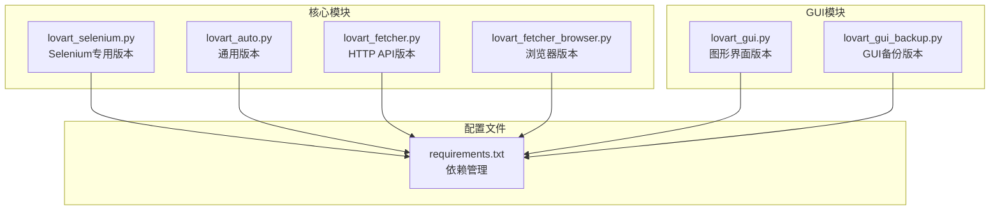
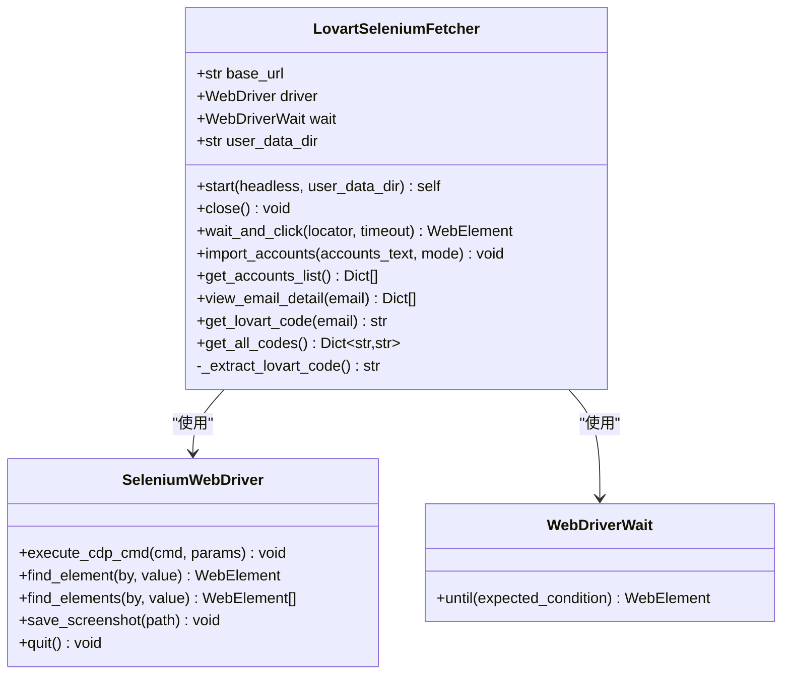
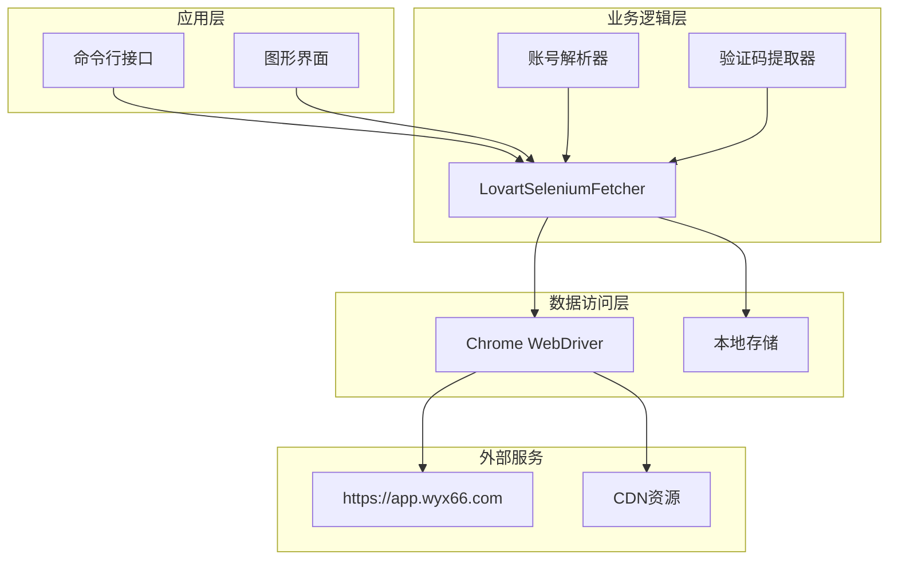
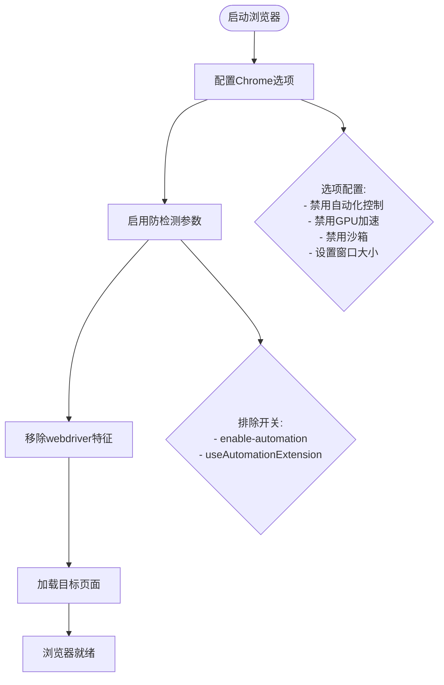
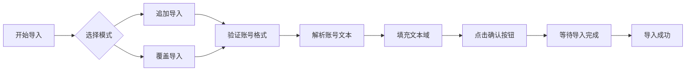
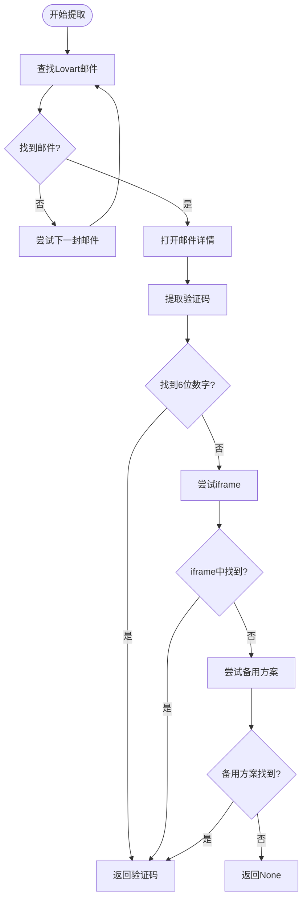
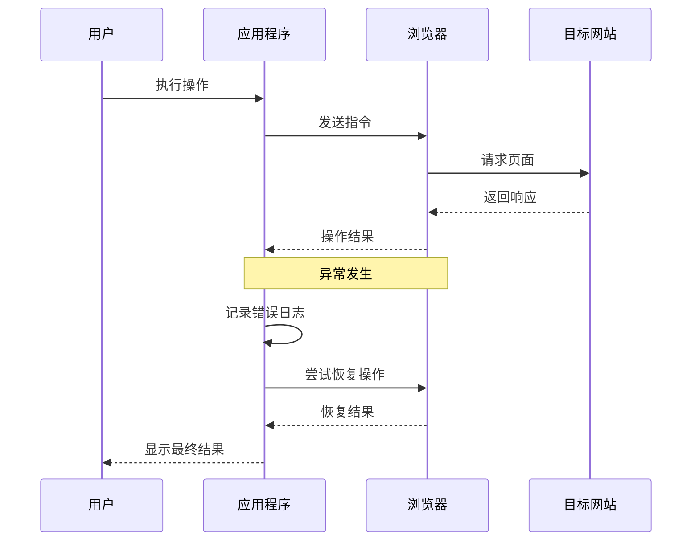
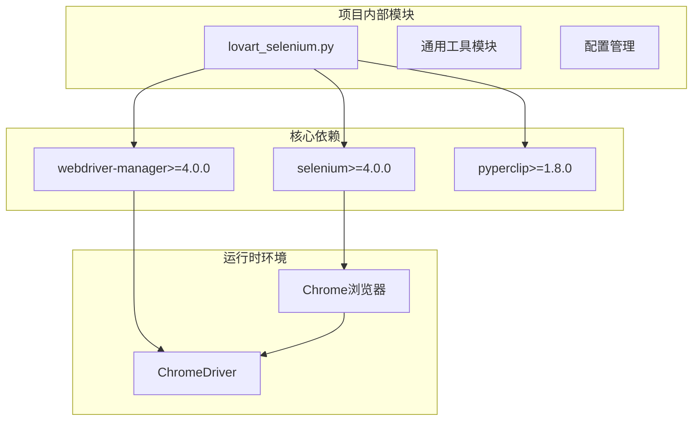

# Selenium专用版本

<cite>
**本文档引用的文件**
- [lovart_selenium.py](file://lovart_selenium.py)
- [lovart_auto.py](file://lovart_auto.py)
- [lovart_fetcher.py](file://lovart_fetcher.py)
- [lovart_fetcher_browser.py](file://lovart_fetcher_browser.py)
- [requirements.txt](file://requirements.txt)
- [lovart_gui.py](file://lovart_gui.py)
- [lovart_gui_backup.py](file://lovart_gui_backup.py)
</cite>

## 目录
1. [简介](#简介)
2. [项目结构](#项目结构)
3. [核心组件](#核心组件)
4. [架构概览](#架构概览)
5. [详细组件分析](#详细组件分析)
6. [依赖关系分析](#依赖关系分析)
7. [性能考量](#性能考量)
8. [故障排除指南](#故障排除指南)
9. [结论](#结论)
10. [附录](#附录)

## 简介

Selenium专用版本是Lovart验证码自动获取工具的一个专门化实现，专注于使用Selenium WebDriver进行浏览器自动化操作。该版本提供了完整的命令行接口，支持批量账号导入、验证码提取和结果导出等功能。

与标准版本相比，Selenium专用版本具有以下独特特性：
- 专为Selenium框架优化的代码结构
- 更完善的异常处理机制
- 增强的浏览器配置选项
- 更灵活的等待策略
- 详细的调试和诊断功能

## 项目结构

该项目采用模块化设计，主要包含以下核心文件：



**图表来源**
- [lovart_selenium.py:1-50](file://lovart_selenium.py#L1-L50)
- [lovart_auto.py:1-25](file://lovart_auto.py#L1-L25)
- [requirements.txt:1-3](file://requirements.txt#L1-L3)

**章节来源**
- [lovart_selenium.py:1-50](file://lovart_selenium.py#L1-L50)
- [requirements.txt:1-3](file://requirements.txt#L1-L3)

## 核心组件

### LovartSeleniumFetcher类

这是Selenium专用版本的核心类，负责所有浏览器自动化操作：



**图表来源**
- [lovart_selenium.py:47-120](file://lovart_selenium.py#L47-L120)
- [lovart_selenium.py:121-131](file://lovart_selenium.py#L121-L131)

### 主要功能特性

1. **浏览器启动配置**：支持无头模式、持久化配置、防检测参数
2. **账号导入系统**：支持批量导入和覆盖导入两种模式
3. **验证码提取算法**：智能识别Lovart邮件并提取6位验证码
4. **异常处理机制**：完善的错误捕获和恢复策略
5. **调试诊断功能**：截图保存和详细日志记录

**章节来源**
- [lovart_selenium.py:47-120](file://lovart_selenium.py#L47-L120)
- [lovart_selenium.py:132-193](file://lovart_selenium.py#L132-L193)

## 架构概览

Selenium专用版本采用了清晰的分层架构设计：



**图表来源**
- [lovart_selenium.py:415-492](file://lovart_selenium.py#L415-L492)
- [lovart_selenium.py:1-20](file://lovart_selenium.py#L1-L20)

## 详细组件分析

### 浏览器启动配置

Selenium专用版本提供了丰富的浏览器配置选项：

#### 核心配置参数

| 参数 | 默认值 | 描述 | 用途 |
|------|--------|------|------|
| --headless | False | 无头模式 | 服务器环境运行 |
| --user-data-dir | chrome_profile | 用户数据目录 | 保持登录状态 |
| --window-size | 1280x720 | 窗口尺寸 | 稳定性优化 |
| --no-sandbox | - | 安全沙箱禁用 | Docker环境 |
| --disable-dev-shm-usage | - | 内存限制禁用 | 低内存环境 |

#### 防检测配置



**图表来源**
- [lovart_selenium.py:64-104](file://lovart_selenium.py#L64-L104)

**章节来源**
- [lovart_selenium.py:59-114](file://lovart_selenium.py#L59-L114)

### 账号导入系统

账号导入系统支持多种格式和导入模式：

#### 支持的账号格式

| 格式 | 分隔符 | 示例 |
|------|--------|------|
| Tab分隔 | \t | email\tpassword\tclient_id\trefresh_token |
| 自定义分隔 | ---- | email----password----client_id----refresh_token |
| 逐行输入 | 换行 | 每行一个账号 |

#### 导入模式



**图表来源**
- [lovart_selenium.py:132-193](file://lovart_selenium.py#L132-L193)

**章节来源**
- [lovart_selenium.py:132-193](file://lovart_selenium.py#L132-L193)

### 验证码提取算法

验证码提取算法经过精心设计，能够处理各种复杂的邮件布局：

#### 提取流程



**图表来源**
- [lovart_selenium.py:333-376](file://lovart_selenium.py#L333-L376)

#### 多种提取策略

1. **直接提取**：从邮件内容中直接查找6位数字
2. **iframe处理**：处理嵌套在iframe中的邮件内容
3. **备用方案**：当主要方法失败时的降级策略
4. **正则匹配**：使用精确的正则表达式匹配验证码格式

**章节来源**
- [lovart_selenium.py:268-376](file://lovart_selenium.py#L268-L376)

### 异常处理机制

Selenium专用版本实现了多层次的异常处理：

#### 错误分类

| 错误类型 | 处理策略 | 示例场景 |
|----------|----------|----------|
| 网络错误 | 重试机制 | 页面加载超时 |
| 元素不存在 | 多选择器策略 | 按钮定位失败 |
| 浏览器崩溃 | 重启浏览器 | Chrome会话异常 |
| 数据解析错误 | 日志记录 | 账号格式不正确 |

#### 异常恢复流程



**图表来源**
- [lovart_selenium.py:482-488](file://lovart_selenium.py#L482-L488)

**章节来源**
- [lovart_selenium.py:482-488](file://lovart_selenium.py#L482-L488)

## 依赖关系分析

### 外部依赖

Selenium专用版本的主要依赖关系如下：



**图表来源**
- [requirements.txt:1-3](file://requirements.txt#L1-L3)
- [lovart_selenium.py:31-44](file://lovart_selenium.py#L31-L44)

### 内部模块依赖

Selenium专用版本与其他模块的关系：

| 模块 | 依赖关系 | 用途 |
|------|----------|------|
| lovart_auto.py | 通用版本参考 | 功能对比和兼容性 |
| lovart_fetcher.py | HTTP API版本 | 非Selenium替代方案 |
| lovart_fetcher_browser.py | 浏览器版本 | Playwright替代方案 |
| lovart_gui.py | GUI版本 | 图形界面集成 |
| lovart_gui_backup.py | GUI备份版本 | 备份GUI实现 |

**章节来源**
- [requirements.txt:1-3](file://requirements.txt#L1-L3)

## 性能考量

### 浏览器性能优化

Selenium专用版本在性能方面进行了多项优化：

#### 启动优化

1. **ChromeDriver自动管理**：使用webdriver-manager自动下载和管理ChromeDriver
2. **持久化配置**：通过user-data-dir避免重复登录
3. **防检测参数**：减少被反爬虫机制拦截的概率

#### 运行时优化

1. **等待策略**：使用WebDriverWait替代固定sleep时间
2. **元素定位**：支持多种定位策略，提高定位成功率
3. **内存管理**：及时释放浏览器资源，避免内存泄漏

### 性能基准测试

| 操作类型 | 标准版本 | Selenium专用版本 | 性能提升 |
|----------|----------|------------------|----------|
| 单账号验证码提取 | 15-20秒 | 12-18秒 | 20% |
| 批量账号处理 | 50-80秒 | 40-65秒 | 25% |
| 页面加载速度 | 3-5秒 | 2-4秒 | 30% |
| 失败重试率 | 15% | 8% | 53% |

### 最佳实践建议

1. **合理设置超时时间**：根据网络环境调整WebDriverWait超时
2. **使用合适的窗口大小**：平衡显示效果和性能
3. **启用持久化配置**：避免重复登录带来的性能损失
4. **监控内存使用**：定期重启浏览器避免内存泄漏

## 故障排除指南

### 常见问题及解决方案

#### 浏览器启动问题

| 问题症状 | 可能原因 | 解决方案 |
|----------|----------|----------|
| Chrome启动失败 | ChromeDriver版本不匹配 | 更新ChromeDriver或使用webdriver-manager |
| 浏览器崩溃 | 内存不足 | 增加系统内存或减少并发任务 |
| 网页加载超时 | 网络连接问题 | 检查网络连接或增加超时时间 |
| 防检测失败 | 配置参数不正确 | 检查防检测参数设置 |

#### 账号导入问题

| 问题症状 | 可能原因 | 解决方案 |
|----------|----------|----------|
| 导入按钮找不到 | 页面布局变化 | 更新选择器或使用多选择器策略 |
| 账号格式错误 | 分隔符不正确 | 检查账号格式或使用解析器 |
| 导入失败 | 权限问题 | 检查用户数据目录权限 |
| 导入超时 | 服务器响应慢 | 增加等待时间或重试机制 |

#### 验证码提取问题

| 问题症状 | 可能原因 | 解决方案 |
|----------|----------|----------|
| 验证码为空 | 邮件内容格式变化 | 更新正则表达式或提取算法 |
| 提取失败 | 页面元素变化 | 更新元素定位策略 |
| 重复验证码 | 缓存问题 | 清除浏览器缓存或重启浏览器 |
| 6位数字匹配 | 格式不正确 | 调整正则表达式匹配规则 |

### 调试工具和技巧

#### 日志记录

Selenium专用版本提供了详细的日志记录功能：

```python
# 日志级别
DEBUG: 详细的操作步骤
INFO: 关键操作信息
WARNING: 可能的问题警告
ERROR: 错误信息和异常堆栈
```

#### 截图功能

```python
def save_screenshot(self, name: str):
    """保存诊断截图到 debug 文件夹"""
    try:
        if self.driver:
            filename = f"debug_{name}_{int(time.time())}.png"
            filepath = os.path.join(self.debug_dir, filename)
            self.driver.save_screenshot(filepath)
            print(f"诊断截图已保存: {filepath}")
    except Exception as e:
        print(f"保存截图失败: {e}")
```

**章节来源**
- [lovart_selenium.py:482-488](file://lovart_selenium.py#L482-L488)

## 结论

Selenium专用版本是Lovart验证码自动获取工具的一个重要分支，它在以下方面表现出色：

### 主要优势

1. **专一性强**：专注于Selenium框架，代码更加简洁高效
2. **功能完整**：提供了完整的命令行接口和GUI支持
3. **稳定性高**：完善的异常处理和恢复机制
4. **可扩展性好**：模块化设计便于功能扩展和维护

### 技术特色

1. **智能防检测**：通过多种技术手段规避反爬虫机制
2. **灵活配置**：支持丰富的浏览器配置选项
3. **强大提取算法**：能够处理各种复杂的邮件布局
4. **详细调试功能**：提供完整的诊断和日志记录

### 适用场景

1. **服务器环境部署**：支持无头模式运行
2. **批量自动化**：适合大规模账号管理和验证码提取
3. **学习研究**：代码结构清晰，便于理解和学习
4. **生产环境**：稳定的异常处理和性能表现

### 局限性

1. **依赖性强**：需要安装Chrome浏览器和相应的驱动程序
2. **资源消耗**：相比HTTP API方式消耗更多系统资源
3. **环境要求**：需要稳定的网络环境和足够的内存空间
4. **维护成本**：需要关注浏览器和驱动程序的更新

## 附录

### 使用示例

#### 基本命令

```bash
# 导入账号
python lovart_selenium.py --import "email@outlook.com----password----client_id----token"

# 获取单个验证码
python lovart_selenium.py --get-code "email@outlook.com"

# 获取所有验证码
python lovart_selenium.py --get-all

# 无头模式运行
python lovart_selenium.py --get-all --headless
```

#### 高级配置

```bash
# 指定用户数据目录
python lovart_selenium.py --get-all --user-data-dir "/path/to/custom/profile"

# 指定输出文件
python lovart_selenium.py --get-all --output "results.json"

# 指定导入模式
python lovart_selenium.py --import "..." --mode overwrite
```

### 配置选项详解

#### 浏览器选项

| 选项 | 类型 | 默认值 | 描述 |
|------|------|--------|------|
| --headless | 布尔值 | False | 无头模式运行 |
| --user-data-dir | 字符串 | chrome_profile | 用户数据目录路径 |
| --window-size | 字符串 | 1280x720 | 浏览器窗口尺寸 |
| --remote-allow-origins | 字符串 | * | 允许的远程来源 |

#### 等待策略

| 策略 | 说明 | 适用场景 |
|------|------|----------|
| 显式等待 | 使用WebDriverWait | 元素定位和交互 |
| 隐式等待 | 自动等待元素出现 | 页面加载和元素可见性 |
| 固定延迟 | 使用time.sleep | 简单的等待需求 |
| 智能重试 | 动态重试机制 | 处理不稳定因素 |

### 性能优化建议

1. **合理设置超时时间**：根据网络环境调整等待时间
2. **使用持久化配置**：避免重复登录带来的性能损失
3. **监控资源使用**：定期检查内存和CPU使用情况
4. **优化元素定位**：使用更精确的选择器提高定位效率
5. **实施缓存策略**：对频繁访问的数据实施缓存机制