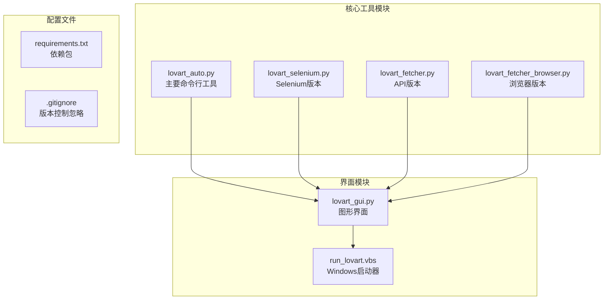
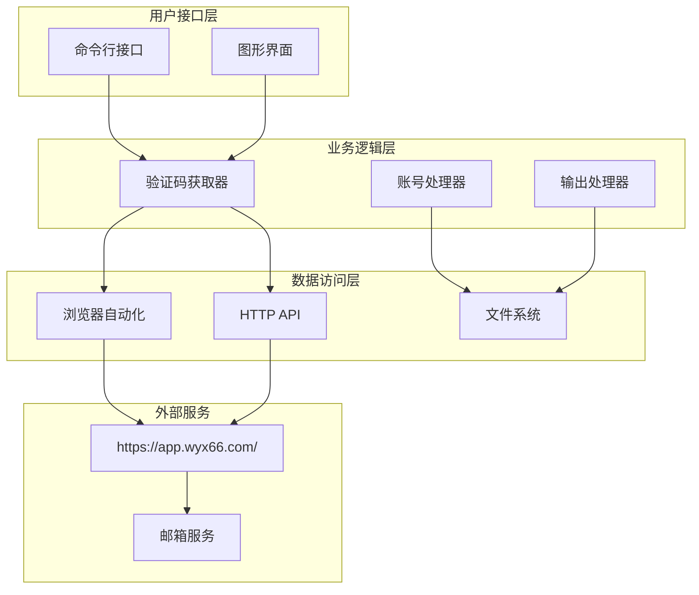
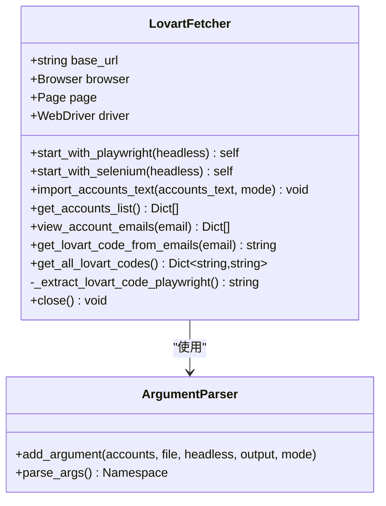
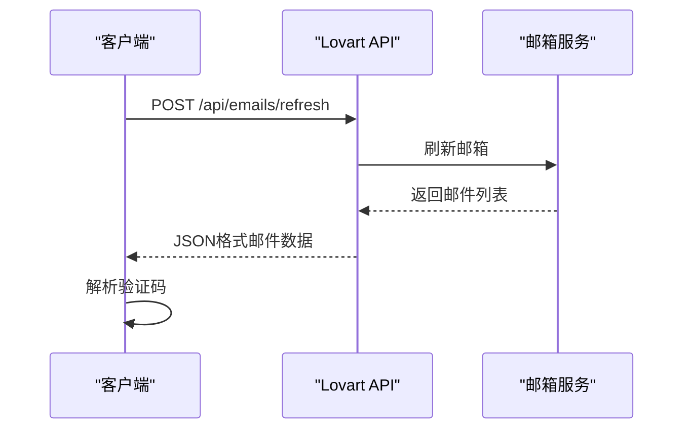
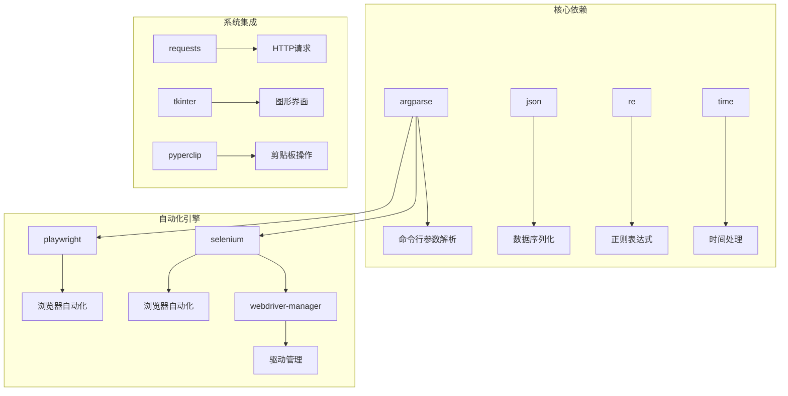
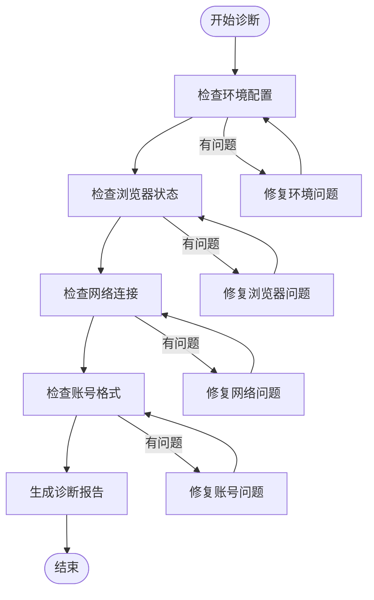

# 命令行工具使用文档

<cite>
**本文档引用的文件**
- [lovart_auto.py](file://lovart_auto.py)
- [lovart_selenium.py](file://lovart_selenium.py)
- [lovart_fetcher.py](file://lovart_fetcher.py)
- [lovart_fetcher_browser.py](file://lovart_fetcher_browser.py)
- [lovart_gui.py](file://lovart_gui.py)
- [requirements.txt](file://requirements.txt)
- [run_lovart.vbs](file://run_lovart.vbs)
</cite>

## 目录
1. [简介](#简介)
2. [项目结构](#项目结构)
3. [核心组件](#核心组件)
4. [架构概览](#架构概览)
5. [详细组件分析](#详细组件分析)
6. [依赖关系分析](#依赖关系分析)
7. [性能考虑](#性能考虑)
8. [故障排除指南](#故障排除指南)
9. [结论](#结论)

## 简介

Lovart验证码自动获取工具是一个功能强大的命令行工具，专门设计用于从https://app.wyx66.com/网站自动获取邮箱中的Lovart验证码。该工具提供了多种运行模式，包括基于Playwright的自动化浏览器模式和基于Selenium的浏览器自动化模式，支持批量处理多个账号，并提供灵活的命令行参数配置。

该工具的主要特点包括：
- 支持Playwright和Selenium两种自动化引擎
- 提供命令行和图形界面两种使用方式
- 支持批量账号导入和验证码提取
- 自动识别和提取6位数字验证码
- 完善的错误处理和故障排除机制

## 项目结构

该项目采用模块化设计，包含多个独立的工具文件，每个文件专注于特定的功能领域：



**图表来源**
- [lovart_auto.py:1-50](file://lovart_auto.py#L1-L50)
- [lovart_selenium.py:1-30](file://lovart_selenium.py#L1-L30)
- [lovart_gui.py:1-30](file://lovart_gui.py#L1-L30)

**章节来源**
- [lovart_auto.py:1-50](file://lovart_auto.py#L1-L50)
- [requirements.txt:1-3](file://requirements.txt#L1-L3)

## 核心组件

### 主要功能特性

该工具提供了以下核心功能：

1. **账号管理**：支持从命令行或文件导入账号信息
2. **验证码提取**：自动从邮箱中识别和提取Lovart验证码
3. **批量处理**：支持同时处理多个账号
4. **灵活输出**：支持JSON格式输出结果
5. **错误处理**：完善的异常处理和故障排除机制

### 支持的自动化引擎

工具支持两种不同的自动化引擎：

| 引擎类型 | 优点 | 适用场景 | 依赖要求 |
|---------|------|----------|----------|
| Playwright | 性能优异，稳定性好 | 生产环境，高并发场景 | `playwright` |
| Selenium | 兼容性强，社区支持广泛 | 学习研究，兼容性要求高 | `selenium`, `webdriver-manager` |

**章节来源**
- [lovart_auto.py:25-43](file://lovart_auto.py#L25-L43)
- [lovart_selenium.py:31-45](file://lovart_selenium.py#L31-L45)

## 架构概览

该工具采用分层架构设计，将不同功能模块分离，便于维护和扩展：



**图表来源**
- [lovart_auto.py:45-94](file://lovart_auto.py#L45-L94)
- [lovart_selenium.py:47-120](file://lovart_selenium.py#L47-L120)

## 详细组件分析

### 命令行工具 (lovart_auto.py)

这是主要的命令行工具，提供了完整的自动化功能：

#### 主要类结构



**图表来源**
- [lovart_auto.py:45-94](file://lovart_auto.py#L45-L94)
- [lovart_auto.py:357-438](file://lovart_auto.py#L357-L438)

#### 命令行参数详解

| 参数 | 短格式 | 类型 | 默认值 | 描述 |
|------|--------|------|--------|------|
| --accounts | -a | string | None | 直接提供账号文本，每行一个账号 |
| --file | -f | string | None | 指定账号文件路径 |
| --headless | 无 | flag | False | 无头模式运行浏览器 |
| --output | -o | string | None | 指定输出文件路径 |
| --mode | -m | choice | append | 导入模式：append或overwrite |

#### 账号数据格式

工具支持两种账号数据格式：

**格式1：Tab分隔**
```
email@domain.com	password	client_id	refresh_token
user@example.com	pass123	client123	token456
```

**格式2：自定义分隔符**
```
email@domain.com----password----client_id----refresh_token
user@example.com----pass123----client123----token456
```

每个账号必须包含以下四个字段：
1. **邮箱地址**：有效的邮箱格式
2. **密码**：邮箱密码
3. **Client ID**：OAuth客户端ID
4. **Refresh Token**：OAuth刷新令牌

**章节来源**
- [lovart_auto.py:357-438](file://lovart_auto.py#L357-L438)
- [lovart_auto.py:313-345](file://lovart_auto.py#L313-L345)

### Selenium版本 (lovart_selenium.py)

这个版本提供了更丰富的命令行功能：

#### 增强的命令行参数

| 参数 | 短格式 | 类型 | 描述 |
|------|--------|------|------|
| --import | 无 | string | 导入账号文本 |
| --file | -f | string | 从文件导入账号 |
| --get-code | 无 | string | 获取指定邮箱的验证码 |
| --get-all | 无 | flag | 获取所有账号的验证码 |
| --headless | 无 | flag | 无头模式运行 |
| --output | -o | string | 输出文件路径 |
| --mode | -m | choice | 导入模式 |

#### 单独功能模式

该版本支持以下独立功能模式：

1. **账号导入模式**：仅导入账号，不提取验证码
2. **验证码提取模式**：仅提取验证码，不导入账号
3. **批量处理模式**：同时进行导入和验证码提取

**章节来源**
- [lovart_selenium.py:415-492](file://lovart_selenium.py#L415-L492)
- [lovart_selenium.py:132-193](file://lovart_selenium.py#L132-L193)

### API版本 (lovart_fetcher.py)

这是一个基于HTTP API的版本，适合服务器端集成：

#### 主要API接口



**图表来源**
- [lovart_fetcher.py:21-52](file://lovart_fetcher.py#L21-L52)

**章节来源**
- [lovart_fetcher.py:12-104](file://lovart_fetcher.py#L12-L104)

## 依赖关系分析

### Python依赖关系



**图表来源**
- [requirements.txt:1-3](file://requirements.txt#L1-L3)
- [lovart_auto.py:17-24](file://lovart_auto.py#L17-L24)

### 外部服务依赖

工具需要访问以下外部服务：

1. **目标网站**：https://app.wyx66.com/
2. **邮箱服务**：支持IMAP协议的邮箱服务
3. **OAuth服务**：用于邮箱认证的OAuth服务

**章节来源**
- [requirements.txt:1-3](file://requirements.txt#L1-L3)
- [lovart_fetcher.py:13-20](file://lovart_fetcher.py#L13-L20)

## 性能考虑

### 并发处理策略

工具支持以下并发处理方式：

1. **串行处理**：逐个处理每个账号，最稳定但速度较慢
2. **并行处理**：同时处理多个账号，速度更快但资源消耗更大
3. **批处理模式**：将多个账号分批处理，平衡性能和稳定性

### 内存和CPU优化

| 优化策略 | 实现方式 | 效果 |
|----------|----------|------|
| 浏览器复用 | 复用同一个浏览器实例 | 减少启动开销 |
| 连接池 | 复用HTTP连接 | 提高网络效率 |
| 缓存机制 | 缓存已处理的验证码 | 避免重复处理 |
| 异步处理 | 异步处理非阻塞操作 | 提升整体性能 |

### 资源管理

工具实现了完善的资源管理机制：

1. **自动清理**：程序退出时自动清理浏览器进程
2. **内存监控**：监控内存使用情况，避免内存泄漏
3. **超时控制**：设置合理的超时时间，防止无限等待
4. **错误恢复**：遇到错误时自动恢复到安全状态

## 故障排除指南

### 常见错误及解决方案

#### 浏览器相关问题

| 错误类型 | 错误代码 | 可能原因 | 解决方案 |
|----------|----------|----------|----------|
| 浏览器启动失败 | 1001 | ChromeDriver未安装 | 运行 `playwright install chromium` |
| 页面加载超时 | 1002 | 网络连接不稳定 | 检查网络连接，增加超时时间 |
| 元素未找到 | 1003 | 页面结构变化 | 更新选择器，检查页面布局 |
| 浏览器崩溃 | 1004 | 内存不足 | 关闭其他Chrome实例，释放内存 |

#### 账号导入问题

| 错误类型 | 错误代码 | 可能原因 | 解决方案 |
|----------|----------|----------|----------|
| 格式错误 | 2001 | 账号格式不正确 | 检查Tab分隔符，确保字段完整 |
| 导入失败 | 2002 | 目标网站限制 | 稍后重试，检查网络状态 |
| 覆盖模式冲突 | 2003 | 账号已存在 | 使用追加模式或清理现有数据 |

#### 验证码提取问题

| 错误类型 | 错误代码 | 可能原因 | 解决方案 |
|----------|----------|----------|----------|
| 未找到验证码 | 3001 | 邮件未到达 | 等待邮件刷新，检查邮箱设置 |
| 格式不匹配 | 3002 | 验证码格式变化 | 更新正则表达式，检查邮件模板 |
| 正则匹配失败 | 3003 | 正则表达式错误 | 调试正则表达式，测试匹配规则 |

### 调试和诊断

#### 日志记录

工具提供了多级别的日志记录：

1. **错误日志**：记录所有错误信息
2. **调试日志**：记录详细的操作步骤
3. **性能日志**：记录性能指标和耗时信息

#### 诊断工具



**图表来源**
- [lovart_auto.py:432-438](file://lovart_auto.py#L432-L438)
- [lovart_selenium.py:482-488](file://lovart_selenium.py#L482-L488)

**章节来源**
- [lovart_auto.py:432-438](file://lovart_auto.py#L432-L438)
- [lovart_selenium.py:482-488](file://lovart_selenium.py#L482-L488)

## 结论

Lovart验证码自动获取工具是一个功能完善、设计合理的自动化工具。它提供了多种使用方式和灵活的配置选项，能够满足不同用户的需求。

### 主要优势

1. **多引擎支持**：同时支持Playwright和Selenium两种自动化引擎
2. **灵活的使用方式**：提供命令行和图形界面两种使用方式
3. **完善的错误处理**：具有健壮的错误处理和故障排除机制
4. **可扩展性**：模块化设计便于功能扩展和维护

### 最佳实践建议

1. **生产环境优先**：推荐使用Playwright引擎以获得更好的性能
2. **合理配置超时**：根据网络环境调整超时设置
3. **定期更新**：关注目标网站的变化，及时更新选择器和处理逻辑
4. **监控和日志**：建立完善的监控和日志记录机制

### 未来发展方向

1. **增强的API支持**：开发更多HTTP API接口
2. **插件系统**：支持第三方插件扩展功能
3. **云服务集成**：提供云端部署和管理能力
4. **多语言支持**：支持更多语言的用户界面

该工具为自动化验证码获取提供了完整的解决方案，通过合理的配置和使用，可以显著提高工作效率并减少人工操作。