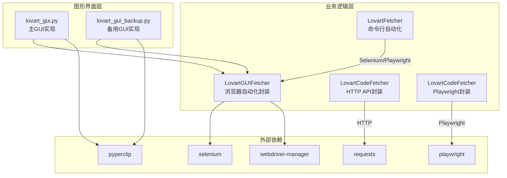
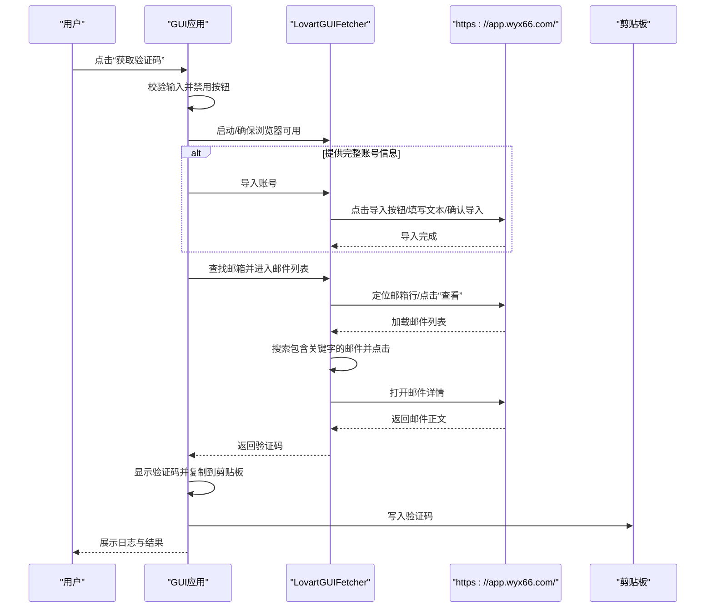
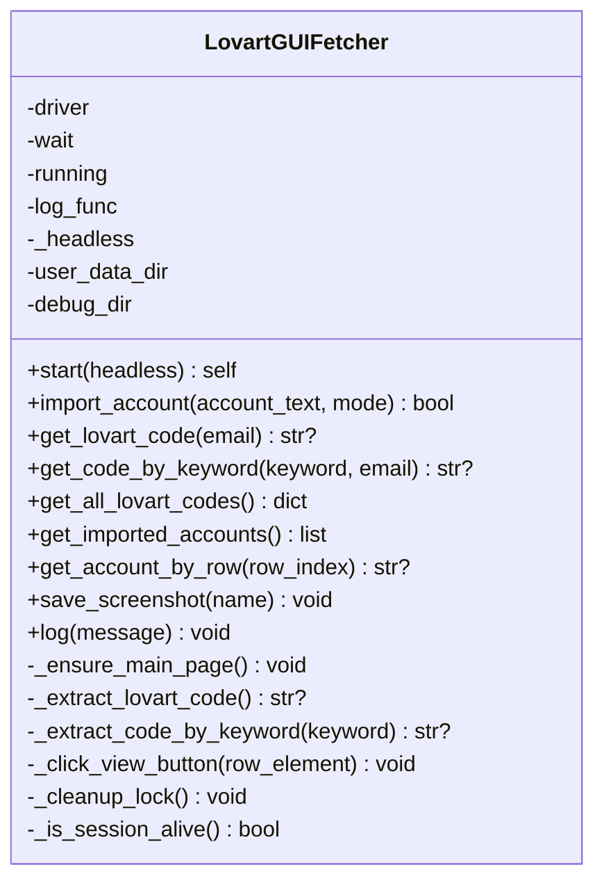
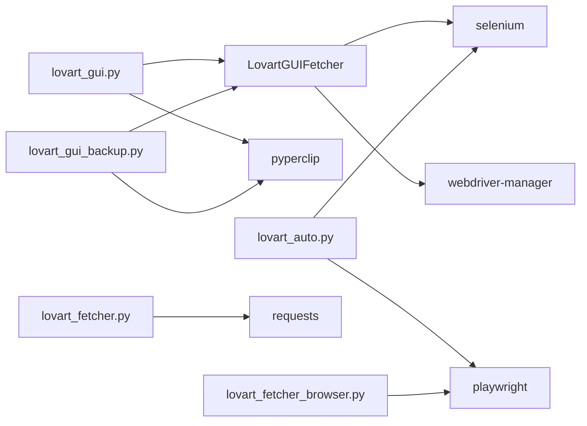

# 图形界面应用

<cite>
**本文引用的文件**
- [lovart_gui.py](file://lovart_gui.py)
- [lovart_gui_backup.py](file://lovart_gui_backup.py)
- [lovart_auto.py](file://lovart_auto.py)
- [lovart_fetcher.py](file://lovart_fetcher.py)
- [lovart_fetcher_browser.py](file://lovart_fetcher_browser.py)
- [requirements.txt](file://requirements.txt)
</cite>

## 目录
1. [简介](#简介)
2. [项目结构](#项目结构)
3. [核心组件](#核心组件)
4. [架构总览](#架构总览)
5. [详细组件分析](#详细组件分析)
6. [依赖关系分析](#依赖关系分析)
7. [性能与稳定性考虑](#性能与稳定性考虑)
8. [故障排除指南](#故障排除指南)
9. [结论](#结论)
10. [附录](#附录)

## 简介
本项目提供一个基于图形界面的 Lovart 验证码自动获取工具，支持：
- 账号导入（支持自动导入与手动模式）
- 验证码获取（按邮箱精确查找、按关键字模糊查找、批量获取）
- 实时日志与错误提示
- 剪贴板复制验证码
- GUI 备用实现（lovart_gui_backup.py）

该工具通过浏览器自动化访问 https://app.wyx66.com/，自动定位并提取 Lovart 验证码，简化了重复的人工操作流程。

## 项目结构
- 图形界面主实现：lovart_gui.py
- 图形界面备用实现：lovart_gui_backup.py
- 自动化脚本（命令行）：lovart_auto.py
- API 方案（HTTP 请求）：lovart_fetcher.py
- 浏览器自动化（Playwright）：lovart_fetcher_browser.py
- 依赖声明：requirements.txt

图表来源
- [lovart_gui.py:74-796](file://lovart_gui.py#L74-L796)
- [lovart_gui_backup.py:48-734](file://lovart_gui_backup.py#L48-L734)
- [lovart_auto.py:45-311](file://lovart_auto.py#L45-L311)
- [lovart_fetcher.py:12-103](file://lovart_fetcher.py#L12-L103)
- [lovart_fetcher_browser.py:25-231](file://lovart_fetcher_browser.py#L25-L231)
- [requirements.txt:1-3](file://requirements.txt#L1-L3)

章节来源
- [lovart_gui.py:74-1258](file://lovart_gui.py#L74-L1258)
- [lovart_gui_backup.py:48-1177](file://lovart_gui_backup.py#L48-L1177)
- [lovart_auto.py:1-442](file://lovart_auto.py#L1-L442)
- [lovart_fetcher.py:1-147](file://lovart_fetcher.py#L1-L147)
- [lovart_fetcher_browser.py:1-285](file://lovart_fetcher_browser.py#L1-L285)
- [requirements.txt:1-3](file://requirements.txt#L1-L3)

## 核心组件
- GUI 应用程序类（主实现与备用实现）
  - 负责构建界面、事件绑定、线程调度、日志展示、剪贴板交互
- 浏览器自动化封装类（LovartGUIFetcher）
  - 负责启动/管理浏览器、账号导入、验证码提取、页面导航、异常处理与截图诊断
- 自动化脚本（LovartFetcher）
  - 提供命令行模式下的账号导入、验证码提取与批量处理能力
- API 封装（LovartCodeFetcher）
  - 提供基于 HTTP 的邮件刷新与验证码提取能力
- Playwright 封装（LovartCodeFetcher）
  - 提供基于 Playwright 的浏览器自动化能力

章节来源
- [lovart_gui.py:798-1258](file://lovart_gui.py#L798-L1258)
- [lovart_gui_backup.py:737-1177](file://lovart_gui_backup.py#L737-L1177)
- [lovart_auto.py:45-311](file://lovart_auto.py#L45-L311)
- [lovart_fetcher.py:12-103](file://lovart_fetcher.py#L12-L103)
- [lovart_fetcher_browser.py:25-231](file://lovart_fetcher_browser.py#L25-L231)

## 架构总览
GUI 应用通过按钮触发业务逻辑，业务逻辑通过浏览器自动化封装类与目标网站交互，实时日志通过 ScrolledText 展示，验证码通过剪贴板复制。

图表来源
- [lovart_gui.py:1006-1054](file://lovart_gui.py#L1006-L1054)
- [lovart_gui.py:356-431](file://lovart_gui.py#L356-L431)
- [lovart_gui.py:654-749](file://lovart_gui.py#L654-L749)

## 详细组件分析

### GUI 应用（主实现）
- 界面布局
  - 账号输入区：支持粘贴示例账号、格式要求（email----password----client_id----refresh_token）
  - 快捷输入与模式：静默运行开关、粘贴示例账号
  - 功能按钮区：自动导入、手动模式、获取验证码、获取已导入账号、获取全部、按行号查询、关键字查询
  - 日志显示区：ScrolledText 实时滚动日志
  - 结果显示区：验证码展示与复制按钮
  - 底部提示：手动模式说明
- 控制流
  - 按钮点击 -> 参数校验 -> 后台线程执行 -> 浏览器启动/复用 -> 业务逻辑 -> 结果回传 -> UI 更新
- 错误处理
  - 弹窗提示错误信息
  - 日志记录异常堆栈
  - 按钮状态恢复

章节来源
- [lovart_gui.py:824-943](file://lovart_gui.py#L824-L943)
- [lovart_gui.py:972-1004](file://lovart_gui.py#L972-L1004)
- [lovart_gui.py:1006-1054](file://lovart_gui.py#L1006-L1054)
- [lovart_gui.py:1056-1089](file://lovart_gui.py#L1056-L1089)
- [lovart_gui.py:1091-1124](file://lovart_gui.py#L1091-L1124)
- [lovart_gui.py:1126-1165](file://lovart_gui.py#L1126-L1165)
- [lovart_gui.py:1167-1191](file://lovart_gui.py#L1167-L1191)
- [lovart_gui.py:1193-1214](file://lovart_gui.py#L1193-L1214)
- [lovart_gui.py:1215-1233](file://lovart_gui.py#L1215-L1233)
- [lovart_gui.py:1235-1247](file://lovart_gui.py#L1235-L1247)

### GUI 应用（备用实现）
- 界面布局与主实现一致，但按钮样式与字体略有差异
- 功能逻辑与主实现基本相同，差异点在于：
  - 复制到剪贴板时的兼容处理
  - 部分日志提示文案不同
  - 手动模式启动时的提示语

章节来源
- [lovart_gui_backup.py:737-1177](file://lovart_gui_backup.py#L737-L1177)
- [lovart_gui_backup.py:879-883](file://lovart_gui_backup.py#L879-L883)
- [lovart_gui_backup.py:1122-1132](file://lovart_gui_backup.py#L1122-L1132)

### 浏览器自动化封装（LovartGUIFetcher）
- 启动浏览器
  - 支持静默/显式两种模式
  - 自动清理锁定文件、移除自动化特征
  - 会话存活检测与自动重启
- 账号导入
  - 支持多种按钮选择器与导入模式（追加/覆盖）
  - 文本解析与格式化（支持 Tab 与 ---- 分隔）
- 验证码提取
  - 精确邮箱查找与“查看”按钮点击
  - 多种邮件项定位策略（iframe、列表项、全页文本）
  - 关键字模糊查找（支持指定邮箱范围）
  - 批量获取所有账号验证码
- 辅助能力
  - 获取已导入账号列表
  - 按行号获取邮箱
  - 截图诊断（debug_logs 目录）
  - 日志回调接口

图表来源
- [lovart_gui.py:74-796](file://lovart_gui.py#L74-L796)

章节来源
- [lovart_gui.py:136-207](file://lovart_gui.py#L136-L207)
- [lovart_gui.py:266-355](file://lovart_gui.py#L266-L355)
- [lovart_gui.py:356-431](file://lovart_gui.py#L356-L431)
- [lovart_gui.py:433-478](file://lovart_gui.py#L433-L478)
- [lovart_gui.py:572-603](file://lovart_gui.py#L572-L603)
- [lovart_gui.py:654-749](file://lovart_gui.py#L654-L749)
- [lovart_gui.py:209-255](file://lovart_gui.py#L209-L255)
- [lovart_gui.py:604-641](file://lovart_gui.py#L604-L641)
- [lovart_gui.py:643-652](file://lovart_gui.py#L643-L652)

### 自动化脚本（命令行）
- 支持 Playwright 与 Selenium 两种后端
- 提供账号导入、邮件列表获取、验证码提取、批量处理
- 命令行参数：账号文本/文件、导入模式、输出文件、无头模式

章节来源
- [lovart_auto.py:45-311](file://lovart_auto.py#L45-L311)
- [lovart_auto.py:357-438](file://lovart_auto.py#L357-L438)

### API 封装（HTTP）
- 基于 requests 的 HTTP 客户端
- 提供邮件刷新与验证码提取（需适配实际 API 返回格式）

章节来源
- [lovart_fetcher.py:12-103](file://lovart_fetcher.py#L12-L103)

### Playwright 封装
- 基于 Playwright 的浏览器自动化
- 提供账号导入、邮件列表获取、验证码提取、批量处理

章节来源
- [lovart_fetcher_browser.py:25-231](file://lovart_fetcher_browser.py#L25-L231)

## 依赖关系分析
- 运行时依赖
  - selenium、webdriver-manager、pyperclip
- 项目内依赖
  - GUI 应用依赖浏览器自动化封装
  - 自动化脚本可独立运行（可选 Playwright/Selenium）
  - API 封装依赖 requests
  - Playwright 封装依赖 playwright

图表来源
- [lovart_gui.py:41-72](file://lovart_gui.py#L41-L72)
- [lovart_gui_backup.py:26-46](file://lovart_gui_backup.py#L26-L46)
- [lovart_auto.py:25-42](file://lovart_auto.py#L25-L42)
- [lovart_fetcher.py:6-10](file://lovart_fetcher.py#L6-L10)
- [lovart_fetcher_browser.py:16-22](file://lovart_fetcher_browser.py#L16-L22)
- [requirements.txt:1-3](file://requirements.txt#L1-L3)

章节来源
- [lovart_gui.py:41-72](file://lovart_gui.py#L41-L72)
- [lovart_gui_backup.py:26-46](file://lovart_gui_backup.py#L26-L46)
- [lovart_auto.py:25-42](file://lovart_auto.py#L25-L42)
- [lovart_fetcher.py:6-10](file://lovart_fetcher.py#L6-L10)
- [lovart_fetcher_browser.py:16-22](file://lovart_fetcher_browser.py#L16-L22)
- [requirements.txt:1-3](file://requirements.txt#L1-L3)

## 性能与稳定性考虑
- 浏览器稳定性
  - 启动参数优化（禁用沙箱、内存限制、忽略证书错误等）
  - 自动清理锁定文件与残留进程
  - 会话存活检测与自动重启
- 页面交互鲁棒性
  - 多种选择器与回退策略（按钮、输入框、邮件项）
  - 等待与截图诊断（debug_logs）
- 并发与线程安全
  - 按钮状态与 UI 更新在主线程进行
  - 浏览器实例加锁保护
- 用户体验
  - 自动复制验证码到剪贴板
  - 实时日志滚动显示
  - 失败弹窗与日志提示

章节来源
- [lovart_gui.py:136-207](file://lovart_gui.py#L136-L207)
- [lovart_gui.py:100-125](file://lovart_gui.py#L100-L125)
- [lovart_gui.py:956-970](file://lovart_gui.py#L956-L970)
- [lovart_gui.py:1235-1247](file://lovart_gui.py#L1235-L1247)
- [lovart_gui.py:643-652](file://lovart_gui.py#L643-L652)

## 故障排除指南
- 依赖缺失
  - 安装命令：pip install selenium webdriver-manager pyperclip
- 浏览器启动失败
  - 清理锁定文件、关闭占用 Chrome 进程
  - 切换/关闭静默模式
  - 检查网络与证书设置
- 页面元素未找到
  - 等待页面加载、增加截图诊断
  - 使用备用选择器或关键字查找
- 验证码未提取
  - 确认账号有相关邮件
  - 使用关键字查找或按行号查询兜底
- 日志与截图
  - 查看 debug_logs 目录中的截图
  - 关注日志中的错误提示与建议

章节来源
- [requirements.txt:1-3](file://requirements.txt#L1-L3)
- [lovart_gui.py:100-125](file://lovart_gui.py#L100-L125)
- [lovart_gui.py:186-191](file://lovart_gui.py#L186-L191)
- [lovart_gui.py:643-652](file://lovart_gui.py#L643-L652)
- [lovart_gui.py:1047-1049](file://lovart_gui.py#L1047-L1049)

## 结论
本图形界面应用通过模块化的 GUI 与浏览器自动化封装，实现了从账号导入到验证码获取的完整流程。其具备良好的容错与诊断能力，适合在多场景下快速获取 Lovart 验证码。备用 GUI 实现与命令行脚本进一步增强了可用性与扩展性。

## 附录

### 使用流程（从账号导入到验证码获取）
- 准备账号信息
  - 格式：email----password----client_id----refresh_token
  - 可通过“粘贴示例账号”快速填充
- 自动导入
  - 点击“自动导入”，等待导入完成
- 获取验证码
  - 输入邮箱或完整账号信息
  - 点击“获取验证码”，自动复制到剪贴板
- 手动模式
  - 点击“手动模式”，显式浏览器启动，可手动导入或登录
- 批量获取
  - 点击“获取全部”，批量处理所有账号

章节来源
- [lovart_gui.py:944-948](file://lovart_gui.py#L944-L948)
- [lovart_gui.py:972-1004](file://lovart_gui.py#L972-L1004)
- [lovart_gui.py:1006-1054](file://lovart_gui.py#L1006-L1054)
- [lovart_gui.py:1215-1233](file://lovart_gui.py#L1215-L1233)
- [lovart_gui.py:1167-1191](file://lovart_gui.py#L1167-L1191)

### 界面元素与配置说明
- 账号输入框
  - 支持粘贴示例账号
  - 格式要求：email----password----client_id----refresh_token
- 静默运行开关
  - 默认启用，隐藏浏览器窗口
- 快捷输入
  - “粘贴示例账号”
- 功能按钮
  - 自动导入、手动模式、获取验证码、获取已导入账号、获取全部、按行号查询、关键字查询
- 日志显示
  - 实时滚动日志，包含时间戳
- 验证码显示与复制
  - 显示区与“复制到剪贴板”按钮

章节来源
- [lovart_gui.py:831-943](file://lovart_gui.py#L831-L943)
- [lovart_gui.py:1193-1214](file://lovart_gui.py#L1193-L1214)

### 实时日志与错误提示机制
- 日志记录
  - GUI 应用通过 ScrolledText 实时展示日志
  - 包含时间戳与消息
- 错误提示
  - 弹窗提示错误信息
  - 日志中记录异常堆栈
- 截图诊断
  - 在关键节点保存截图至 debug_logs 目录

章节来源
- [lovart_gui.py:950-954](file://lovart_gui.py#L950-L954)
- [lovart_gui.py:1047-1049](file://lovart_gui.py#L1047-L1049)
- [lovart_gui.py:643-652](file://lovart_gui.py#L643-L652)

### GUI 备用实现使用说明
- 启动方式
  - 运行 python lovart_gui_backup.py
- 功能与主实现一致
  - 界面布局、按钮功能、日志与错误提示
- 差异点
  - 按钮样式与字体
  - 剪贴板兼容处理
  - 部分提示文案差异

章节来源
- [lovart_gui_backup.py:1169-1177](file://lovart_gui_backup.py#L1169-L1177)
- [lovart_gui_backup.py:1122-1132](file://lovart_gui_backup.py#L1122-L1132)