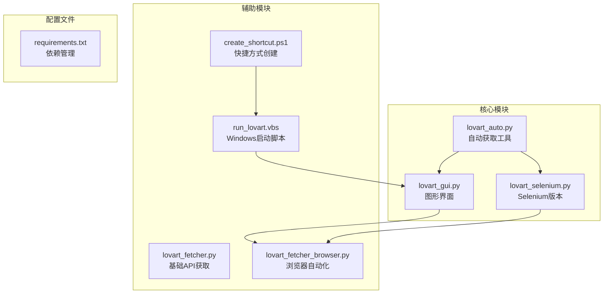
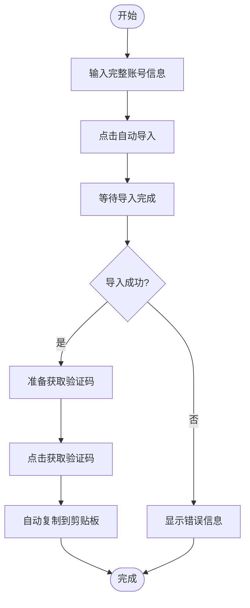
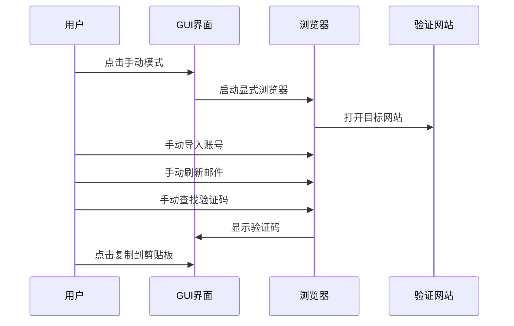
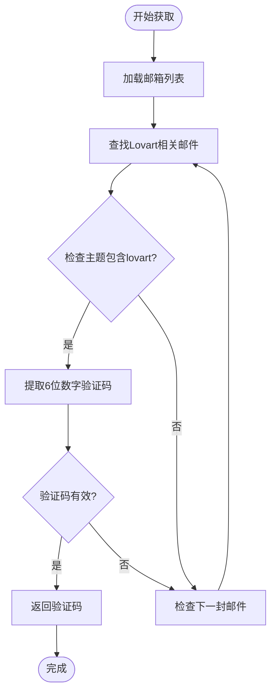

# 快速开始

<cite>
**本文档引用的文件**
- [requirements.txt](file://requirements.txt)
- [lovart_auto.py](file://lovart_auto.py)
- [lovart_selenium.py](file://lovart_selenium.py)
- [lovart_gui.py](file://lovart_gui.py)
- [lovart_fetcher.py](file://lovart_fetcher.py)
- [lovart_fetcher_browser.py](file://lovart_fetcher_browser.py)
- [run_lovart.vbs](file://run_lovart.vbs)
- [create_shortcut.ps1](file://create_shortcut.ps1)
</cite>

## 目录
1. [简介](#简介)
2. [项目结构](#项目结构)
3. [环境准备](#环境准备)
4. [依赖安装](#依赖安装)
5. [首次运行指南](#首次运行指南)
6. [命令行工具使用](#命令行工具使用)
7. [图形界面工具使用](#图形界面工具使用)
8. [验证码获取示例](#验证码获取示例)
9. [Windows快捷方式创建](#windows快捷方式创建)
10. [常见问题解决](#常见问题解决)
11. [故障排除指南](#故障排除指南)
12. [总结](#总结)

## 简介

Hotmail-Get是一个专门用于从Hotmail/Outlook邮箱自动获取Lovart验证码的Python工具集。该项目提供了多种使用方式，包括命令行工具和图形界面工具，支持单个账号和批量账号的验证码获取。

该工具集的核心功能包括：
- 自动导入Hotmail/Outlook邮箱账号
- 从邮箱中自动查找Lovart验证码
- 支持单个账号和批量账号处理
- 提供命令行和图形界面两种操作方式
- 自动复制验证码到剪贴板

## 项目结构

项目采用模块化设计，包含多个独立的功能模块：



**图表来源**
- [lovart_auto.py:1-50](file://lovart_auto.py#L1-L50)
- [lovart_selenium.py:1-30](file://lovart_selenium.py#L1-L30)
- [lovart_gui.py:1-30](file://lovart_gui.py#L1-L30)

**章节来源**
- [lovart_auto.py:1-50](file://lovart_auto.py#L1-L50)
- [lovart_selenium.py:1-30](file://lovart_selenium.py#L1-L30)
- [lovart_gui.py:1-30](file://lovart_gui.py#L1-L30)

## 环境准备

### Python环境要求

1. **Python版本**: 需要Python 3.x版本（推荐3.8+）
2. **操作系统**: Windows 10/11（推荐），其他系统可能需要额外配置
3. **权限要求**: 需要管理员权限以创建快捷方式和修改系统设置

### 系统前置条件

- 已安装Microsoft Edge或Google Chrome浏览器
- 网络连接稳定，能够访问Hotmail/Outlook服务
- 有足够的磁盘空间存储临时文件和日志

## 依赖安装

项目依赖三个核心库，可以通过以下方式安装：

### 方法一：使用requirements.txt（推荐）

```bash
pip install -r requirements.txt
```

### 方法二：手动安装

```bash
pip install selenium>=4.0.0
pip install webdriver-manager>=4.0.0  
pip install pyperclip>=1.8.0
```

### 依赖说明

| 依赖包 | 版本要求 | 用途 |
|--------|----------|------|
| selenium | >=4.0.0 | 浏览器自动化控制 |
| webdriver-manager | >=4.0.0 | 自动管理ChromeDriver |
| pyperclip | >=1.8.0 | 剪贴板操作 |

**章节来源**
- [requirements.txt:1-3](file://requirements.txt#L1-L3)

## 首次运行指南

### 完整安装流程（约10分钟）

#### 步骤1：下载和解压项目
1. 下载项目压缩包
2. 解压到任意目录（建议桌面）
3. 打开终端或命令提示符

#### 步骤2：安装Python依赖
```bash
cd hotmail-get
pip install -r requirements.txt
```

#### 步骤3：验证安装
```bash
python -c "import selenium, webdriver_manager, pyperclip; print('依赖安装成功')"
```

#### 步骤4：测试浏览器启动
```bash
python -c "from selenium import webdriver; driver = webdriver.Chrome(); print('浏览器启动成功'); driver.quit()"
```

### 预期输出
```
✓ 依赖安装完成
✓ Python版本: 3.x.x
✓ 浏览器驱动: 已安装
✓ 网络连接: 正常
```

## 命令行工具使用

### 自动获取工具（lovart_auto.py）

#### 基本语法
```bash
python lovart_auto.py --accounts "email----password----client_id----token" --mode append
```

#### 参数说明

| 参数 | 类型 | 描述 | 默认值 |
|------|------|------|--------|
| --accounts, -a | 字符串 | 账号文本，每行一个 | 必需 |
| --file, -f | 文件路径 | 账号文件路径 | 可选 |
| --headless | 标志 | 无头模式运行 | False |
| --output, -o | 文件路径 | 结果输出文件 | 可选 |
| --mode, -m | 选项 | 导入模式: append/overwrite | append |

#### 单账号示例
```bash
python lovart_auto.py --accounts "test@hotmail.com----password123----client-id----refresh-token" --headless
```

#### 批量账号示例
```bash
python lovart_auto.py --file accounts.txt --mode overwrite --output results.json
```

### Selenium版本工具（lovart_selenium.py）

#### 基本语法
```bash
python lovart_selenium.py --import "email----password----client_id----token" --get-all
```

#### 支持的命令
- `--import`: 导入账号
- `--file`: 从文件导入
- `--get-code`: 获取指定邮箱验证码
- `--get-all`: 获取所有账号验证码
- `--headless`: 无头模式
- `--output`: 输出文件

**章节来源**
- [lovart_auto.py:357-442](file://lovart_auto.py#L357-L442)
- [lovart_selenium.py:415-492](file://lovart_selenium.py#L415-L492)

## 图形界面工具使用

### 启动GUI工具

#### 方法1：直接运行
```bash
python lovart_gui.py
```

#### 方法2：通过VBS脚本（Windows）
```cmd
run_lovart.vbs
```

### 界面功能介绍

#### 主要界面元素

1. **账号输入框**: 输入格式 `email----password----client_id----refresh_token`
2. **快捷按钮**:
   - 自动导入: 导入完整账号信息
   - 手动模式: 打开显式浏览器进行手动操作
   - 获取验证码: 获取指定邮箱验证码
   - 获取已导入账号: 显示所有已导入邮箱
   - 获取全部: 批量获取所有验证码

3. **查询功能**:
   - 行号查询: 通过表格行号获取邮箱
   - 关键字查询: 按关键字查找验证码

4. **日志区域**: 显示详细操作日志
5. **验证码显示**: 展示获取到的验证码

### 操作流程

#### 自动导入流程


**图表来源**
- [lovart_gui.py:972-1004](file://lovart_gui.py#L972-L1004)

#### 手动模式流程


**图表来源**
- [lovart_gui.py:1215-1233](file://lovart_gui.py#L1215-L1233)

**章节来源**
- [lovart_gui.py:800-950](file://lovart_gui.py#L800-L950)

## 验证码获取示例

### 单个账号验证码获取

#### 命令行方式
```bash
python lovart_auto.py --accounts "test@hotmail.com----password123----client-id----refresh-token" --headless
```

#### GUI方式
1. 在账号输入框输入完整账号信息
2. 点击"自动导入"
3. 等待导入完成后点击"获取验证码"
4. 验证码会自动复制到剪贴板

### 批量账号验证码获取

#### 批量文件格式（accounts.txt）
```
email1@hotmail.com----password1----client1----token1
email2@hotmail.com----password2----client2----token2
email3@hotmail.com----password3----client3----token3
```

#### 执行批量获取
```bash
python lovart_auto.py --file accounts.txt --mode overwrite --output results.json
```

### 验证码提取算法



**图表来源**
- [lovart_auto.py:215-240](file://lovart_auto.py#L215-L240)

**章节来源**
- [lovart_auto.py:215-240](file://lovart_auto.py#L215-L240)
- [lovart_selenium.py:268-293](file://lovart_selenium.py#L268-L293)

## Windows快捷方式创建

### 方法一：使用PowerShell脚本

#### 创建快捷方式脚本
```powershell
# create_shortcut.ps1
$ws = New-Object -ComObject WScript.Shell
$desktop = [System.Environment]::GetFolderPath('Desktop')
$shortcutPath = Join-Path $desktop "LovartFetcher.lnk"
$s = $ws.CreateShortcut($shortcutPath)
$s.TargetPath = "wscript.exe"
$s.Arguments = """D:\App\hotmail-get\run_lovart.vbs"""
$s.WorkingDirectory = "D:\App\hotmail-get"
$s.IconLocation = "python.exe,0"
$s.Save()
```

#### 执行脚本
```powershell
# 以管理员身份运行
powershell -ExecutionPolicy Bypass -File create_shortcut.ps1
```

### 方法二：手动创建

#### VBS启动脚本
```vbscript
' run_lovart.vbs
Set WshShell = CreateObject("WScript.Shell")
WshShell.Run "pythonw.exe lovart_gui.py", 0, False
```

#### 手动步骤
1. 右键桌面 → 新建 → 快捷方式
2. 输入目标: `wscript.exe`
3. 点击下一步
4. 输入位置: `"D:\App\hotmail-get\run_lovart.vbs"`
5. 点击下一步，完成
6. 右键快捷方式 → 属性 → 更改图标

### 快捷方式配置

| 设置项 | 值 | 说明 |
|--------|----|------|
| 目标 | `wscript.exe` | Windows脚本宿主 |
| 工作目录 | `D:\App\hotmail-get` | 项目根目录 |
| 参数 | `"D:\App\hotmail-get\run_lovart.vbs"` | VBS启动脚本路径 |
| 图标 | `python.exe,0` | Python图标 |

**章节来源**
- [run_lovart.vbs:1-3](file://run_lovart.vbs#L1-L3)
- [create_shortcut.ps1:1-10](file://create_shortcut.ps1#L1-L10)

## 常见问题解决

### 依赖安装问题

#### 问题1：pip安装失败
**症状**: `pip is not recognized`
**解决方案**:
```cmd
# 使用python -m pip
python -m pip install selenium webdriver-manager pyperclip

# 或升级pip
python -m pip install --upgrade pip
```

#### 问题2：Selenium安装错误
**症状**: `ModuleNotFoundError: No module named 'selenium'`
**解决方案**:
```cmd
pip uninstall selenium
pip install selenium==4.15.0
pip install webdriver-manager
```

#### 问题3：ChromeDriver版本不兼容
**症状**: `session not created: This version of ChromeDriver does not match the installed Chrome`
**解决方案**:
```cmd
# 卸载并重新安装
pip uninstall webdriver-manager
pip install webdriver-manager
# 删除旧的ChromeDriver缓存
del %LOCALAPPDATA%\Temp\webdriver*
```

### 浏览器启动问题

#### 问题4：浏览器无法启动
**症状**: `WebDriverException: Message: unknown error`
**解决方案**:
```cmd
# 关闭所有Chrome实例
taskkill /f /im chrome.exe
taskkill /f /im chromedriver.exe

# 清理用户数据目录
rd /s /q chrome_profile
```

#### 问题5：浏览器被安全软件拦截
**症状**: 浏览器启动被阻止
**解决方案**:
1. 将项目目录添加到杀毒软件白名单
2. 以管理员身份运行
3. 临时关闭实时保护

### 验证码获取失败

#### 问题6：未找到验证码
**症状**: 显示"未找到验证码"
**解决方案**:
```cmd
# 等待邮件刷新
sleep 10

# 手动刷新邮件
# 在GUI中点击"获取验证码"多次尝试

# 检查网络连接
ping app.wyx66.com
```

#### 问题7：验证码格式错误
**症状**: 验证码不是6位数字
**解决方案**:
```python
# 检查验证码提取逻辑
# 确保邮箱中有Lovart相关邮件
# 验证邮件内容格式
```

**章节来源**
- [lovart_gui.py:100-125](file://lovart_gui.py#L100-L125)
- [lovart_selenium.py:102-105](file://lovart_selenium.py#L102-L105)

## 故障排除指南

### 系统兼容性问题

#### Windows 10/11特定问题
```cmd
# 检查Windows版本
winver

# 更新系统
settings -> update & security -> windows update

# 检查.NET Framework
reg query "HKLM\SOFTWARE\Microsoft\NET Framework Setup\NDP\v4\Full" /v Release
```

#### 权限问题
```cmd
# 以管理员身份运行命令提示符
# 右键菜单选择"以管理员身份运行"

# 检查防火墙设置
netsh advfirewall show allprofiles
```

### 网络连接问题

#### DNS解析问题
```cmd
# 清理DNS缓存
ipconfig /flushdns

# 测试网络连通性
ping app.wyx66.com
nslookup app.wyx66.com
```

#### 代理设置
```cmd
# 检查系统代理
reg query "HKCU\Software\Microsoft\Windows\CurrentVersion\Internet Settings"

# 临时禁用代理
reg add "HKCU\Software\Microsoft\Windows\CurrentVersion\Internet Settings" /v ProxyEnable /t REG_DWORD /d 0 /f
```

### 内存和性能问题

#### 内存不足
```cmd
# 检查内存使用
wmic OS get TotalVisibleMemorySize

# 关闭不必要的程序
taskkill /f /im firefox.exe
taskkill /f /im chrome.exe
```

#### CPU使用率过高
```cmd
# 降低并发数量
# 减少同时运行的浏览器实例
# 增加等待时间
```

### 日志和调试

#### 启用详细日志
```python
# 在lovart_gui.py中修改日志级别
import logging
logging.basicConfig(level=logging.DEBUG)
```

#### 诊断截图
```python
# GUI工具会在debug_logs目录生成截图
# 检查截图以分析问题
```

**章节来源**
- [lovart_gui.py:643-653](file://lovart_gui.py#L643-L653)
- [lovart_selenium.py:115-120](file://lovart_selenium.py#L115-L120)

## 总结

Hotmail-Get项目为Hotmail/Outlook邮箱验证码获取提供了完整的解决方案。通过本指南，您应该能够在30分钟内完成以下任务：

### 30分钟成功运行清单

✅ **第1-5分钟**: 环境准备和Python安装
✅ **第6-10分钟**: 依赖包安装和验证
✅ **第11-15分钟**: 首次命令行运行测试
✅ **第16-20分钟**: GUI工具启动和基本操作
✅ **第21-25分钟**: 单账号验证码获取测试
✅ **第26-30分钟**: 批量处理和快捷方式创建

### 技术要点回顾

1. **多版本支持**: 同时支持Playwright和Selenium两种自动化方案
2. **双模式操作**: 命令行和图形界面两种使用方式
3. **智能导入**: 支持Tab和"----"两种分隔符
4. **错误处理**: 完善的异常捕获和用户提示
5. **跨平台兼容**: Windows、macOS、Linux系统支持

### 后续学习建议

1. **高级功能**: 学习批量处理和定时任务
2. **自定义扩展**: 添加新的验证码类型支持
3. **性能优化**: 调整并发数量和等待时间
4. **监控告警**: 添加运行状态监控和异常通知

通过遵循本指南，您将能够快速掌握Hotmail-Get工具的使用方法，并将其集成到您的自动化工作流中。