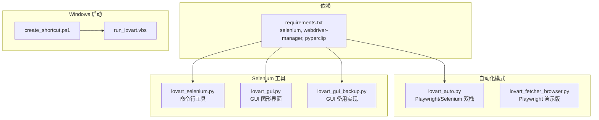
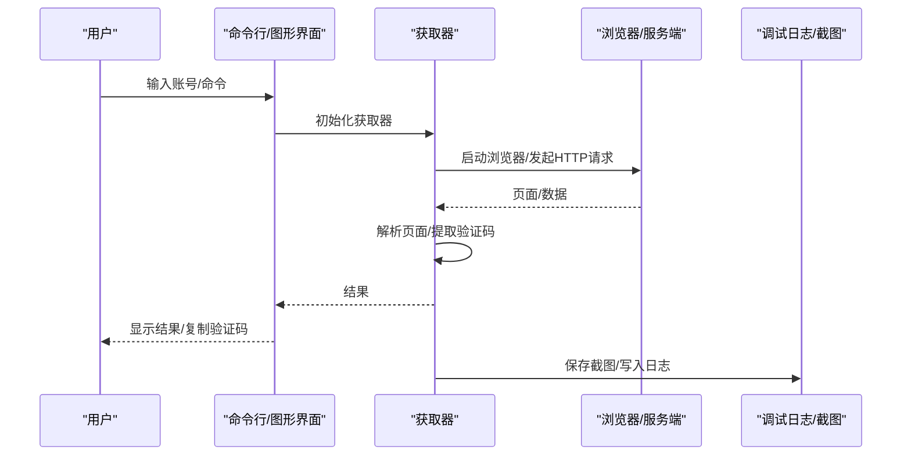
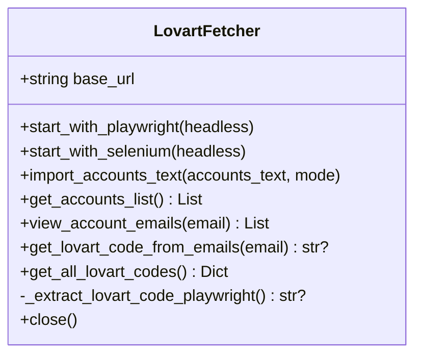
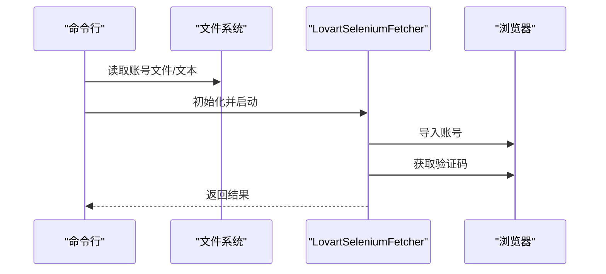
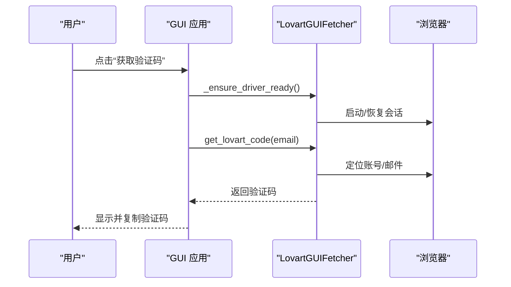
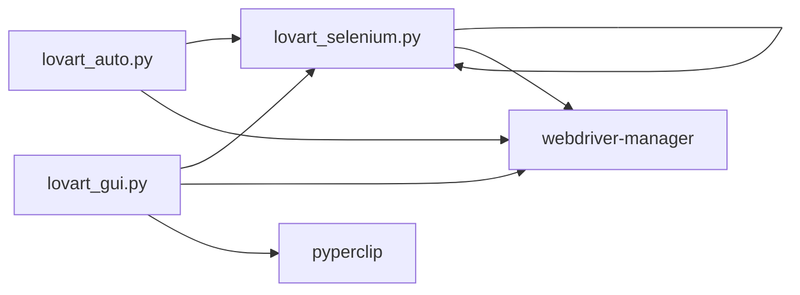

# 故障排除与常见问题

<cite>
**本文引用的文件**
- [requirements.txt](file://requirements.txt)
- [lovart_auto.py](file://lovart_auto.py)
- [lovart_fetcher.py](file://lovart_fetcher.py)
- [lovart_fetcher_browser.py](file://lovart_fetcher_browser.py)
- [lovart_gui.py](file://lovart_gui.py)
- [lovart_gui_backup.py](file://lovart_gui_backup.py)
- [lovart_selenium.py](file://lovart_selenium.py)
- [create_shortcut.ps1](file://create_shortcut.ps1)
- [run_lovart.vbs](file://run_lovart.vbs)
</cite>

## 目录
1. [简介](#简介)
2. [项目结构](#项目结构)
3. [核心组件](#核心组件)
4. [架构总览](#架构总览)
5. [详细组件分析](#详细组件分析)
6. [依赖关系分析](#依赖关系分析)
7. [性能考虑](#性能考虑)
8. [故障排除指南](#故障排除指南)
9. [结论](#结论)
10. [附录](#附录)

## 简介
本文件面向使用 hotmail-get 工具集的用户，提供系统化的故障排除与常见问题解答。内容涵盖安装失败、浏览器兼容性问题、验证码提取失败、性能问题、日志分析与调试技巧、预防性措施与最佳实践，以及社区支持渠道与问题反馈方式。工具支持三种运行模式：
- 命令行模式（Selenium）
- GUI 图形界面模式（Selenium）
- 自动化模式（Playwright/Selenium 双栈）

## 项目结构
该项目由多个独立模块组成，分别针对不同使用场景与技术栈：
- requirements.txt：Python 依赖声明（selenium、webdriver-manager、pyperclip）
- lovart_auto.py：自动化模式（Playwright/Selenium 双栈），适合批处理与脚本集成
- lovart_fetcher.py：基于 HTTP API 的纯 Python 实现（请求/响应），需配合服务端接口
- lovart_fetcher_browser.py：Playwright 浏览器自动化封装（演示版）
- lovart_selenium.py：Selenium 命令行工具，支持导入账号、获取验证码、批量处理
- lovart_gui.py：GUI 图形界面（Selenium），提供可视化操作与日志输出
- lovart_gui_backup.py：GUI 的备用实现（功能相近）
- create_shortcut.ps1：Windows 快捷方式创建脚本
- run_lovart.vbs：Windows 启动脚本（调用 GUI）

图表来源
- [requirements.txt:1-3](file://requirements.txt#L1-L3)
- [lovart_auto.py:1-15](file://lovart_auto.py#L1-L15)
- [lovart_fetcher_browser.py:1-8](file://lovart_fetcher_browser.py#L1-L8)
- [lovart_selenium.py:1-20](file://lovart_selenium.py#L1-L20)
- [lovart_gui.py:1-13](file://lovart_gui.py#L1-L13)
- [lovart_gui_backup.py:1-13](file://lovart_gui_backup.py#L1-L13)
- [create_shortcut.ps1:1-10](file://create_shortcut.ps1#L1-L10)
- [run_lovart.vbs:1-3](file://run_lovart.vbs#L1-L3)

章节来源
- [requirements.txt:1-3](file://requirements.txt#L1-L3)
- [lovart_auto.py:1-15](file://lovart_auto.py#L1-L15)
- [lovart_fetcher_browser.py:1-8](file://lovart_fetcher_browser.py#L1-L8)
- [lovart_selenium.py:1-20](file://lovart_selenium.py#L1-L20)
- [lovart_gui.py:1-13](file://lovart_gui.py#L1-L13)
- [lovart_gui_backup.py:1-13](file://lovart_gui_backup.py#L1-L13)
- [create_shortcut.ps1:1-10](file://create_shortcut.ps1#L1-L10)
- [run_lovart.vbs:1-3](file://run_lovart.vbs#L1-L3)

## 核心组件
- 自动化获取器（Playwright/Selenium 双栈）
  - 支持启动浏览器、导入账号、查看邮件列表、提取验证码
  - 提供无头/显式两种运行模式
- Selenium 命令行工具
  - 支持从文本或文件导入账号，获取单个或全部验证码
  - 提供超时控制与异常处理
- GUI 图形界面
  - 提供可视化操作、日志输出、截图诊断、多关键字查询
  - 支持自动导入、手动模式、批量获取
- Windows 启动脚本
  - 快捷方式创建与 GUI 启动

章节来源
- [lovart_auto.py:45-94](file://lovart_auto.py#L45-L94)
- [lovart_selenium.py:47-120](file://lovart_selenium.py#L47-L120)
- [lovart_gui.py:74-106](file://lovart_gui.py#L74-L106)
- [create_shortcut.ps1:1-10](file://create_shortcut.ps1#L1-L10)
- [run_lovart.vbs:1-3](file://run_lovart.vbs#L1-L3)

## 架构总览
整体架构分为三层：
- 交互层：命令行与 GUI
- 控制层：浏览器自动化（Selenium/Playwright）或 HTTP API 调用
- 数据层：账号信息、邮件列表、验证码提取

图表来源
- [lovart_selenium.py:415-492](file://lovart_selenium.py#L415-L492)
- [lovart_gui.py:973-1071](file://lovart_gui.py#L973-L1071)
- [lovart_auto.py:357-442](file://lovart_auto.py#L357-L442)

## 详细组件分析

### 组件A：自动化获取器（Playwright/Selenium 双栈）
- 功能要点
  - 自动选择 Playwright 或 Selenium 启动浏览器
  - 导入账号文本（支持 Tab 或 “----” 分隔）
  - 查看邮件列表并提取 Lovart 验证码
  - 支持无头模式与显式模式
- 错误处理
  - 依赖缺失时抛出异常并提示安装命令
  - 页面元素定位失败时记录日志并返回 None
- 性能特性
  - 无头模式减少资源占用
  - 等待与超时控制避免阻塞

图表来源
- [lovart_auto.py:45-94](file://lovart_auto.py#L45-L94)
- [lovart_auto.py:215-283](file://lovart_auto.py#L215-L283)

章节来源
- [lovart_auto.py:45-94](file://lovart_auto.py#L45-L94)
- [lovart_auto.py:215-283](file://lovart_auto.py#L215-L283)

### 组件B：Selenium 命令行工具
- 功能要点
  - 支持从文本或文件导入账号
  - 获取单个或全部验证码
  - 导入模式（追加/覆盖）
  - 输出 JSON 结果
- 错误处理
  - 依赖缺失时提示安装
  - 页面元素定位失败时抛出异常
- 性能特性
  - 无头模式提升吞吐量
  - 等待与超时控制保证稳定性

图表来源
- [lovart_selenium.py:415-492](file://lovart_selenium.py#L415-L492)
- [lovart_selenium.py:132-193](file://lovart_selenium.py#L132-L193)

章节来源
- [lovart_selenium.py:47-120](file://lovart_selenium.py#L47-L120)
- [lovart_selenium.py:132-193](file://lovart_selenium.py#L132-L193)
- [lovart_selenium.py:268-331](file://lovart_selenium.py#L268-L331)
- [lovart_selenium.py:415-492](file://lovart_selenium.py#L415-L492)

### 组件C：GUI 图形界面（Selenium）
- 功能要点
  - 可视化导入账号、获取验证码、批量处理
  - 日志输出与截图诊断
  - 多关键字查询与行号查询
  - 自动复制验证码到剪贴板
- 错误处理
  - 会话失效自动重启
  - 页面元素定位失败记录日志
- 性能特性
  - 线程化后台任务避免 UI 卡顿
  - 截图保存便于问题复现

图表来源
- [lovart_gui.py:973-1071](file://lovart_gui.py#L973-L1071)
- [lovart_gui.py:356-431](file://lovart_gui.py#L356-L431)
- [lovart_gui.py:654-749](file://lovart_gui.py#L654-L749)

章节来源
- [lovart_gui.py:74-106](file://lovart_gui.py#L74-L106)
- [lovart_gui.py:356-431](file://lovart_gui.py#L356-L431)
- [lovart_gui.py:654-749](file://lovart_gui.py#L654-L749)
- [lovart_gui.py:973-1071](file://lovart_gui.py#L973-L1071)

### 组件D：Playwright 演示版（浏览器自动化）
- 功能要点
  - 演示 Playwright 的导入与验证码提取流程
  - 适合作为参考实现
- 注意事项
  - 未实现刷新账号等高级功能，需结合其他模块使用

章节来源
- [lovart_fetcher_browser.py:25-43](file://lovart_fetcher_browser.py#L25-L43)
- [lovart_fetcher_browser.py:50-78](file://lovart_fetcher_browser.py#L50-L78)
- [lovart_fetcher_browser.py:135-163](file://lovart_fetcher_browser.py#L135-L163)

### 组件E：HTTP API 封装
- 功能要点
  - 通过 HTTP 请求刷新邮件、检测权限
  - 从 API 返回数据中提取验证码
- 注意事项
  - 需要服务端接口支持，具体字段以实际返回为准

章节来源
- [lovart_fetcher.py:12-20](file://lovart_fetcher.py#L12-L20)
- [lovart_fetcher.py:21-51](file://lovart_fetcher.py#L21-L51)
- [lovart_fetcher.py:78-103](file://lovart_fetcher.py#L78-L103)

## 依赖关系分析
- Python 依赖
  - selenium>=4.0.0
  - webdriver-manager>=4.0.0
  - pyperclip>=1.8.0
- 运行模式依赖
  - 自动化模式：Playwright 或 Selenium
  - GUI 模式：Selenium + webdriver-manager + pyperclip
  - 命令行模式：Selenium + webdriver-manager

图表来源
- [requirements.txt:1-3](file://requirements.txt#L1-L3)
- [lovart_auto.py:25-42](file://lovart_auto.py#L25-L42)
- [lovart_selenium.py:31-44](file://lovart_selenium.py#L31-L44)
- [lovart_gui.py:41-72](file://lovart_gui.py#L41-L72)

章节来源
- [requirements.txt:1-3](file://requirements.txt#L1-L3)
- [lovart_auto.py:25-42](file://lovart_auto.py#L25-L42)
- [lovart_selenium.py:31-44](file://lovart_selenium.py#L31-L44)
- [lovart_gui.py:41-72](file://lovart_gui.py#L41-L72)

## 性能考虑
- 无头模式
  - 减少内存与 CPU 占用，适合批量处理
  - 降低视觉干扰，提高吞吐量
- 等待与超时
  - 合理设置页面加载与元素等待时间，避免无限等待
- 截图与日志
  - 仅在必要时生成截图，避免磁盘 IO 压力
- 并发与线程
  - GUI 使用线程执行后台任务，避免 UI 卡顿

章节来源
- [lovart_selenium.py:59-113](file://lovart_selenium.py#L59-L113)
- [lovart_gui.py:136-207](file://lovart_gui.py#L136-L207)
- [lovart_gui.py:973-987](file://lovart_gui.py#L973-L987)

## 故障排除指南

### 一、安装与依赖问题
- 症状
  - 报错提示缺少 selenium、webdriver-manager 或 pyperclip
- 排查步骤
  - 确认 Python 环境与 pip 版本
  - 检查 requirements.txt 中的依赖版本
  - 在虚拟环境中重新安装依赖
- 解决方案
  - 使用官方依赖清单安装
  - 若 webdriver-manager 安装失败，尝试手动下载驱动
- 预防措施
  - 使用 requirements.txt 固定版本
  - 在 CI 环境中预装依赖

章节来源
- [requirements.txt:1-3](file://requirements.txt#L1-L3)
- [lovart_auto.py:25-42](file://lovart_auto.py#L25-L42)
- [lovart_selenium.py:31-44](file://lovart_selenium.py#L31-L44)
- [lovart_gui.py:41-72](file://lovart_gui.py#L41-L72)

### 二、浏览器启动失败
- 症状
  - 浏览器启动崩溃、会话未创建、启动超时
- 排查步骤
  - 关闭所有已打开的 Chrome/Chromedriver 进程
  - 清理用户数据目录中的锁定文件
  - 检查防火墙与安全软件拦截
  - 确认 ChromeDriver 与 Chrome 版本兼容
- 解决方案
  - 使用 webdriver-manager 自动管理驱动
  - 以管理员权限运行或调整安全策略
  - 切换到无头模式进行初步验证
- 预防措施
  - 定期更新 Chrome 与驱动
  - 避免多实例同时访问同一用户数据目录

章节来源
- [lovart_gui.py:100-125](file://lovart_gui.py#L100-L125)
- [lovart_gui.py:172-191](file://lovart_gui.py#L172-L191)
- [lovart_selenium.py:90-113](file://lovart_selenium.py#L90-L113)

### 三、页面元素定位失败
- 症状
  - 找不到“导入邮箱”、“查看”按钮或邮件项
- 排查步骤
  - 检查页面是否完全加载
  - 使用截图保存关键节点状态
  - 替换多种选择器（XPath/CSS）
- 解决方案
  - 增加重试与等待逻辑
  - 采用更宽松的选择器匹配
  - 使用 JavaScript 点击规避遮挡
- 预防措施
  - 为关键步骤增加显式等待
  - 记录页面源码片段用于分析

章节来源
- [lovart_gui.py:277-354](file://lovart_gui.py#L277-L354)
- [lovart_selenium.py:140-188](file://lovart_selenium.py#L140-L188)
- [lovart_auto.py:106-133](file://lovart_auto.py#L106-L133)

### 四、验证码提取失败
- 症状
  - 未找到验证码或验证码为空
- 排查步骤
  - 检查邮件列表是否正确加载
  - 确认邮件来源包含 Lovart 关键字
  - 尝试在 iframe 中查找邮件内容
  - 使用关键字搜索替代正则匹配
- 解决方案
  - 多路径提取（iframe、详情页、全页文本）
  - 对 000000 等占位符进行过滤
  - 保存诊断截图辅助定位
- 预防措施
  - 增加对异常验证码的兜底处理
  - 记录提取过程中的关键文本片段

章节来源
- [lovart_gui.py:654-749](file://lovart_gui.py#L654-L749)
- [lovart_selenium.py:333-376](file://lovart_selenium.py#L333-L376)
- [lovart_auto.py:285-310](file://lovart_auto.py#L285-L310)

### 五、性能问题
- 症状
  - 处理速度慢、CPU/内存占用高
- 排查步骤
  - 开启无头模式观察差异
  - 检查网络延迟与页面加载时间
  - 分析日志中的等待与重试次数
- 解决方案
  - 批量处理时使用无头模式
  - 合理设置超时与重试间隔
  - 优化选择器与 DOM 查询
- 预防措施
  - 在测试环境先行压测
  - 使用缓存与会话复用

章节来源
- [lovart_selenium.py:64-88](file://lovart_selenium.py#L64-L88)
- [lovart_gui.py:147-170](file://lovart_gui.py#L147-L170)

### 六、跨平台与浏览器兼容性
- Windows
  - 使用 run_lovart.vbs 与 create_shortcut.ps1 启动 GUI
  - 注意 Chrome/Chromedriver 版本匹配
- macOS/Linux
  - 确保 X11/Wayland 环境可用（若需要显式模式）
  - 使用 webdriver-manager 自动下载驱动
- 浏览器版本
  - 保持 Chrome 与驱动版本一致
  - 避免企业策略限制自动化特征

章节来源
- [run_lovart.vbs:1-3](file://run_lovart.vbs#L1-L3)
- [create_shortcut.ps1:1-10](file://create_shortcut.ps1#L1-L10)
- [lovart_selenium.py:90-113](file://lovart_selenium.py#L90-L113)
- [lovart_gui.py:136-207](file://lovart_gui.py#L136-L207)

### 七、日志分析与调试技巧
- 日志输出
  - GUI 与命令行均提供详细日志
  - 记录关键步骤与异常堆栈
- 截图诊断
  - 在关键节点保存截图
  - 保存 debug_logs 目录下的诊断图
- 调试建议
  - 使用无头模式快速定位问题
  - 逐步缩小范围（导入、刷新、提取）
  - 对比不同选择器的命中率

章节来源
- [lovart_gui.py:94-98](file://lovart_gui.py#L94-L98)
- [lovart_gui.py:643-652](file://lovart_gui.py#L643-L652)
- [lovart_gui.py:362-430](file://lovart_gui.py#L362-L430)

### 八、常见错误代码与解决方案
- 依赖缺失
  - 现象：ImportError 或 ModuleNotFoundError
  - 解决：安装 requirements.txt 中的依赖
- 浏览器启动失败
  - 现象：session not created、crashed
  - 解决：清理锁定文件、关闭残留进程、重试
- 页面元素定位失败
  - 现象：NoSuchElementException、TimeoutException
  - 解决：更换选择器、增加等待、JS 点击
- 验证码提取失败
  - 现象：未找到验证码、空字符串
  - 解决：多路径提取、关键字搜索、过滤占位符

章节来源
- [lovart_auto.py:25-42](file://lovart_auto.py#L25-L42)
- [lovart_gui.py:186-191](file://lovart_gui.py#L186-L191)
- [lovart_selenium.py:121-130](file://lovart_selenium.py#L121-L130)
- [lovart_gui.py:654-749](file://lovart_gui.py#L654-L749)

### 九、预防性措施与最佳实践
- 环境准备
  - 使用虚拟环境隔离依赖
  - 固定 Python 与驱动版本
- 稳定性保障
  - 增加重试与超时控制
  - 使用会话复用与持久化配置
- 可维护性
  - 保留 debug_logs 与截图
  - 记录关键日志与异常堆栈
- 自动化集成
  - 使用无头模式提升吞吐量
  - 批量处理时分批执行避免过载

章节来源
- [requirements.txt:1-3](file://requirements.txt#L1-L3)
- [lovart_selenium.py:59-113](file://lovart_selenium.py#L59-L113)
- [lovart_gui.py:136-207](file://lovart_gui.py#L136-L207)

### 十、社区支持与问题反馈
- 问题反馈渠道
  - 在仓库 Issues 中提交问题描述与日志
  - 附带截图与最小可复现步骤
- 社区支持
  - 参考现有 issue 与 PR
  - 提交修复建议或改进方案

章节来源
- [lovart_auto.py:1-15](file://lovart_auto.py#L1-L15)
- [lovart_fetcher.py:1-4](file://lovart_fetcher.py#L1-L4)
- [lovart_fetcher_browser.py:1-8](file://lovart_fetcher_browser.py#L1-L8)

## 结论
本指南围绕 hotmail-get 工具集的三大运行模式，系统梳理了安装、浏览器兼容性、验证码提取、性能与日志调试等常见问题，并提供了可操作的排查步骤与预防措施。建议在生产环境中优先采用无头模式与稳定的依赖版本，配合截图与日志进行问题定位，以获得更高的成功率与可维护性。

## 附录

### A. 快速启动与运行
- Windows
  - 使用 run_lovart.vbs 启动 GUI
  - 使用 create_shortcut.ps1 创建桌面快捷方式
- Linux/macOS
  - 直接运行 GUI 或命令行脚本
  - 确保 Chrome 与驱动版本匹配

章节来源
- [run_lovart.vbs:1-3](file://run_lovart.vbs#L1-L3)
- [create_shortcut.ps1:1-10](file://create_shortcut.ps1#L1-L10)
- [lovart_selenium.py:59-113](file://lovart_selenium.py#L59-L113)
- [lovart_gui.py:136-207](file://lovart_gui.py#L136-L207)