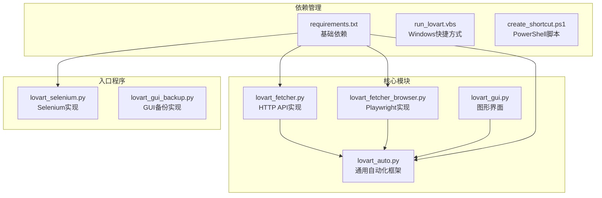
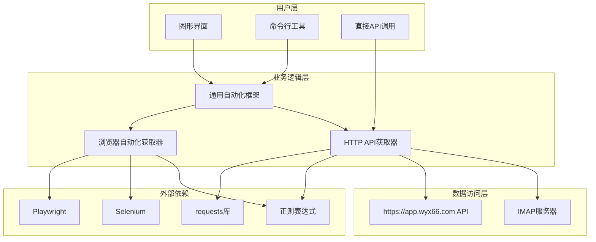
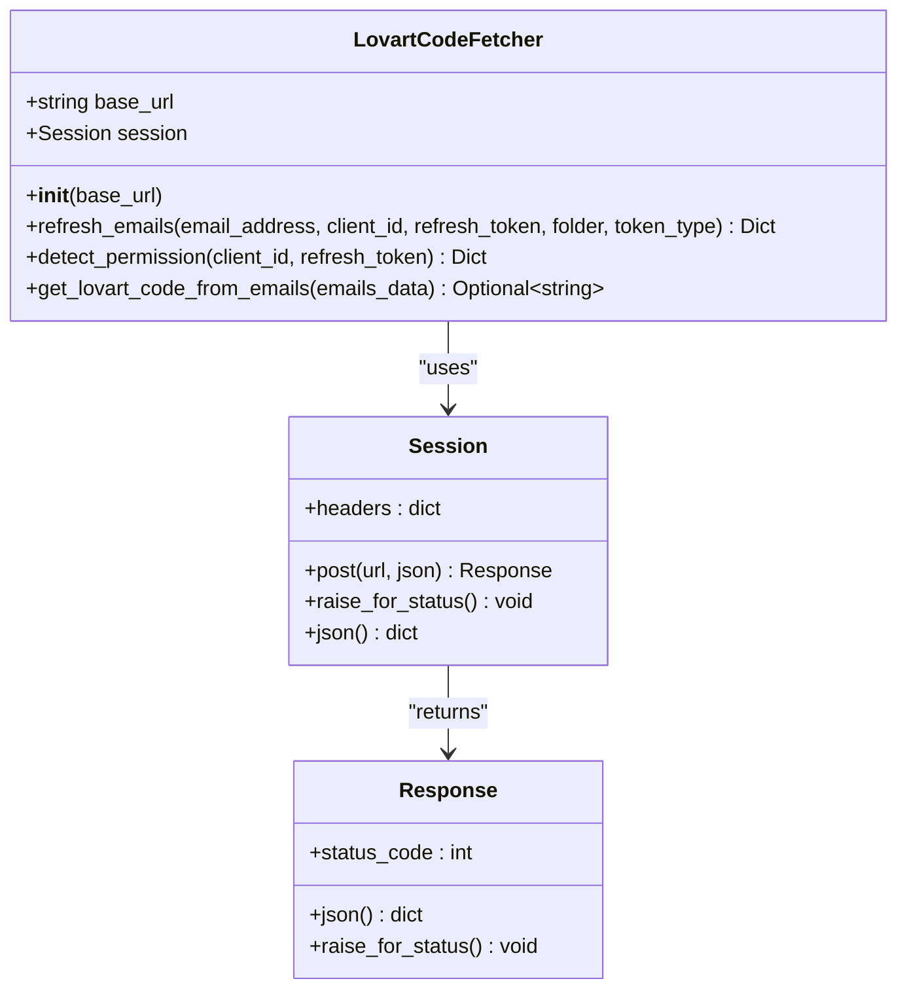
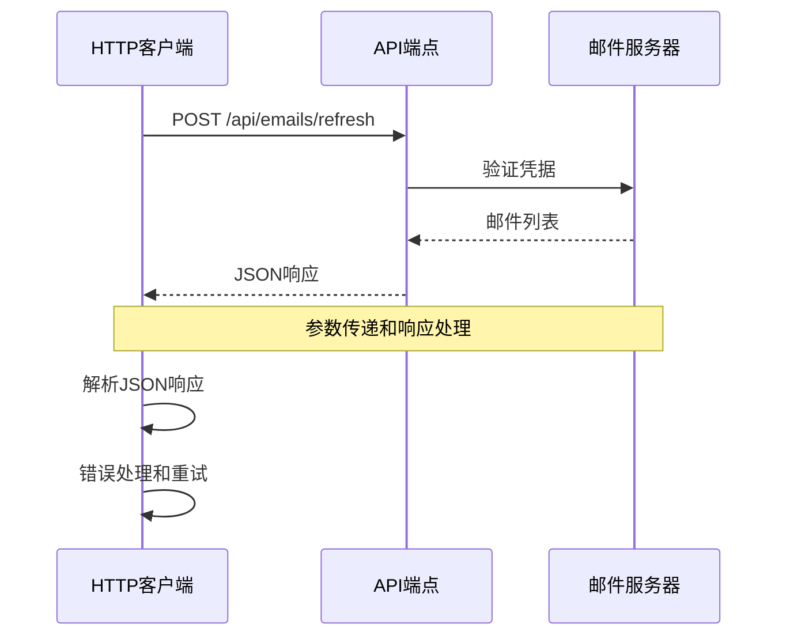
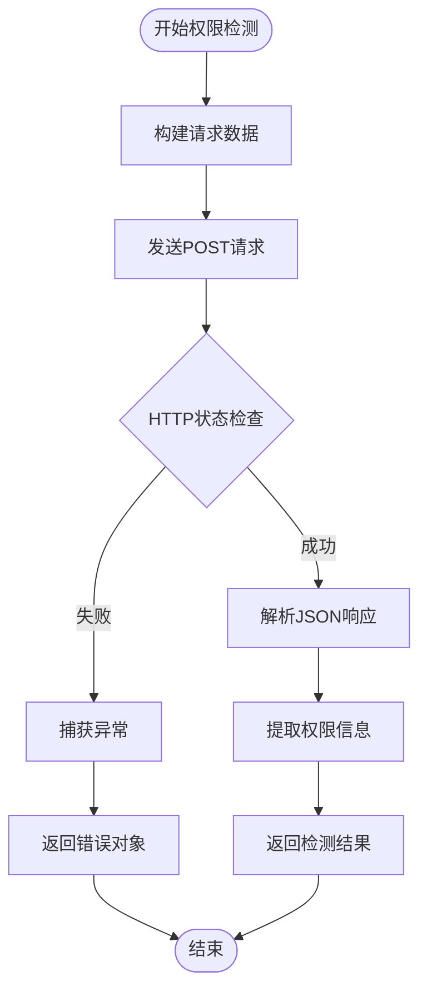
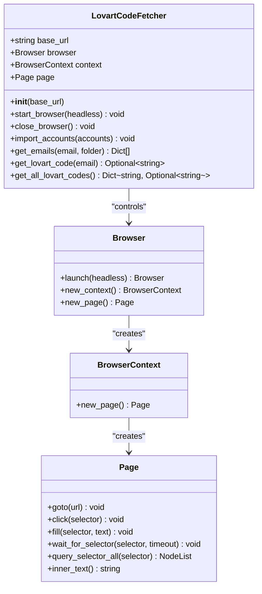
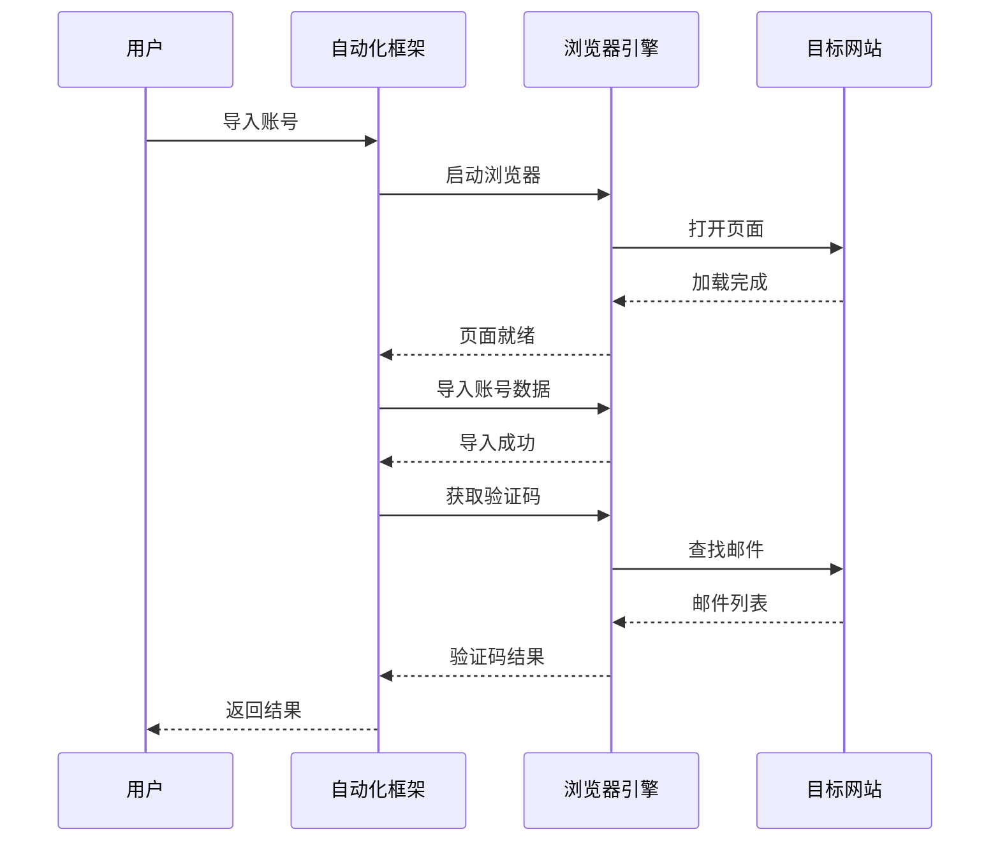
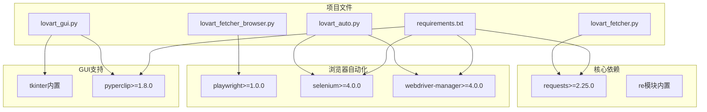

# Lovart验证码获取器

<cite>
**本文档引用的文件**
- [lovart_fetcher.py](file://lovart_fetcher.py)
- [lovart_fetcher_browser.py](file://lovart_fetcher_browser.py)
- [lovart_auto.py](file://lovart_auto.py)
- [lovart_gui.py](file://lovart_gui.py)
- [requirements.txt](file://requirements.txt)
</cite>

## 目录
1. [简介](#简介)
2. [项目结构](#项目结构)
3. [核心组件](#核心组件)
4. [架构概览](#架构概览)
5. [详细组件分析](#详细组件分析)
6. [依赖关系分析](#依赖关系分析)
7. [性能考量](#性能考量)
8. [故障排除指南](#故障排除指南)
9. [结论](#结论)
10. [附录](#附录)

## 简介
本项目提供多种方式自动获取Lovart验证码的服务，支持基于HTTP API的纯代码实现和基于浏览器自动化的两种主要模式。项目包含：
- HTTP API模式：通过requests库与https://app.wyx66.com进行交互，无需浏览器
- 浏览器自动化模式：使用Playwright或Selenium模拟用户操作
- 图形界面模式：提供完整的GUI应用，支持手动和自动两种模式

## 项目结构
项目采用模块化设计，每个功能都有独立的实现文件：



**图表来源**
- [lovart_fetcher.py:1-147](file://lovart_fetcher.py#L1-L147)
- [lovart_fetcher_browser.py:1-285](file://lovart_fetcher_browser.py#L1-L285)
- [lovart_auto.py:1-442](file://lovart_auto.py#L1-L442)
- [lovart_gui.py:1-1275](file://lovart_gui.py#L1-L1275)

**章节来源**
- [lovart_fetcher.py:1-147](file://lovart_fetcher.py#L1-L147)
- [lovart_fetcher_browser.py:1-285](file://lovart_fetcher_browser.py#L1-L285)
- [lovart_auto.py:1-442](file://lovart_auto.py#L1-L442)
- [lovart_gui.py:1-1275](file://lovart_gui.py#L1-L1275)

## 核心组件
项目包含三个主要的验证码获取器类：

### 1. HTTP API获取器
- **LovartCodeFetcher**：基于requests的HTTP客户端
- 支持邮箱刷新、权限检测、验证码提取
- 使用持久化Session管理连接

### 2. 浏览器自动化获取器
- **LovartCodeFetcher**：基于Playwright的自动化客户端
- 支持账号导入、邮件列表获取、验证码提取
- 完整的浏览器操作流程

### 3. 通用自动化框架
- **LovartFetcher**：统一的自动化接口
- 支持Playwright和Selenium双引擎
- 提供一致的API接口

**章节来源**
- [lovart_fetcher.py:12-103](file://lovart_fetcher.py#L12-L103)
- [lovart_fetcher_browser.py:25-231](file://lovart_fetcher_browser.py#L25-L231)
- [lovart_auto.py:45-310](file://lovart_auto.py#L45-L310)

## 架构概览



**图表来源**
- [lovart_fetcher.py:12-103](file://lovart_fetcher.py#L12-L103)
- [lovart_fetcher_browser.py:25-231](file://lovart_fetcher_browser.py#L25-L231)
- [lovart_auto.py:45-310](file://lovart_auto.py#L45-L310)

## 详细组件分析

### HTTP API获取器架构



**图表来源**
- [lovart_fetcher.py:12-103](file://lovart_fetcher.py#L12-L103)

#### 初始化过程
HTTP获取器的初始化包含以下关键步骤：
1. **基础URL配置**：默认指向`https://app.wyx66.com`
2. **Session创建**：使用requests.Session()建立持久连接
3. **请求头配置**：
   - User-Agent：模拟真实浏览器
   - Content-Type：application/json

#### HTTP会话管理
- 使用持久化Session减少连接开销
- 统一的请求头管理
- 异常处理和错误响应

**章节来源**
- [lovart_fetcher.py:13-19](file://lovart_fetcher.py#L13-L19)

### 邮件刷新功能实现



**图表来源**
- [lovart_fetcher.py:21-51](file://lovart_fetcher.py#L21-L51)

#### API端点调用
- **端点**：`/api/emails/refresh`
- **请求参数**：
  - email_address：邮箱地址
  - client_id：客户端ID
  - refresh_token：刷新令牌
  - folder：文件夹类型（默认inbox）
  - token_type：令牌类型（默认imap）

#### 参数传递和验证
- 使用JSON格式传递参数
- 支持IMAP和其他令牌类型
- 文件夹参数支持多种类型

#### 响应处理
- 使用response.raise_for_status()进行HTTP状态验证
- 解析JSON响应数据
- 统一的异常处理机制

**章节来源**
- [lovart_fetcher.py:36-51](file://lovart_fetcher.py#L36-L51)

### 权限检测机制



**图表来源**
- [lovart_fetcher.py:53-76](file://lovart_fetcher.py#L53-L76)

#### 工作流程
1. **请求构建**：client_id和refresh_token组合
2. **API调用**：POST到`/detect-permission`端点
3. **状态验证**：使用raise_for_status()检查HTTP状态
4. **结果解析**：返回JSON格式的权限信息

#### 安全考虑
- 凭证通过HTTPS传输
- 异常处理避免敏感信息泄露
- 返回标准化的错误对象

**章节来源**
- [lovart_fetcher.py:64-76](file://lovart_fetcher.py#L64-L76)

### 验证码提取算法

```mermaid
flowchart TD
Start([开始验证码提取]) --> ValidateInput["验证输入数据"]
ValidateInput --> CheckStructure{"检查数据结构"}
CheckStructure --> |messages存在| IterateMessages["遍历消息列表"]
CheckStructure --> |不存在| ReturnNone["返回None"]
IterateMessages --> FilterSender["过滤发件人"]
FilterSender --> CheckFrom{"发件人匹配?"}
CheckFrom --> |lovart@lovart.ai| CheckSubject["检查主题"]
CheckFrom --> |其他| NextMessage["下一个消息"]
CheckSubject --> CheckKeywords{"包含关键词?"}
CheckKeywords --> |welcome/verification| ExtractBody["提取邮件正文"]
CheckKeywords --> |否| NextMessage
ExtractBody --> RegexSearch["正则表达式搜索"]
RegexSearch --> FoundCode{"找到6位数字?"}
FoundCode --> |是| ReturnCode["返回验证码"]
FoundCode --> |否| NextMessage
NextMessage --> MoreMessages{"还有消息?"}
MoreMessages --> |是| IterateMessages
MoreMessages --> |否| ReturnNone
ReturnCode --> End([结束])
ReturnNone --> End
```

**图表来源**
- [lovart_fetcher.py:78-103](file://lovart_fetcher.py#L78-L103)

#### 邮件过滤逻辑
1. **发件人过滤**：严格匹配`lovart@lovart.ai`
2. **主题匹配**：检查包含"welcome to lovart"或"verification"
3. **内容提取**：从body字段获取邮件正文

#### HTML正文解析
- 使用正则表达式`r'(\d{6})'`提取6位数字
- 支持多种HTML标签格式
- 兼容不同的邮件客户端输出

#### 6位数字验证码提取
- 正则表达式：`\d{6}`
- 支持纯数字格式
- 忽略其他字符干扰

**章节来源**
- [lovart_fetcher.py:91-103](file://lovart_fetcher.py#L91-L103)

### 浏览器自动化获取器



**图表来源**
- [lovart_fetcher_browser.py:25-231](file://lovart_fetcher_browser.py#L25-L231)

#### 浏览器启动配置
- **Playwright集成**：自动安装Chromium浏览器
- **无头模式支持**：可通过参数控制
- **页面导航**：自动跳转到目标网站

#### 账号导入流程
1. **界面交互**：点击"导入邮箱"按钮
2. **数据格式化**：Tab分隔的四列数据
3. **批量导入**：支持追加导入和覆盖导入模式

#### 邮件列表获取
- **页面元素定位**：使用CSS选择器和XPath
- **邮件项解析**：提取发件人、主题、时间、预览
- **数据结构化**：返回标准化的字典列表

**章节来源**
- [lovart_fetcher_browser.py:32-133](file://lovart_fetcher_browser.py#L32-L133)

### 通用自动化框架



**图表来源**
- [lovart_auto.py:54-310](file://lovart_auto.py#L54-L310)

#### 双引擎支持
- **Playwright引擎**：现代浏览器自动化
- **Selenium引擎**：传统Web自动化
- **自动选择**：优先使用Playwright，降级到Selenium

#### 账号管理
- **导入格式**：email----password----client_id----refresh_token
- **导入模式**：支持追加和覆盖两种模式
- **批量处理**：支持多账号同时导入

#### 验证码提取策略
1. **邮件列表解析**：从邮件列表中查找Lovart相关邮件
2. **内容提取**：从邮件预览或正文提取验证码
3. **正则匹配**：使用\d{6}匹配6位数字验证码

**章节来源**
- [lovart_auto.py:95-240](file://lovart_auto.py#L95-L240)

## 依赖关系分析



**图表来源**
- [requirements.txt:1-3](file://requirements.txt#L1-L3)
- [lovart_fetcher.py:6-10](file://lovart_fetcher.py#L6-L10)
- [lovart_fetcher_browser.py:16-22](file://lovart_fetcher_browser.py#L16-L22)
- [lovart_auto.py:25-42](file://lovart_auto.py#L25-L42)
- [lovart_gui.py:41-72](file://lovart_gui.py#L41-L72)

### 依赖特性分析
- **HTTP API模式**：仅需requests库，轻量级依赖
- **浏览器自动化模式**：需要Playwright或Selenium及其驱动
- **GUI模式**：额外需要pyperclip支持剪贴板功能

**章节来源**
- [requirements.txt:1-3](file://requirements.txt#L1-L3)

## 性能考量

### HTTP API模式性能优化
1. **连接复用**：使用Session持久化TCP连接
2. **请求优化**：最小化请求体大小
3. **错误重试**：实现指数退避重试机制

### 浏览器自动化性能优化
1. **无头模式**：减少资源消耗
2. **页面缓存**：利用浏览器缓存机制
3. **异步操作**：使用等待策略避免硬等待

### 内存管理
- 及时释放浏览器资源
- 控制邮件列表大小
- 合理使用正则表达式

## 故障排除指南

### 常见问题及解决方案

#### HTTP API连接问题
- **症状**：网络连接超时或拒绝
- **原因**：网络不稳定或API限制
- **解决**：检查网络连接，增加重试次数

#### 浏览器启动失败
- **症状**：浏览器无法启动或崩溃
- **原因**：ChromeDriver版本不匹配
- **解决**：更新webdriver-manager，清理浏览器缓存

#### 验证码提取失败
- **症状**：无法找到验证码
- **原因**：邮件格式变化或网络延迟
- **解决**：增加等待时间，检查邮件内容格式

**章节来源**
- [lovart_fetcher.py:45-51](file://lovart_fetcher.py#L45-L51)
- [lovart_gui.py:186-191](file://lovart_gui.py#L186-L191)

## 结论
本项目提供了完整的Lovart验证码获取解决方案，具有以下特点：

1. **多模式支持**：HTTP API、浏览器自动化、GUI界面三种模式
2. **高可靠性**：完善的错误处理和重试机制
3. **易扩展性**：模块化设计便于功能扩展
4. **用户友好**：提供图形界面和命令行两种使用方式

推荐使用HTTP API模式进行生产环境部署，使用浏览器自动化模式进行测试和调试，使用GUI模式进行演示和教学用途。

## 附录

### 使用示例

#### HTTP API模式使用
```python
# 创建获取器实例
fetcher = LovartCodeFetcher()

# 刷新邮箱
result = fetcher.refresh_emails(
    email_address="example@hotmail.com",
    client_id="your_client_id",
    refresh_token="your_refresh_token"
)

# 提取验证码
code = fetcher.get_lovart_code_from_emails(result)
```

#### 浏览器自动化模式使用
```python
# 创建获取器实例
fetcher = LovartCodeFetcher()

# 启动浏览器
fetcher.start_browser(headless=False)

# 导入账号
accounts = [
    {
        "email": "example@hotmail.com",
        "password": "password",
        "client_id": "client_id",
        "refresh_token": "refresh_token"
    }
]
fetcher.import_accounts(accounts)

# 获取验证码
code = fetcher.get_all_lovart_codes()
```

### 最佳实践
1. **凭证管理**：使用环境变量存储敏感信息
2. **错误处理**：实现完善的异常捕获和日志记录
3. **性能监控**：监控API响应时间和浏览器性能
4. **安全考虑**：定期更新依赖库，遵循API使用条款