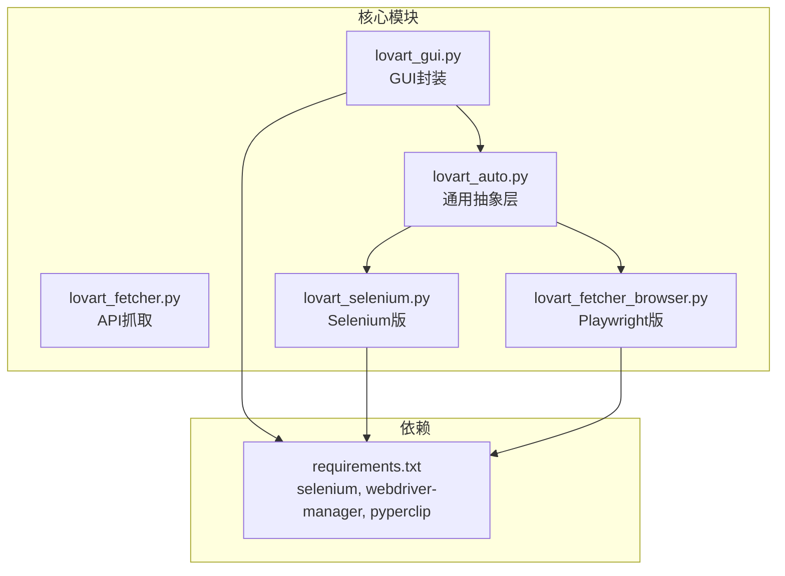
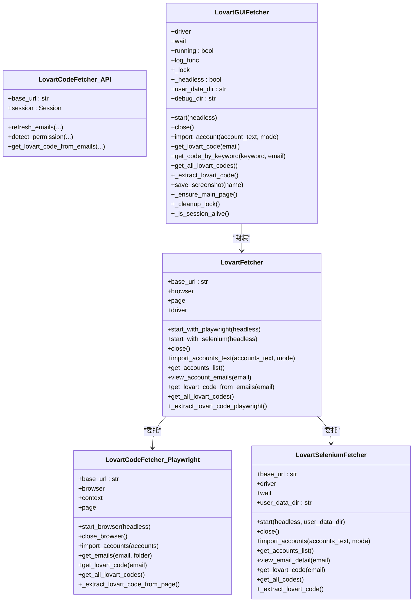
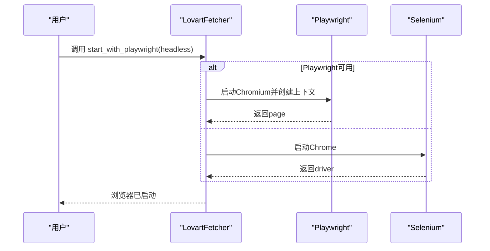
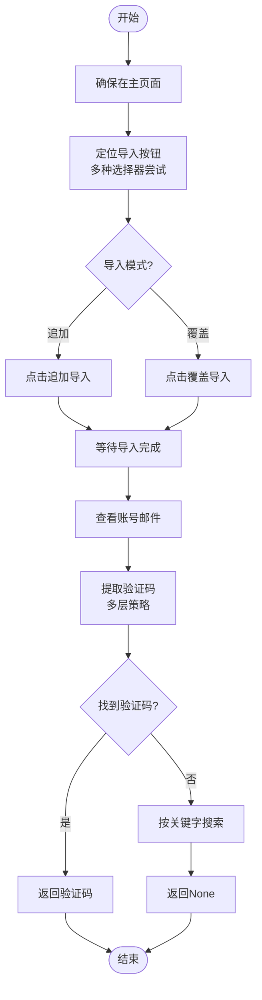
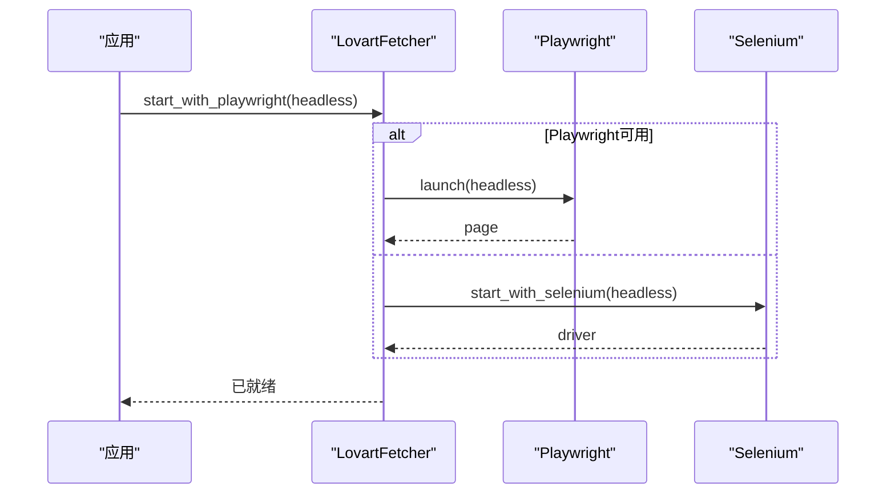
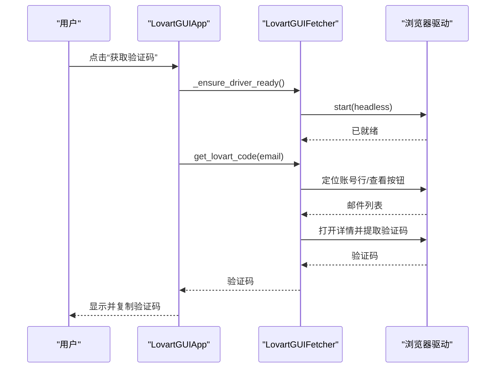
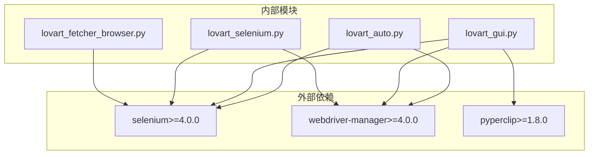

# 核心功能模块

<cite>
**本文档引用的文件**
- [lovart_fetcher.py](file://lovart_fetcher.py)
- [lovart_fetcher_browser.py](file://lovart_fetcher_browser.py)
- [lovart_selenium.py](file://lovart_selenium.py)
- [lovart_auto.py](file://lovart_auto.py)
- [lovart_gui.py](file://lovart_gui.py)
- [requirements.txt](file://requirements.txt)
</cite>

## 目录
1. [简介](#简介)
2. [项目结构](#项目结构)
3. [核心组件](#核心组件)
4. [架构总览](#架构总览)
5. [详细组件分析](#详细组件分析)
6. [依赖关系分析](#依赖关系分析)
7. [性能考虑](#性能考虑)
8. [故障排除指南](#故障排除指南)
9. [结论](#结论)
10. [附录](#附录)

## 简介
本项目围绕“Lovart验证码获取”这一核心业务目标，提供了多套自动化解决方案：
- 基于HTTP请求的纯API抓取（适用于已有邮件数据）
- 基于浏览器自动化（Selenium与Playwright）的端到端流程
- 基于GUI的交互式工具，支持手动与自动两种模式
- 多版本适配：从基础版本到GUI版本，逐步增强功能与可用性

文档重点分析LovartFetcher类的设计架构与实现原理，解释浏览器抽象层如何统一不同框架的接口，详述验证码提取算法的实现细节（HTML解析、正则表达式、多层查找策略），并给出错误处理与异常恢复策略、性能优化与内存管理建议，以及扩展与使用示例。

## 项目结构
项目采用按功能模块划分的组织方式，核心文件如下：
- lovart_fetcher.py：基础API抓取实现
- lovart_fetcher_browser.py：基于Playwright的浏览器自动化版本
- lovart_selenium.py：基于Selenium的浏览器自动化版本
- lovart_auto.py：通用浏览器抽象层（Selenium/Playwright双栈）
- lovart_gui.py：图形界面版本，封装了浏览器自动化与GUI交互
- requirements.txt：第三方依赖声明

图表来源
- [lovart_auto.py:45-94](file://lovart_auto.py#L45-L94)
- [lovart_selenium.py:31-45](file://lovart_selenium.py#L31-L45)
- [lovart_fetcher_browser.py:16-23](file://lovart_fetcher_browser.py#L16-L23)
- [lovart_gui.py:41-72](file://lovart_gui.py#L41-L72)
- [requirements.txt:1-3](file://requirements.txt#L1-L3)

章节来源
- [lovart_fetcher.py:1-147](file://lovart_fetcher.py#L1-L147)
- [lovart_fetcher_browser.py:1-285](file://lovart_fetcher_browser.py#L1-L285)
- [lovart_selenium.py:1-492](file://lovart_selenium.py#L1-L492)
- [lovart_auto.py:1-442](file://lovart_auto.py#L1-L442)
- [lovart_gui.py:1-1258](file://lovart_gui.py#L1-L1258)
- [requirements.txt:1-3](file://requirements.txt#L1-L3)

## 核心组件
本节聚焦于LovartFetcher类及其相关组件，涵盖类设计、方法定义、属性配置与职责边界。

- LovartCodeFetcher（API抓取）
  - 职责：通过HTTP请求刷新邮件、检测权限、从邮件数据中提取验证码
  - 关键属性：base_url、session（requests.Session）
  - 关键方法：refresh_emails、detect_permission、get_lovart_code_from_emails
  - 错误处理：捕获请求异常并返回错误字典

- LovartCodeFetcher（Playwright版）
  - 职责：启动/关闭浏览器、导入账号、获取邮件列表、提取验证码
  - 关键属性：browser、context、page
  - 关键方法：start_browser、close_browser、import_accounts、get_emails、get_lovart_code、get_all_lovart_codes、_extract_lovart_code_from_page
  - 错误处理：未启动时抛出异常；导入/点击等UI操作失败时抛出异常

- LovartSeleniumFetcher（Selenium版）
  - 职责：启动/关闭浏览器、导入账号、获取账号列表、查看邮件详情、提取验证码
  - 关键属性：driver、wait、user_data_dir
  - 关键方法：start、close、wait_and_click、import_accounts、get_accounts_list、view_email_detail、get_lovart_code、get_all_codes、_extract_lovart_code
  - 错误处理：导入按钮定位失败、元素不可见、iframe切换失败等均抛出异常

- LovartFetcher（通用抽象层）
  - 职责：统一Selenium与Playwright的接口，提供一致的API
  - 关键属性：browser/page、driver、playwright、context
  - 关键方法：start_with_playwright、start_with_selenium、close、import_accounts_text、get_accounts_list、view_account_emails、get_lovart_code_from_emails、get_all_lovart_codes、_extract_lovart_code_playwright
  - 设计亮点：动态选择浏览器引擎，兼容不同UI布局

- GUI封装（LovartGUIFetcher/LovartGUIApp）
  - 职责：提供图形界面，封装浏览器生命周期、账号导入、验证码提取、截图诊断、会话恢复
  - 关键属性：driver、wait、running、log_func、_lock、_headless、user_data_dir、debug_dir
  - 关键方法：start、close、import_account、get_lovart_code、get_code_by_keyword、get_all_lovart_codes、_extract_lovart_code、save_screenshot、_ensure_main_page、_cleanup_lock、_is_session_alive
  - 错误处理：会话失效自动重启、启动失败提示、截图诊断、多选择器容错

章节来源
- [lovart_fetcher.py:12-103](file://lovart_fetcher.py#L12-L103)
- [lovart_fetcher_browser.py:25-231](file://lovart_fetcher_browser.py#L25-L231)
- [lovart_selenium.py:47-376](file://lovart_selenium.py#L47-L376)
- [lovart_auto.py:45-310](file://lovart_auto.py#L45-L310)
- [lovart_gui.py:74-795](file://lovart_gui.py#L74-L795)

## 架构总览
本项目采用“抽象层 + 多实现 + GUI封装”的分层架构：
- 抽象层：LovartFetcher（通用抽象层）统一Selenium与Playwright
- 多实现：lovart_selenium.py（Selenium）、lovart_fetcher_browser.py（Playwright）
- GUI封装：lovart_gui.py在抽象层之上提供图形界面与交互逻辑
- API抓取：lovart_fetcher.py提供纯API路径，适合已有邮件数据场景

图表来源
- [lovart_fetcher.py:12-103](file://lovart_fetcher.py#L12-L103)
- [lovart_fetcher_browser.py:25-231](file://lovart_fetcher_browser.py#L25-L231)
- [lovart_selenium.py:47-376](file://lovart_selenium.py#L47-L376)
- [lovart_auto.py:45-310](file://lovart_auto.py#L45-L310)
- [lovart_gui.py:74-795](file://lovart_gui.py#L74-L795)

## 详细组件分析

### 组件A：LovartFetcher（通用抽象层）
- 设计理念
  - 通过start_with_playwright与start_with_selenium在运行时选择浏览器引擎
  - 统一导入账号、查看邮件、提取验证码的接口，屏蔽底层差异
  - 通过条件导入（Playwright优先）提升兼容性与稳定性
- 方法定义与职责
  - start_with_playwright/headless：启动Chromium并创建上下文
  - start_with_selenium/headless：启动Chrome并注入反检测参数
  - import_accounts_text：支持多种选择器定位导入按钮，支持“追加/覆盖”模式
  - get_accounts_list：分别适配Playwright与Selenium的表格解析
  - view_account_emails：统一邮件列表获取流程
  - get_lovart_code_from_emails：基于预解析的邮件列表提取验证码
  - get_all_lovart_codes：遍历账号并批量提取验证码
  - _extract_lovart_code_playwright：在Playwright下打开邮件详情并提取验证码
- 属性配置
  - base_url：目标站点URL
  - browser/page：Playwright实例
  - driver：Selenium实例
  - playwright：Playwright控制器
  - context：浏览器上下文
- 错误处理与异常恢复
  - 未启动时抛出异常，避免空引用
  - 导入按钮定位失败时抛出异常并记录页面源码片段
  - 会话失效时在GUI封装层自动重启浏览器
- 性能与内存
  - 复用浏览器实例，减少启动成本
  - 通过等待策略平衡稳定性与性能

图表来源
- [lovart_auto.py:54-84](file://lovart_auto.py#L54-L84)

章节来源
- [lovart_auto.py:45-310](file://lovart_auto.py#L45-L310)

### 组件B：验证码提取算法
- HTML解析与正则表达式
  - 预解析阶段：从表格行中提取邮箱地址，支持多种CSS选择器与正则兜底
  - 详情页阶段：在邮件详情中查找验证码，优先匹配包裹在标签内的6位数字，其次匹配独立的6位数字
  - 多层查找策略：
    1) iframe内查找（Ant Design表格等）
    2) 邮件列表项中查找（div/ul/li/tr等）
    3) 全页文本匹配（lovart附近6位数字）
    4) 直接body文本匹配
- 容错与健壮性
  - 多种选择器与多种XPath变体，提高定位成功率
  - 对不可见元素、遮挡按钮采用JS滚动与点击
  - 截图诊断（save_screenshot）辅助问题定位
- 异常恢复
  - 会话失效自动重启
  - 页面导航失败时强制回到主页
  - 导入按钮定位失败时打印页面源码片段便于分析

图表来源
- [lovart_gui.py:266-355](file://lovart_gui.py#L266-L355)
- [lovart_gui.py:356-431](file://lovart_gui.py#L356-L431)
- [lovart_gui.py:433-478](file://lovart_gui.py#L433-L478)
- [lovart_gui.py:654-749](file://lovart_gui.py#L654-L749)

章节来源
- [lovart_gui.py:356-749](file://lovart_gui.py#L356-L749)

### 组件C：浏览器抽象层设计
- 统一接口
  - start_with_playwright/start_with_selenium：启动浏览器并返回实例
  - import_accounts_text/get_accounts_list：导入账号与获取账号列表
  - view_account_emails/get_lovart_code_from_emails：查看邮件与提取验证码
  - get_all_lovart_codes：批量处理
- 适配不同UI布局
  - 通过多种CSS选择器与XPath变体适配不同布局
  - 对Ant Design表格、普通表格、列表等进行差异化处理
- 反检测与稳定性
  - 注入CDP脚本移除webdriver特征
  - 设置超时、禁用沙盒、远程允许等参数提升稳定性
  - 持久化用户数据目录，减少重复登录成本

图表来源
- [lovart_auto.py:54-84](file://lovart_auto.py#L54-L84)

章节来源
- [lovart_auto.py:45-310](file://lovart_auto.py#L45-L310)

### 组件D：GUI封装与交互
- 功能特性
  - 图形界面：账号输入、自动导入、手动模式、获取验证码、获取全部、行号查询、关键字查询
  - 日志系统：时间戳记录、状态栏滚动显示
  - 会话管理：自动检测失效、自动重启、锁机制保证线程安全
  - 诊断能力：截图保存、页面源码片段打印
- 使用方式
  - 自动导入：输入完整账号信息，自动导入并等待刷新
  - 手动模式：启动显式浏览器，手动操作
  - 批量获取：一键获取所有账号的验证码
  - 关键字查询：按关键字在邮件中查找最新验证码
- 扩展方式
  - 新增选择器：在导入、查看、提取等关键步骤增加更多定位策略
  - 增强日志：在关键节点添加更详细的日志与截图
  - 会话恢复：在异常时自动重试并恢复到主页面

图表来源
- [lovart_gui.py:956-970](file://lovart_gui.py#L956-L970)
- [lovart_gui.py:1006-1054](file://lovart_gui.py#L1006-L1054)
- [lovart_gui.py:654-749](file://lovart_gui.py#L654-L749)

章节来源
- [lovart_gui.py:798-1258](file://lovart_gui.py#L798-L1258)

## 依赖关系分析
- 第三方依赖
  - selenium>=4.0.0：Selenium自动化框架
  - webdriver-manager>=4.0.0：自动下载与管理ChromeDriver
  - pyperclip>=1.8.0：剪贴板操作（GUI版本）
- 内部依赖
  - lovart_auto.py依赖Playwright/Selenium（条件导入）
  - lovart_gui.py依赖selenium、webdriver-manager、pyperclip
  - lovart_selenium.py与lovart_fetcher_browser.py分别独立实现浏览器自动化

图表来源
- [requirements.txt:1-3](file://requirements.txt#L1-L3)
- [lovart_auto.py:25-42](file://lovart_auto.py#L25-L42)
- [lovart_gui.py:41-72](file://lovart_gui.py#L41-L72)
- [lovart_selenium.py:31-44](file://lovart_selenium.py#L31-L44)
- [lovart_fetcher_browser.py:16-23](file://lovart_fetcher_browser.py#L16-L23)

章节来源
- [requirements.txt:1-3](file://requirements.txt#L1-L3)
- [lovart_auto.py:25-42](file://lovart_auto.py#L25-L42)
- [lovart_gui.py:41-72](file://lovart_gui.py#L41-L72)
- [lovart_selenium.py:31-44](file://lovart_selenium.py#L31-L44)
- [lovart_fetcher_browser.py:16-23](file://lovart_fetcher_browser.py#L16-L23)

## 性能考虑
- 启动与会话复用
  - 复用浏览器实例，避免频繁启动Chrome/Chromium
  - 持久化用户数据目录，减少登录与初始化成本
- 等待策略
  - 使用WebDriverWait与固定等待相结合，平衡稳定性与速度
  - 对iframe、邮件列表加载设置合理超时
- 选择器优化
  - 优先使用稳定的选择器（如表格tbody tr），降低DOM遍历成本
  - 对Ant Design等复杂组件，使用更精确的CSS选择器
- 内存管理
  - 及时关闭浏览器与释放资源（driver.quit/close）
  - GUI封装中使用锁机制避免并发访问导致的资源竞争
- 反检测参数
  - 设置禁用沙盒、远程允许、窗口大小等参数，减少页面加载失败与崩溃

[本节提供一般性指导，无需特定文件来源]

## 故障排除指南
- 浏览器启动失败
  - 症状：启动崩溃、会话未创建、页面加载缓慢
  - 处理：清理锁定文件、结束残留进程、关闭所有Chrome窗口后重试
  - 参考：_cleanup_lock、_is_session_alive、start
- 导入按钮定位失败
  - 症状：找不到“导入邮箱”按钮
  - 处理：尝试多种选择器与XPath，打印页面源码片段辅助分析
  - 参考：import_account/import_accounts_text
- 验证码未找到
  - 症状：邮件列表为空或未匹配到lovart
  - 处理：检查账号是否导入成功、等待邮件刷新、使用关键字搜索
  - 参考：get_lovart_code、get_code_by_keyword、_extract_lovart_code
- 会话失效
  - 症状：页面跳转、元素不可见、操作失败
  - 处理：自动检测会话状态，必要时重启浏览器并回到主页面
  - 参考：_ensure_main_page、_is_session_alive、_cleanup_lock
- 截图诊断
  - 症状：页面布局变化、元素位置异常
  - 处理：保存诊断截图，结合日志定位问题
  - 参考：save_screenshot

章节来源
- [lovart_gui.py:100-134](file://lovart_gui.py#L100-L134)
- [lovart_gui.py:266-355](file://lovart_gui.py#L266-L355)
- [lovart_gui.py:356-431](file://lovart_gui.py#L356-L431)
- [lovart_gui.py:433-478](file://lovart_gui.py#L433-L478)
- [lovart_gui.py:572-603](file://lovart_gui.py#L572-L603)
- [lovart_gui.py:643-653](file://lovart_gui.py#L643-L653)

## 结论
本项目通过抽象层统一不同浏览器框架的接口，提供从API抓取到端到端自动化再到GUI交互的完整解决方案。验证码提取算法采用多层查找策略与正则表达式，结合截图诊断与会话恢复机制，显著提升了稳定性与可用性。建议在生产环境中：
- 优先使用GUI封装，兼顾易用性与稳定性
- 在复杂页面布局下，增加更多选择器与XPath变体
- 加强日志与截图能力，便于问题定位
- 合理设置等待与超时，平衡性能与可靠性

[本节为总结性内容，无需特定文件来源]

## 附录
- 使用示例（路径参考）
  - API抓取：[main函数:106-147](file://lovart_fetcher.py#L106-L147)
  - Playwright版：[main函数:234-285](file://lovart_fetcher_browser.py#L234-L285)
  - Selenium版：[main函数:415-492](file://lovart_selenium.py#L415-L492)
  - 通用抽象层：[main函数:357-442](file://lovart_auto.py#L357-L442)
  - GUI封装：[入口函数:1250-1258](file://lovart_gui.py#L1250-L1258)
- 扩展建议
  - 新增验证码格式支持（如带分隔符的验证码）
  - 增加重试与退避策略
  - 添加配置文件与命令行参数扩展

[本节为补充信息，无需特定文件来源]