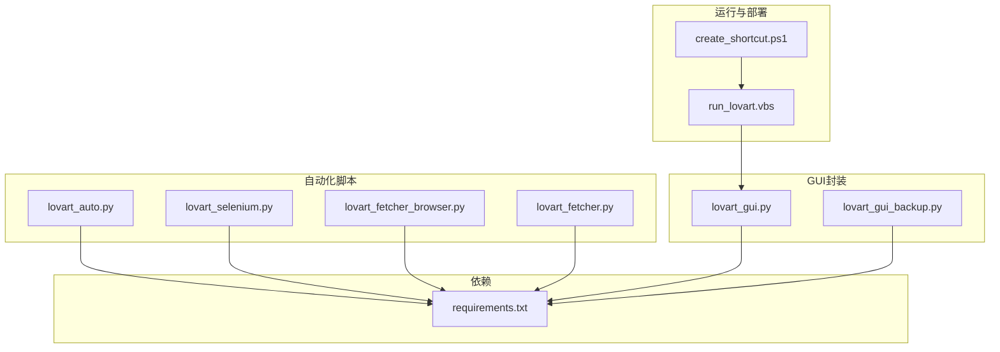
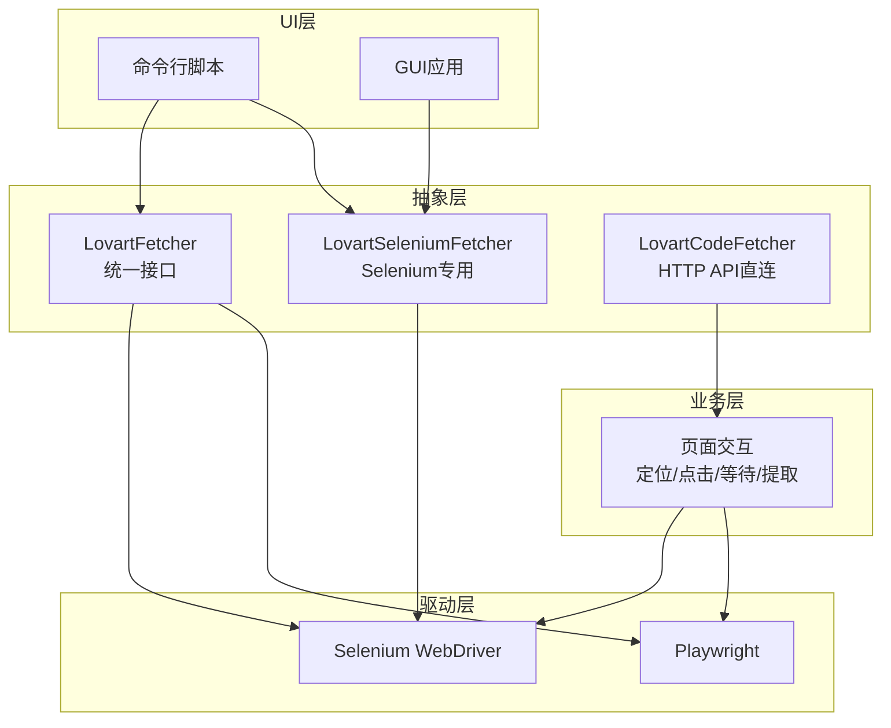
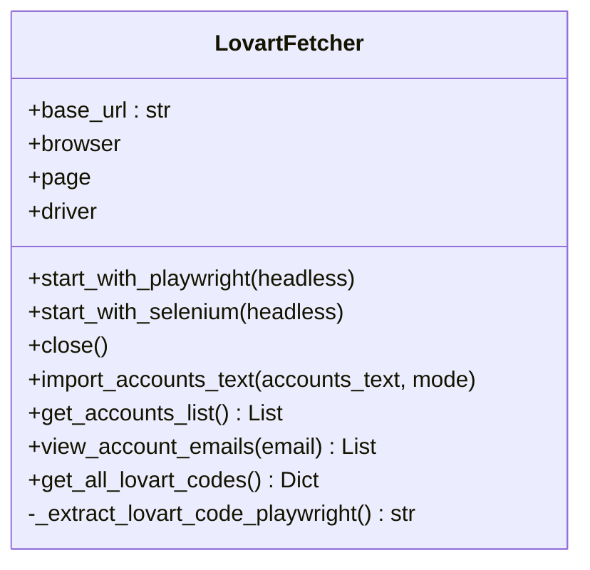
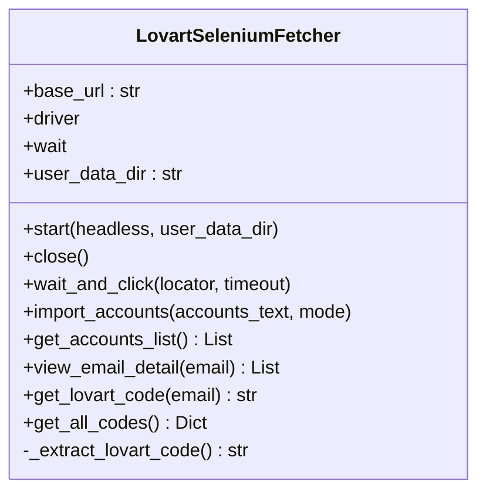
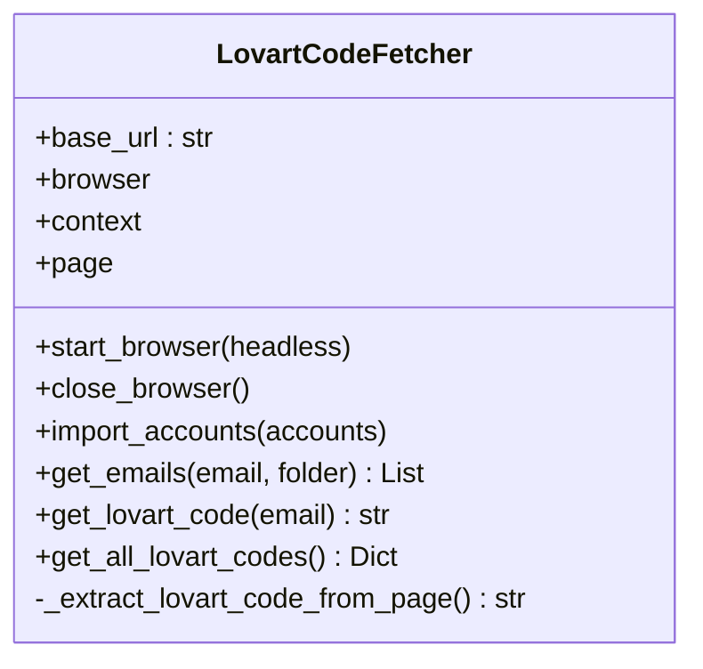
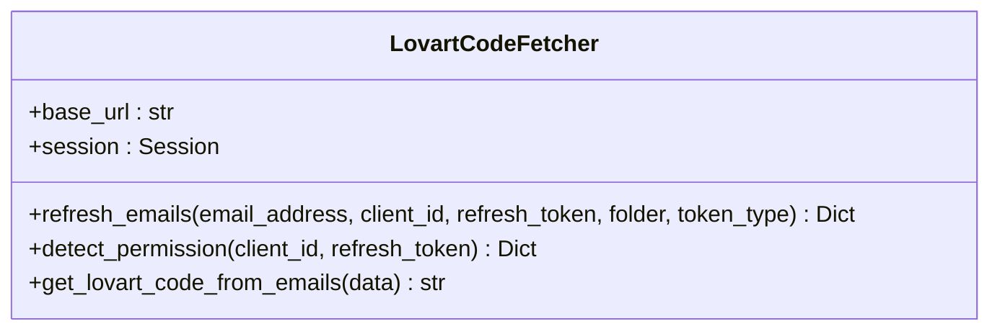
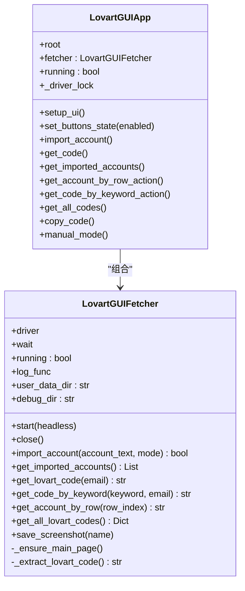
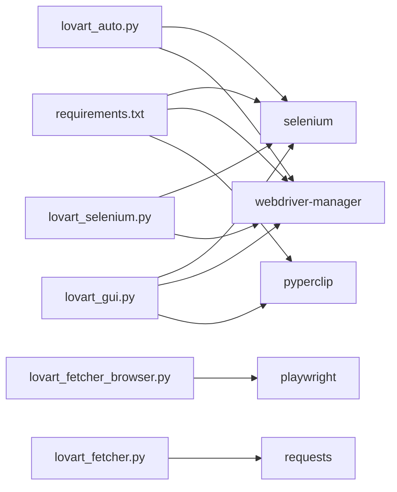

# 浏览器抽象层

<cite>
**本文引用的文件**
- [lovart_auto.py](file://lovart_auto.py)
- [lovart_fetcher.py](file://lovart_fetcher.py)
- [lovart_fetcher_browser.py](file://lovart_fetcher_browser.py)
- [lovart_selenium.py](file://lovart_selenium.py)
- [lovart_gui.py](file://lovart_gui.py)
- [lovart_gui_backup.py](file://lovart_gui_backup.py)
- [requirements.txt](file://requirements.txt)
- [run_lovart.vbs](file://run_lovart.vbs)
- [create_shortcut.ps1](file://create_shortcut.ps1)
</cite>

## 目录
1. [简介](#简介)
2. [项目结构](#项目结构)
3. [核心组件](#核心组件)
4. [架构总览](#架构总览)
5. [详细组件分析](#详细组件分析)
6. [依赖关系分析](#依赖关系分析)
7. [性能与可靠性考量](#性能与可靠性考量)
8. [故障排查指南](#故障排查指南)
9. [结论](#结论)
10. [附录](#附录)

## 简介
本项目围绕“Lovart验证码自动获取”场景，提供了多套浏览器自动化实现与GUI封装，涵盖Selenium与Playwright两种主流框架，并内置了会话管理、元素定位、数据提取、错误恢复与扩展支持等能力。本文档以“浏览器抽象层”的视角，系统梳理统一接口设计、驱动选择机制、会话管理策略、页面交互标准化流程、兼容性与错误恢复方案，以及扩展新浏览器支持的开发指南与测试策略。

## 项目结构
项目采用“功能模块 + 工具脚本”的组织方式：
- 自动化脚本：lovart_auto.py、lovart_selenium.py、lovart_fetcher_browser.py、lovart_fetcher.py
- GUI封装：lovart_gui.py（主版）、lovart_gui_backup.py（备份版）
- 运行与部署：run_lovart.vbs、create_shortcut.ps1
- 依赖声明：requirements.txt

图表来源
- [lovart_auto.py](file://lovart_auto.py)
- [lovart_selenium.py](file://lovart_selenium.py)
- [lovart_fetcher_browser.py](file://lovart_fetcher_browser.py)
- [lovart_fetcher.py](file://lovart_fetcher.py)
- [lovart_gui.py](file://lovart_gui.py)
- [lovart_gui_backup.py](file://lovart_gui_backup.py)
- [run_lovart.vbs](file://run_lovart.vbs)
- [create_shortcut.ps1](file://create_shortcut.ps1)
- [requirements.txt](file://requirements.txt)

章节来源
- [lovart_auto.py](file://lovart_auto.py)
- [lovart_selenium.py](file://lovart_selenium.py)
- [lovart_fetcher_browser.py](file://lovart_fetcher_browser.py)
- [lovart_fetcher.py](file://lovart_fetcher.py)
- [lovart_gui.py](file://lovart_gui.py)
- [lovart_gui_backup.py](file://lovart_gui_backup.py)
- [run_lovart.vbs](file://run_lovart.vbs)
- [create_shortcut.ps1](file://create_shortcut.ps1)
- [requirements.txt](file://requirements.txt)

## 核心组件
- 统一接口类：LovartFetcher（Selenium/Playwright双栈）、LovartSeleniumFetcher（Selenium专用）、LovartCodeFetcher（HTTP API直连）
- GUI封装：LovartGUIFetcher（Selenium）、LovartGUIApp（Tkinter界面）
- 工具与脚本：运行脚本、快捷方式生成脚本

章节来源
- [lovart_auto.py](file://lovart_auto.py)
- [lovart_selenium.py](file://lovart_selenium.py)
- [lovart_fetcher.py](file://lovart_fetcher.py)
- [lovart_gui.py](file://lovart_gui.py)

## 架构总览
整体架构由“抽象层 + 驱动层 + 业务层 + UI层”构成：
- 抽象层：统一的验证码获取接口（导入账号、刷新邮件、提取验证码、批量处理）
- 驱动层：Selenium与Playwright两种驱动实现
- 业务层：页面交互逻辑（元素定位、点击、等待、数据提取）
- UI层：命令行与GUI两种交互入口

图表来源
- [lovart_auto.py](file://lovart_auto.py)
- [lovart_selenium.py](file://lovart_selenium.py)
- [lovart_fetcher.py](file://lovart_fetcher.py)
- [lovart_gui.py](file://lovart_gui.py)

## 详细组件分析

### 组件A：统一接口类（LovartFetcher）
- 设计要点
  - 统一的生命周期管理：start_with_playwright/start_with_selenium/close
  - 统一的导入与提取接口：import_accounts_text/get_all_lovart_codes
  - 双栈兼容：通过条件导入与分支逻辑屏蔽框架差异
- 数据流
  - 启动 -> 导入账号 -> 刷新/等待 -> 邮件列表 -> 定位Lovart邮件 -> 提取验证码
- 错误处理
  - 框架缺失时抛出明确异常；页面元素定位失败时回退或等待

图表来源
- [lovart_auto.py](file://lovart_auto.py)

章节来源
- [lovart_auto.py](file://lovart_auto.py)

### 组件B：Selenium专用实现（LovartSeleniumFetcher）
- 设计要点
  - 会话持久化：user_data_dir + profile-directory
  - 防检测：移除webdriver特征、禁用自动化提示、合理窗口尺寸
  - 稳定性：WebDriverWait + 显式等待 + 异常捕获
- 页面交互
  - 多选择器容错：导入按钮、确认按钮、查看按钮
  - iframe/弹窗处理：切换frame、default_content、关闭对话框
- 批量处理：遍历账号行，逐个提取验证码

图表来源
- [lovart_selenium.py](file://lovart_selenium.py)

章节来源
- [lovart_selenium.py](file://lovart_selenium.py)

### 组件C：Playwright专用实现（LovartCodeFetcher）
- 设计要点
  - 同步Playwright：sync_playwright + chromium + new_context + new_page
  - 页面交互：click/fill/wait_for_selector/query_selector_all
- 页面交互
  - 导入账号、查看邮件、提取验证码（与Selenium版本一致的业务流程）

图表来源
- [lovart_fetcher_browser.py](file://lovart_fetcher_browser.py)

章节来源
- [lovart_fetcher_browser.py](file://lovart_fetcher_browser.py)

### 组件D：HTTP API直连实现（LovartCodeFetcher）
- 设计要点
  - 使用requests.Session进行会话复用
  - 通过POST刷新邮件、检测权限、提取验证码
- 适用场景
  - 不依赖浏览器渲染的纯API场景；需配合服务端返回的数据结构

图表来源
- [lovart_fetcher.py](file://lovart_fetcher.py)

章节来源
- [lovart_fetcher.py](file://lovart_fetcher.py)

### 组件E：GUI封装（LovartGUIFetcher + LovartGUIApp）
- 设计要点
  - 线程安全：使用锁避免并发访问驱动
  - 会话健康检查：_is_session_alive + 自动重启
  - 诊断能力：截图保存、日志输出、异常提示
  - 多模式：自动导入、手动模式、关键字查询、批量获取
- 页面交互
  - 行号定位、关键字搜索、iframe切换、弹窗关闭

图表来源
- [lovart_gui.py](file://lovart_gui.py)

章节来源
- [lovart_gui.py](file://lovart_gui.py)

### 组件F：运行与部署脚本
- run_lovart.vbs：以非交互方式启动GUI
- create_shortcut.ps1：在桌面创建快捷方式，指向VBS

章节来源
- [run_lovart.vbs](file://run_lovart.vbs)
- [create_shortcut.ps1](file://create_shortcut.ps1)

## 依赖关系分析
- 依赖声明：selenium、webdriver-manager、pyperclip
- 运行时动态导入：Selenium/Playwright按可用性选择
- GUI依赖：tkinter（标准库）、pyperclip（可选）

图表来源
- [requirements.txt](file://requirements.txt)
- [lovart_auto.py](file://lovart_auto.py)
- [lovart_selenium.py](file://lovart_selenium.py)
- [lovart_fetcher_browser.py](file://lovart_fetcher_browser.py)
- [lovart_fetcher.py](file://lovart_fetcher.py)
- [lovart_gui.py](file://lovart_gui.py)

章节来源
- [requirements.txt](file://requirements.txt)
- [lovart_auto.py](file://lovart_auto.py)
- [lovart_selenium.py](file://lovart_selenium.py)
- [lovart_fetcher_browser.py](file://lovart_fetcher_browser.py)
- [lovart_fetcher.py](file://lovart_fetcher.py)
- [lovart_gui.py](file://lovart_gui.py)

## 性能与可靠性考量
- 启动参数优化
  - 无头模式、固定窗口尺寸、禁用GPU、忽略证书错误等参数提升稳定性
- 等待策略
  - 显式等待（WebDriverWait）+ 隐式等待（sleep）结合，降低竞态
- 会话复用
  - requests.Session减少连接开销；Selenium持久化用户数据目录
- 防检测
  - 移除navigator.webdriver特征、禁用自动化标志、合理UA
- 资源释放
  - 显式quit/close，异常finally块保证资源回收

章节来源
- [lovart_selenium.py](file://lovart_selenium.py)
- [lovart_gui.py](file://lovart_gui.py)
- [lovart_auto.py](file://lovart_auto.py)

## 故障排查指南
- 启动失败
  - 检查依赖安装与版本；若ChromeDriver冲突，清理残留进程与锁文件
- 元素定位失败
  - 使用多种选择器；增加等待时间；必要时截图定位
- 会话失效
  - GUI封装提供会话健康检查与自动重启
- 验证码未提取
  - 检查iframe/弹窗；尝试关键字搜索；兜底正则提取

章节来源
- [lovart_gui.py](file://lovart_gui.py)
- [lovart_selenium.py](file://lovart_selenium.py)
- [lovart_auto.py](file://lovart_auto.py)

## 结论
本项目通过统一接口与多驱动适配，实现了浏览器自动化的一致体验；结合会话管理、元素定位、数据提取与错误恢复机制，形成了可扩展、可维护的抽象层。建议后续进一步完善：
- 抽象层接口标准化（定义清晰的接口契约）
- 工厂模式与策略模式的显式化
- 面向接口编程，便于接入更多驱动
- 增强测试覆盖率与可视化回归

## 附录

### 浏览器驱动选择机制与工厂模式
- 选择机制
  - 动态导入：优先Playwright，其次Selenium
  - 条件分支：根据可用性选择启动方式
- 工厂模式
  - 当前为简单分支；建议引入工厂类统一创建与销毁

章节来源
- [lovart_auto.py](file://lovart_auto.py)

### 会话管理策略
- Cookie与用户代理
  - Selenium：通过ChromeOptions设置；持久化用户数据目录
  - HTTP API：Session默认UA，可按需修改
- 浏览器状态维护
  - GUI封装提供会话健康检查与自动重启
  - 会话失效时清理锁文件并提示用户

章节来源
- [lovart_selenium.py](file://lovart_selenium.py)
- [lovart_gui.py](file://lovart_gui.py)
- [lovart_fetcher.py](file://lovart_fetcher.py)

### 页面交互标准化流程
- 元素定位：多选择器容错 + 显式等待
- 点击操作：JS滚动 + JS点击兜底
- 数据提取：优先iframe内/详情页，再回退全文本正则

章节来源
- [lovart_selenium.py](file://lovart_selenium.py)
- [lovart_gui.py](file://lovart_gui.py)
- [lovart_fetcher_browser.py](file://lovart_fetcher_browser.py)

### 浏览器兼容性与错误恢复
- 兼容性
  - 多种选择器与等待策略应对UI变化
  - 截图与日志辅助定位问题
- 错误恢复
  - 会话失效自动重启
  - 超时异常捕获与降级处理

章节来源
- [lovart_gui.py](file://lovart_gui.py)
- [lovart_selenium.py](file://lovart_selenium.py)

### 扩展新浏览器支持的开发指南
- 新增驱动步骤
  - 定义统一接口（导入、刷新、提取、批量）
  - 实现驱动适配类（启动、元素定位、点击、等待、提取）
  - 编写工厂类/注册表，按可用性选择
  - 补充测试用例与错误处理
- 测试策略
  - 单元测试：接口契约验证
  - 回归测试：关键UI流程（导入、查看、提取）
  - 可视化回归：截图对比

章节来源
- [lovart_auto.py](file://lovart_auto.py)
- [lovart_selenium.py](file://lovart_selenium.py)
- [lovart_fetcher_browser.py](file://lovart_fetcher_browser.py)