# Playwright集成详解

<cite>
**本文档引用的文件**
- [lovart_auto.py](file://lovart_auto.py)
- [lovart_fetcher_browser.py](file://lovart_fetcher_browser.py)
- [lovart_selenium.py](file://lovart_selenium.py)
- [lovart_gui.py](file://lovart_gui.py)
- [requirements.txt](file://requirements.txt)
- [run_lovart.vbs](file://run_lovart.vbs)
- [create_shortcut.ps1](file://create_shortcut.ps1)
</cite>

## 目录
1. [项目概述](#项目概述)
2. [Playwright核心特性](#playwright核心特性)
3. [浏览器启动配置](#浏览器启动配置)
4. [页面导航与元素交互](#页面导航与元素交互)
5. [选择器语法与定位策略](#选择器语法与定位策略)
6. [断言与查询机制](#断言与查询机制)
7. [性能优化策略](#性能优化策略)
8. [并发处理与多实例管理](#并发处理与多实例管理)
9. [内存管理与资源清理](#内存管理与资源清理)
10. [常见问题与调试技巧](#常见问题与调试技巧)
11. [最佳实践指南](#最佳实践指南)
12. [故障排除](#故障排除)

## 项目概述

本项目是一个自动化Lovart验证码获取工具，提供了多种浏览器自动化方案的实现。虽然主要使用Selenium，但代码库中包含了完整的Playwright集成示例，展示了现代浏览器自动化框架的强大功能。

项目采用模块化设计，支持：
- 命令行界面版本
- 图形界面版本  
- 纯代码集成版本
- 多种浏览器驱动支持

**章节来源**
- [lovart_auto.py:1-50](file://lovart_auto.py#L1-L50)
- [lovart_fetcher_browser.py:1-25](file://lovart_fetcher_browser.py#L1-L25)

## Playwright核心特性

### 同步与异步API支持

项目中的Playwright实现展示了两种主要的API模式：

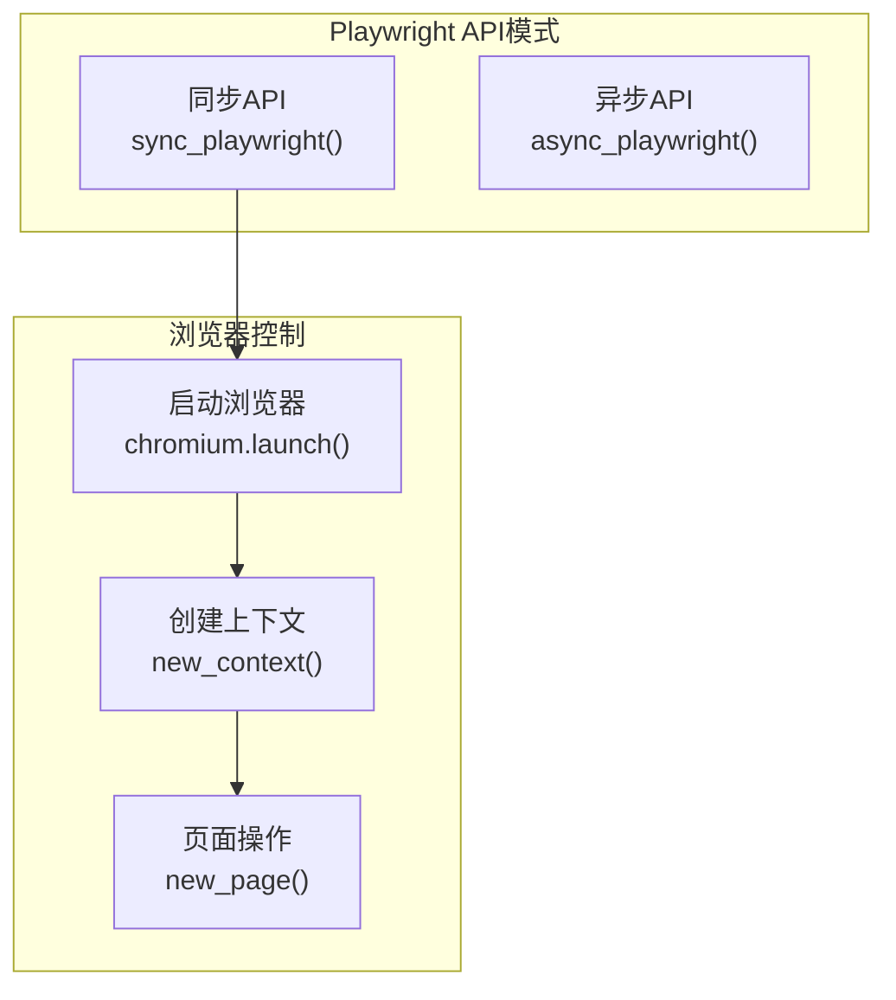

**图表来源**
- [lovart_auto.py:54-67](file://lovart_auto.py#L54-L67)
- [lovart_fetcher_browser.py:32-42](file://lovart_fetcher_browser.py#L32-L42)

### 多浏览器支持

Playwright支持多种浏览器引擎：
- Chromium内核
- Firefox内核  
- WebKit内核

**章节来源**
- [lovart_auto.py:26-30](file://lovart_auto.py#L26-L30)
- [lovart_fetcher_browser.py:17-22](file://lovart_fetcher_browser.py#L17-L22)

## 浏览器启动配置

### 基础启动流程

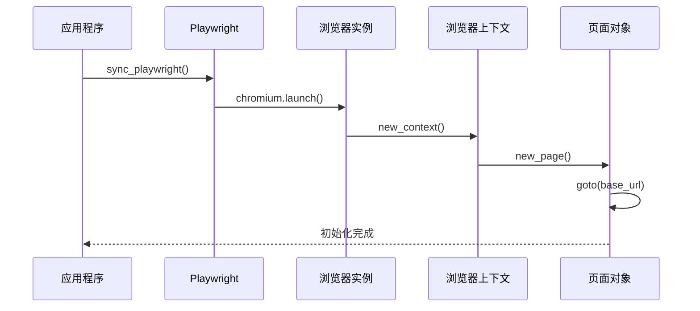

**图表来源**
- [lovart_auto.py:54-67](file://lovart_auto.py#L54-L67)
- [lovart_fetcher_browser.py:32-42](file://lovart_fetcher_browser.py#L32-L42)

### 无头模式配置

无头模式是Playwright的重要特性，适用于服务器环境和批量处理场景：

| 配置选项 | 默认值 | 描述 |
|---------|--------|------|
| headless | False | 是否启用无头模式 |
| viewport | 1280x720 | 视口尺寸设置 |
| slow_mo | None | 操作延迟设置 |
| devtools | False | 开发者工具启用 |

**章节来源**
- [lovart_auto.py:54-67](file://lovart_auto.py#L54-L67)
- [lovart_fetcher_browser.py:32-42](file://lovart_fetcher_browser.py#L32-L42)

### 上下文管理

Playwright的上下文管理提供了隔离的浏览环境：

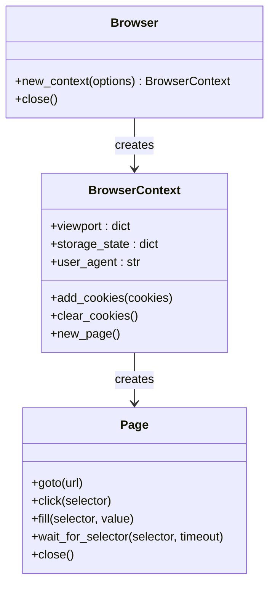

**图表来源**
- [lovart_auto.py:61-64](file://lovart_auto.py#L61-L64)
- [lovart_fetcher_browser.py:39-40](file://lovart_fetcher_browser.py#L39-L40)

**章节来源**
- [lovart_auto.py:61-67](file://lovart_auto.py#L61-L67)
- [lovart_fetcher_browser.py:39-42](file://lovart_fetcher_browser.py#L39-L42)

## 页面导航与元素交互

### 导航策略

Playwright提供了多种导航方法：

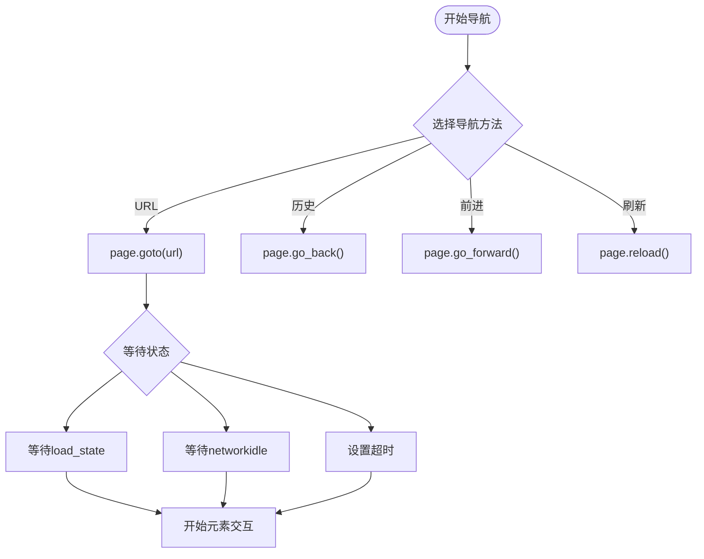

**图表来源**
- [lovart_auto.py:65](file://lovart_auto.py#L65)
- [lovart_fetcher_browser.py:41](file://lovart_fetcher_browser.py#L41)

### 元素交互API

| 方法 | 功能 | 参数 | 返回值 |
|------|------|------|--------|
| click() | 点击元素 | selector, options | Promise |
| fill() | 填充文本 | selector, value | Promise |
| type() | 模拟键盘输入 | selector, text, delay | Promise |
| hover() | 悬停元素 | selector | Promise |
| focus() | 聚焦元素 | selector | Promise |
| press() | 按键操作 | selector, key | Promise |

**章节来源**
- [lovart_auto.py:107-131](file://lovart_auto.py#L107-L131)
- [lovart_fetcher_browser.py:61-77](file://lovart_fetcher_browser.py#L61-L77)

### 等待策略

Playwright内置了智能等待机制：

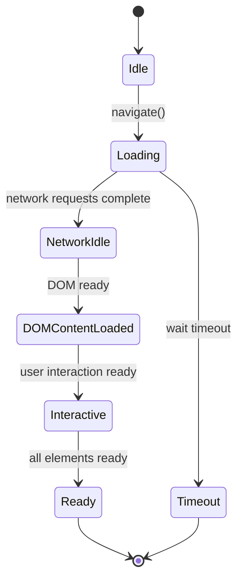

**图表来源**
- [lovart_auto.py:126](file://lovart_auto.py#L126)
- [lovart_fetcher_browser.py:110](file://lovart_fetcher_browser.py#L110)

**章节来源**
- [lovart_auto.py:126-131](file://lovart_auto.py#L126-L131)
- [lovart_fetcher_browser.py:120](file://lovart_fetcher_browser.py#L120)

## 选择器语法与定位策略

### 选择器类型对比

| 选择器类型 | Playwright语法 | Selenium语法 | 适用场景 |
|-----------|----------------|--------------|----------|
| 文本选择器 | `button:has-text("导入邮箱")` | `//button[contains(text(), '导入邮箱')]` | 动态文本匹配 |
| 属性选择器 | `input[name="email"]` | `//input[@name='email']` | 标准属性定位 |
| CSS选择器 | `.email-item` | `.email-item` | 类名定位 |
| XPath选择器 | `//div[@class='email-item']` | `//div[@class='email-item']` | 复杂层级定位 |
| 数据测试ID | `[data-testid="email-input"]` | `[data-testid="email-input"]` | 测试友好定位 |

**章节来源**
- [lovart_auto.py:107-108](file://lovart_auto.py#L107-L108)
- [lovart_fetcher_browser.py:61](file://lovart_fetcher_browser.py#L61)

### 动态内容处理

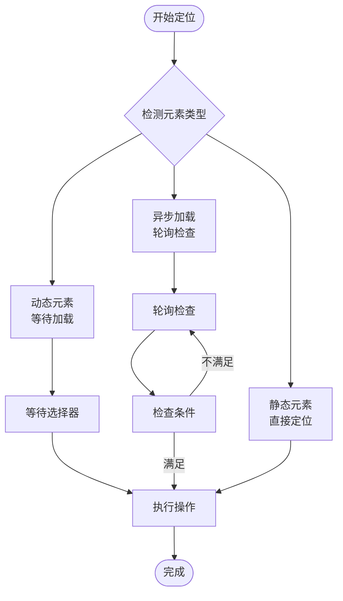

**图表来源**
- [lovart_auto.py:126](file://lovart_auto.py#L126)
- [lovart_fetcher_browser.py:77](file://lovart_fetcher_browser.py#L77)

**章节来源**
- [lovart_auto.py:141-151](file://lovart_auto.py#L141-L151)
- [lovart_fetcher_browser.py:124-131](file://lovart_fetcher_browser.py#L124-L131)

## 断言与查询机制

### 查询API对比

| 功能 | Playwright | Selenium |
|------|------------|----------|
| 单元素查询 | `query_selector()` | `find_element()` |
| 多元素查询 | `query_selector_all()` | `find_elements()` |
| 文本获取 | `inner_text()` | `.text` |
| 属性获取 | `get_attribute()` | `.get_attribute()` |
| HTML获取 | `inner_html()` | `.get_attribute('innerHTML')` |

**章节来源**
- [lovart_auto.py:141-151](file://lovart_auto.py#L141-L151)
- [lovart_fetcher_browser.py:182](file://lovart_fetcher_browser.py#L182)

### 断言策略

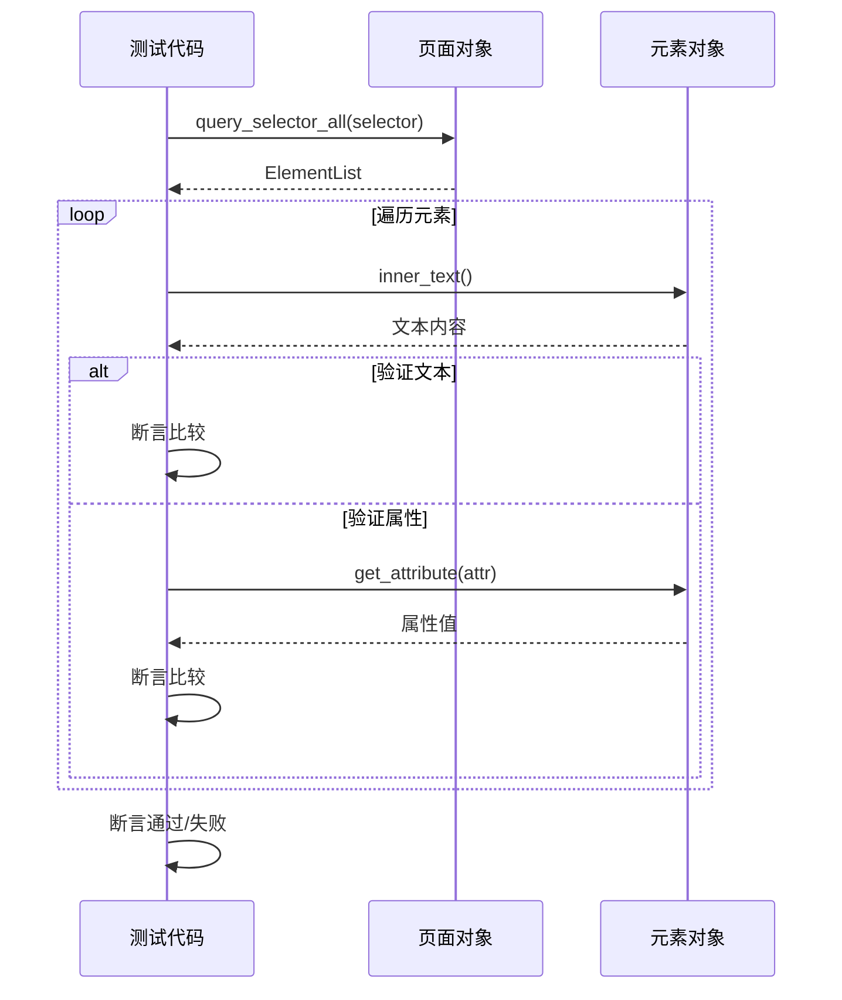

**图表来源**
- [lovart_auto.py:141-151](file://lovart_auto.py#L141-L151)
- [lovart_fetcher_browser.py:186](file://lovart_fetcher_browser.py#L186)

**章节来源**
- [lovart_auto.py:232-239](file://lovart_auto.py#L232-L239)
- [lovart_fetcher_browser.py:209-231](file://lovart_fetcher_browser.py#L209-L231)

## 性能优化策略

### 内存管理

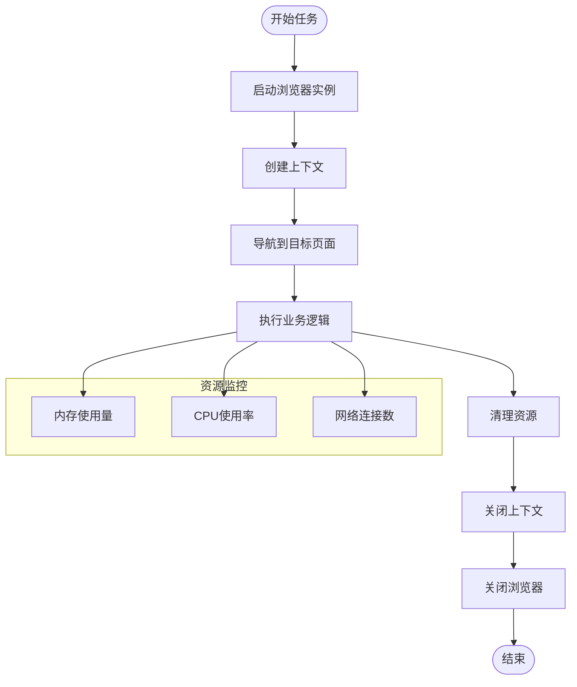

**图表来源**
- [lovart_auto.py:86-93](file://lovart_auto.py#L86-L93)
- [lovart_fetcher_browser.py:44-48](file://lovart_fetcher_browser.py#L44-L48)

### 缓存策略

| 缓存类型 | 实现方式 | 性能收益 |
|----------|----------|----------|
| Cookie缓存 | `context.storage_state()` | 减少登录时间 |
| LocalStorage | `page.evaluate()` | 保持用户状态 |
| 缓存页面 | `page.cache()` | 减少重复加载 |
| 会话复用 | `context.reuse()` | 提高并发效率 |

**章节来源**
- [lovart_auto.py:86-93](file://lovart_auto.py#L86-L93)
- [lovart_fetcher_browser.py:44-48](file://lovart_fetcher_browser.py#L44-L48)

## 并发处理与多实例管理

### 多实例架构

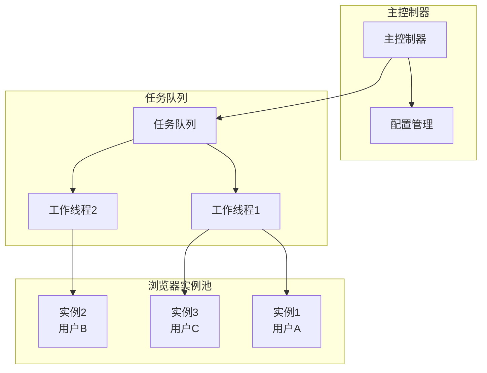

**图表来源**
- [lovart_auto.py:394-404](file://lovart_auto.py#L394-L404)
- [lovart_fetcher_browser.py:263-281](file://lovart_fetcher_browser.py#L263-L281)

### 并发控制策略

| 策略 | 实现方式 | 适用场景 |
|------|----------|----------|
| 信号量控制 | `threading.Semaphore(max_workers)` | 限制同时运行的实例数 |
| 任务队列 | `queue.Queue()` | 顺序处理任务 |
| 轮询调度 | `round_robin` | 平均分配负载 |
| 优先级队列 | `heapq` | 高优先级任务优先处理 |

**章节来源**
- [lovart_auto.py:394-404](file://lovart_auto.py#L394-L404)
- [lovart_fetcher_browser.py:263-281](file://lovart_fetcher_browser.py#L263-L281)

## 内存管理与资源清理

### 生命周期管理

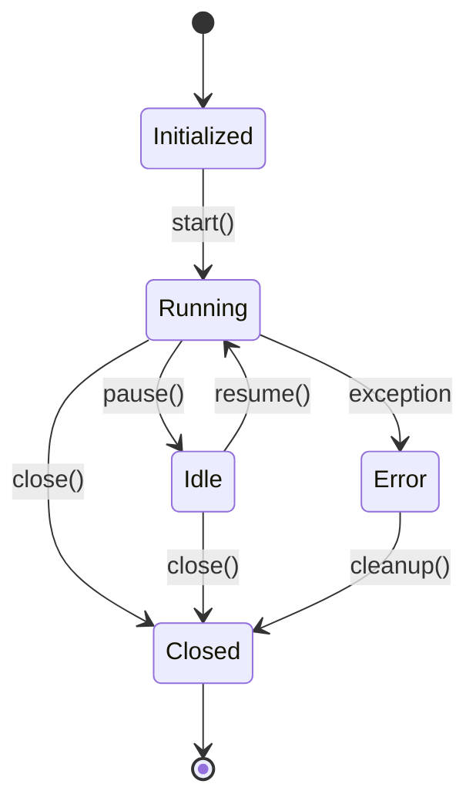

**图表来源**
- [lovart_auto.py:86-93](file://lovart_auto.py#L86-L93)
- [lovart_fetcher_browser.py:44-48](file://lovart_fetcher_browser.py#L44-L48)

### 资源清理策略

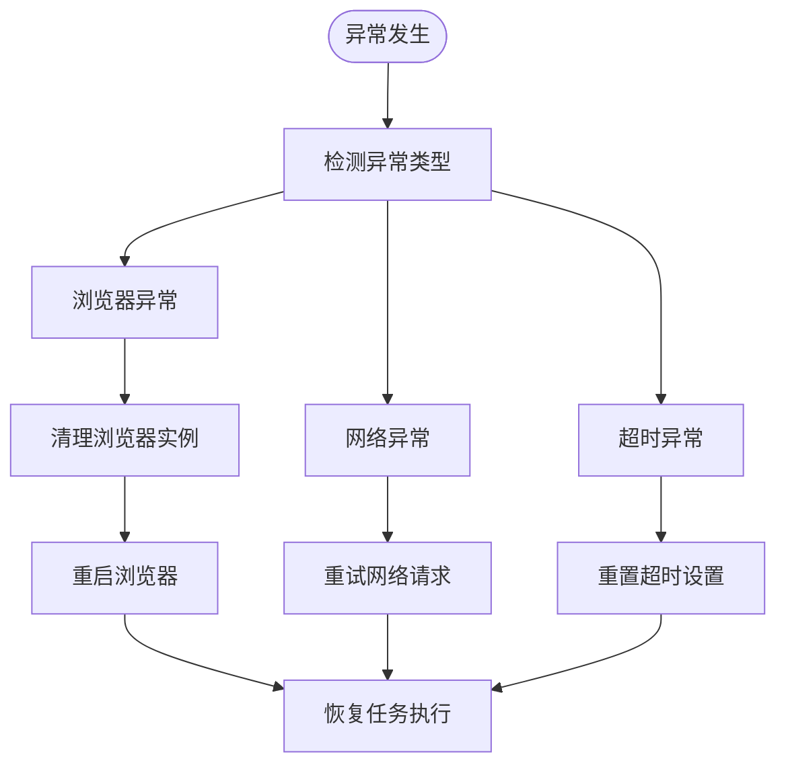

**图表来源**
- [lovart_auto.py:432-438](file://lovart_auto.py#L432-L438)
- [lovart_fetcher_browser.py:277-281](file://lovart_fetcher_browser.py#L277-L281)

**章节来源**
- [lovart_auto.py:432-438](file://lovart_auto.py#L432-L438)
- [lovart_fetcher_browser.py:277-281](file://lovart_fetcher_browser.py#L277-L281)

## 常见问题与调试技巧

### 启动问题排查

| 问题类型 | 症状 | 解决方案 |
|----------|------|----------|
| 浏览器启动失败 | `Session not created` | 检查Chrome版本兼容性 |
| 依赖缺失 | `ModuleNotFoundError` | 安装playwright依赖 |
| 权限问题 | `Permission denied` | 检查文件系统权限 |
| 端口占用 | `Address already in use` | 释放端口或修改端口 |

**章节来源**
- [lovart_auto.py:56-57](file://lovart_auto.py#L56-L57)
- [lovart_fetcher_browser.py:34-35](file://lovart_fetcher_browser.py#L34-L35)

### 元素定位问题

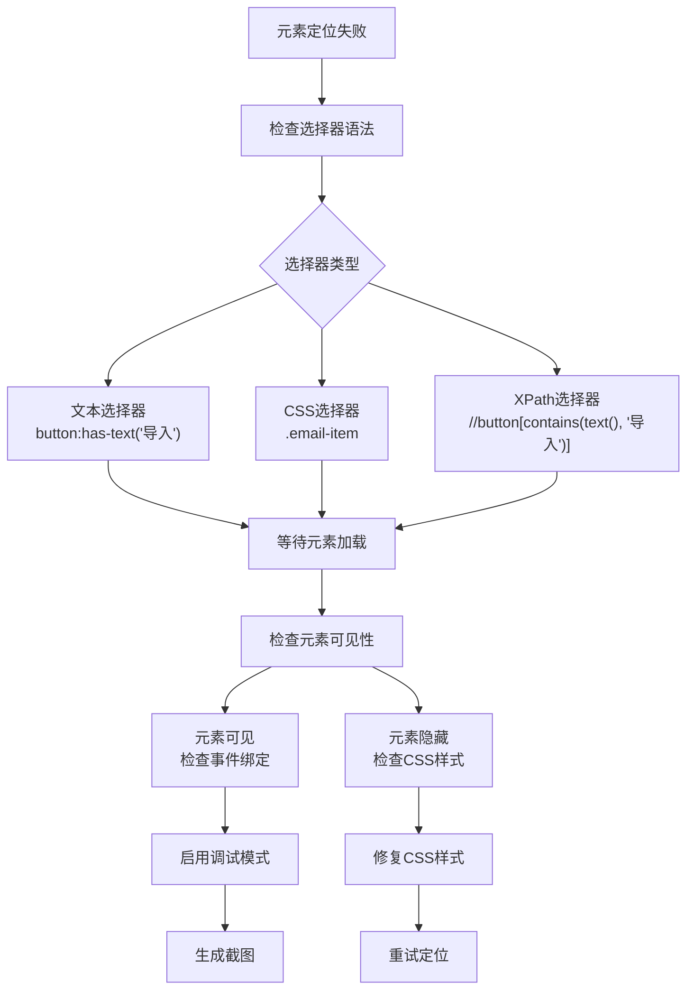

**图表来源**
- [lovart_auto.py:126](file://lovart_auto.py#L126)
- [lovart_fetcher_browser.py:77](file://lovart_fetcher_browser.py#L77)

### 调试工具使用

| 工具 | 功能 | 使用场景 |
|------|------|----------|
| 截图功能 | `page.screenshot()` | 问题定位和证据保留 |
| 源码导出 | `page.content()` | 分析页面结构 |
| 控制台日志 | `page.on('console')` | 调试JavaScript代码 |
| 网络监控 | `page.on('request')` | 分析网络请求 |

**章节来源**
- [lovart_auto.py:432-438](file://lovart_auto.py#L432-L438)
- [lovart_fetcher_browser.py:277-281](file://lovart_fetcher_browser.py#L277-L281)

## 最佳实践指南

### 错误处理策略

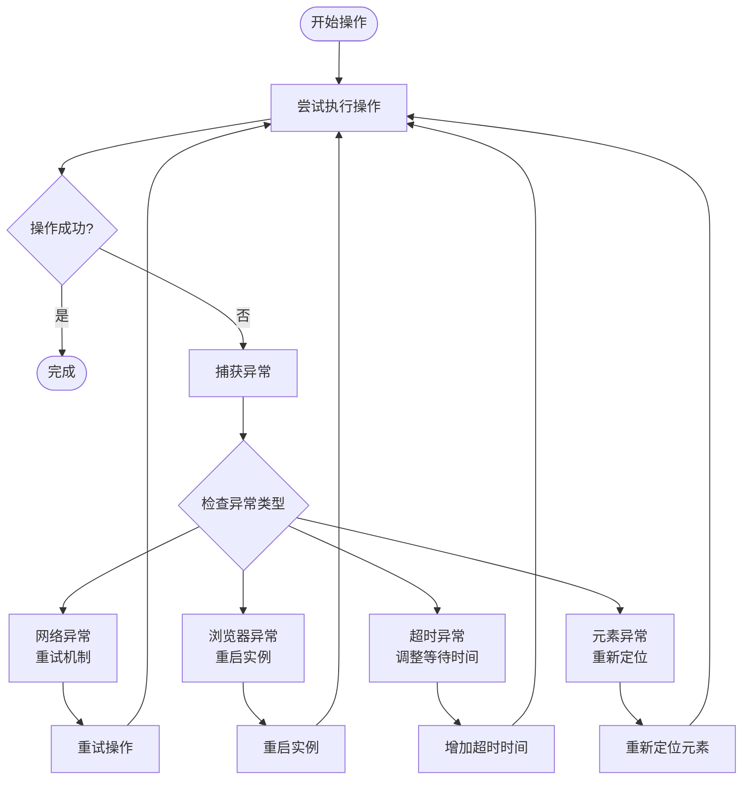

**图表来源**
- [lovart_auto.py:432-438](file://lovart_auto.py#L432-L438)
- [lovart_fetcher_browser.py:277-281](file://lovart_fetcher_browser.py#L277-L281)

### 性能优化建议

1. **合理设置超时时间**
   - 导航超时：30-60秒
   - 元素等待：10-30秒
   - 网络超时：15-45秒

2. **优化选择器性能**
   - 优先使用CSS选择器
   - 避免使用通配符选择器
   - 使用更精确的选择器限定范围

3. **资源管理优化**
   - 及时关闭不需要的上下文
   - 合理使用缓存机制
   - 监控内存使用情况

**章节来源**
- [lovart_auto.py:126](file://lovart_auto.py#L126)
- [lovart_fetcher_browser.py:110](file://lovart_fetcher_browser.py#L110)

## 故障排除

### 环境配置问题

| 问题 | 原因 | 解决方案 |
|------|------|----------|
| Playwright安装失败 | 网络问题或权限不足 | 使用代理或管理员权限 |
| 浏览器下载失败 | CDN访问受限 | 手动下载浏览器二进制文件 |
| Python版本不兼容 | 版本过低 | 升级到支持的Python版本 |

### 运行时错误

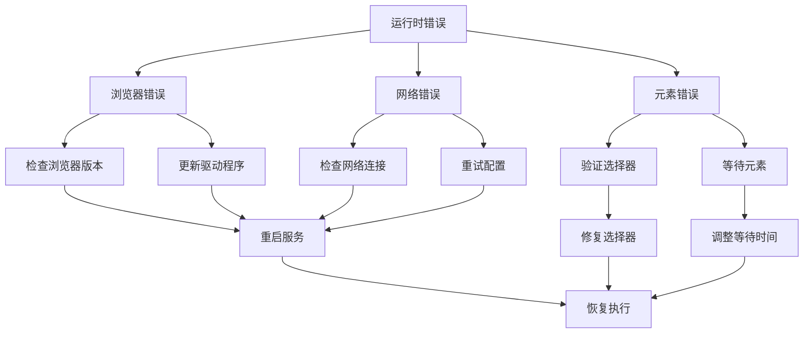

**图表来源**
- [lovart_auto.py:56-57](file://lovart_auto.py#L56-L57)
- [lovart_fetcher_browser.py:34-35](file://lovart_fetcher_browser.py#L34-L35)

### 日志分析

| 日志级别 | 用途 | 示例 |
|----------|------|------|
| DEBUG | 详细调试信息 | 元素定位过程 |
| INFO | 重要操作记录 | 页面导航记录 |
| WARNING | 警告信息 | 可能的问题 |
| ERROR | 错误信息 | 异常和错误 |

**章节来源**
- [lovart_auto.py:432-438](file://lovart_auto.py#L432-L438)
- [lovart_fetcher_browser.py:277-281](file://lovart_fetcher_browser.py#L277-L281)

通过以上详细的分析，我们可以看到Playwright在现代浏览器自动化中的强大功能和应用价值。项目中的实现示例展示了从基础配置到高级功能的完整使用流程，为开发者提供了宝贵的参考和实践经验。