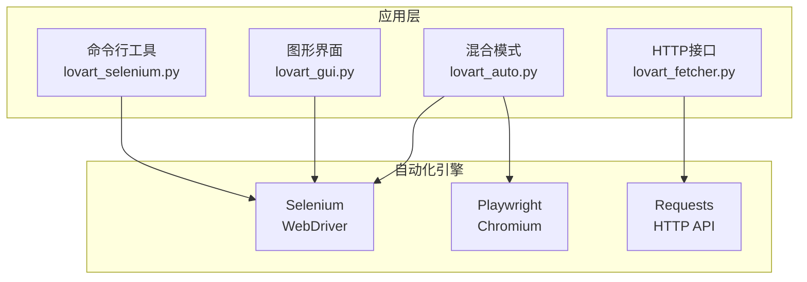
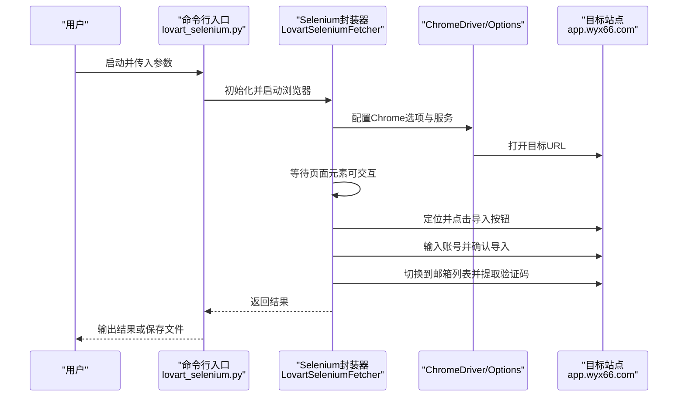
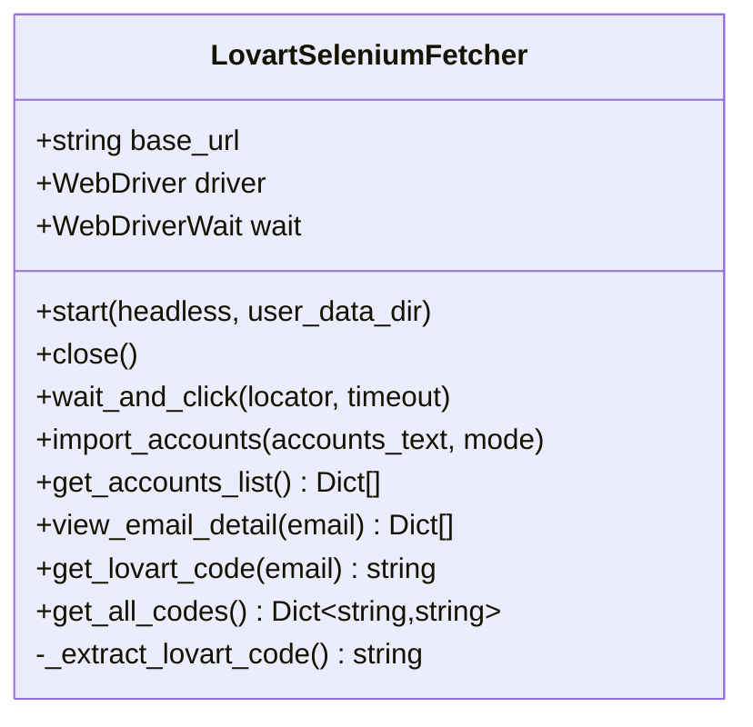
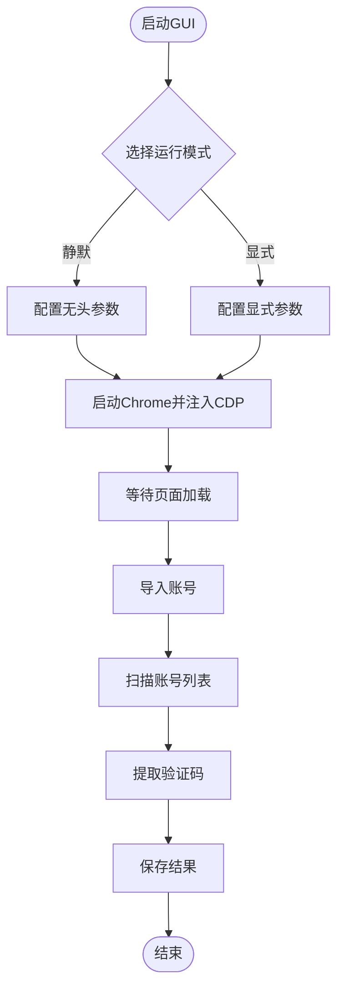
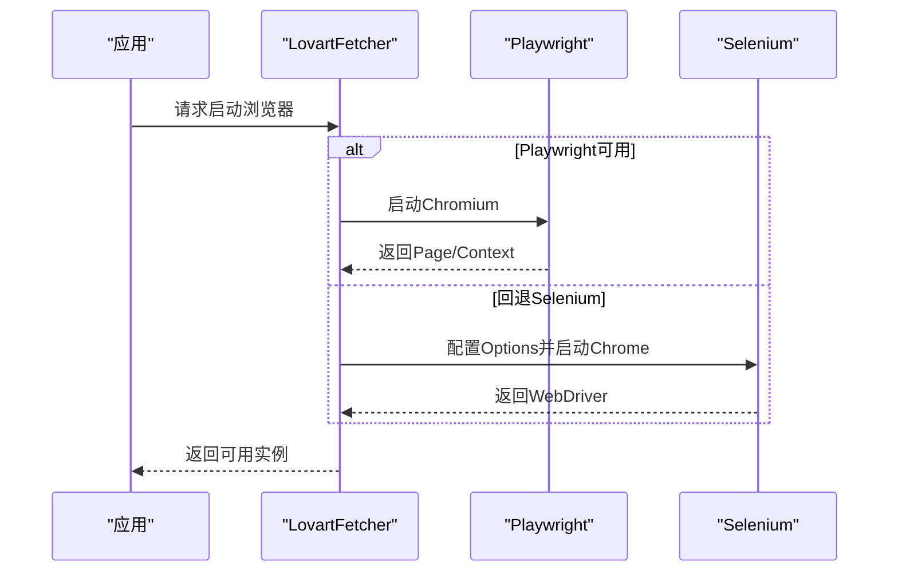
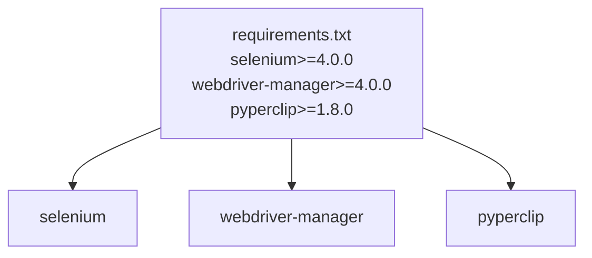

# Selenium集成详解

<cite>
**本文档引用的文件**
- [lovart_selenium.py](file://lovart_selenium.py)
- [lovart_fetcher_browser.py](file://lovart_fetcher_browser.py)
- [lovart_fetcher.py](file://lovart_fetcher.py)
- [lovart_auto.py](file://lovart_auto.py)
- [lovart_gui.py](file://lovart_gui.py)
- [requirements.txt](file://requirements.txt)
- [run_lovart.vbs](file://run_lovart.vbs)
- [create_shortcut.ps1](file://create_shortcut.ps1)
</cite>

## 目录
1. [简介](#简介)
2. [项目结构](#项目结构)
3. [核心组件](#核心组件)
4. [架构总览](#架构总览)
5. [详细组件分析](#详细组件分析)
6. [依赖关系分析](#依赖关系分析)
7. [性能考量](#性能考量)
8. [故障排除指南](#故障排除指南)
9. [结论](#结论)
10. [附录](#附录)

## 简介
本项目围绕Selenium WebDriver在自动化场景中的应用，提供了多版本的Lovart验证码获取工具，涵盖命令行、图形界面与混合方案。文档重点解释Selenium WebDriver的工作原理、Chrome驱动程序的配置策略（含无头模式、启动参数、安全选项）、WebDriverWait与显式等待的使用策略、元素定位与交互技术、以及版本兼容性与最佳实践。同时提供故障排除与性能调优建议，帮助读者在不同环境中稳定运行自动化流程。

## 项目结构
该项目采用模块化设计，围绕Selenium与Playwright两种自动化引擎提供不同形态的实现：
- 命令行Selenium版本：提供导入账号、获取验证码的完整CLI流程
- GUI版本：基于Tkinter构建的图形界面，支持静默/显式模式、截图诊断、多账号处理
- 混合版本：在同一脚本中优先使用Playwright，若不可用则回退到Selenium
- 纯HTTP版本：通过REST API直接获取邮件数据（非Selenium）

图表来源
- [lovart_selenium.py:47-376](file://lovart_selenium.py#L47-L376)
- [lovart_gui.py:74-795](file://lovart_gui.py#L74-L795)
- [lovart_auto.py:45-442](file://lovart_auto.py#L45-L442)
- [lovart_fetcher.py:12-103](file://lovart_fetcher.py#L12-L103)

章节来源
- [lovart_selenium.py:1-50](file://lovart_selenium.py#L1-L50)
- [lovart_gui.py:1-100](file://lovart_gui.py#L1-L100)
- [lovart_auto.py:1-50](file://lovart_auto.py#L1-L50)
- [lovart_fetcher.py:1-20](file://lovart_fetcher.py#L1-L20)

## 核心组件
- Selenium WebDriver封装类：统一启动Chrome、配置参数、等待策略、元素交互与异常处理
- GUI控制器：基于Tkinter的图形界面，支持静默/显式模式、截图诊断、多账号批量处理
- 混合模式适配器：优先使用Playwright，失败时回退Selenium，提升可用性
- HTTP API客户端：通过REST接口获取邮件数据，避免浏览器自动化复杂度

章节来源
- [lovart_selenium.py:47-120](file://lovart_selenium.py#L47-L120)
- [lovart_gui.py:74-165](file://lovart_gui.py#L74-L165)
- [lovart_auto.py:45-90](file://lovart_auto.py#L45-L90)
- [lovart_fetcher.py:12-52](file://lovart_fetcher.py#L12-L52)

## 架构总览
下图展示了Selenium在项目中的整体架构与关键交互点，包括浏览器启动、页面导航、元素定位、等待策略与异常处理。

图表来源
- [lovart_selenium.py:415-492](file://lovart_selenium.py#L415-L492)
- [lovart_selenium.py:59-114](file://lovart_selenium.py#L59-L114)
- [lovart_selenium.py:132-193](file://lovart_selenium.py#L132-L193)
- [lovart_selenium.py:268-293](file://lovart_selenium.py#L268-L293)

## 详细组件分析

### Selenium封装器（命令行）
该组件负责Selenium的完整生命周期管理，包括浏览器启动、参数配置、页面等待、元素交互与异常处理。

- 浏览器启动与参数配置
  - 无头模式：启用新内核无头模式与GPU禁用，设置窗口尺寸
  - 用户数据持久化：通过用户数据目录与配置目录参数确保持久化
  - 安全与反检测：移除自动化特征、禁用沙箱与共享内存限制、允许跨域访问
  - CDP注入：通过Chrome DevTools Protocol隐藏webdriver标志
  - 降级启动：当自动管理器失败时回退到本地ChromeDriver

- 显式等待与元素交互
  - 统一使用WebDriverWait与EC条件进行元素等待
  - 提供等待并点击封装方法，减少重复逻辑
  - 多选择器容错：导入按钮与确认按钮采用多种XPATH/CSS选择器组合

- 数据提取与验证码识别
  - 邮件列表解析：支持多种容器选择器与iframe嵌套
  - 验证码提取：优先在邮件详情中提取，其次在页面源码中正则匹配

图表来源
- [lovart_selenium.py:47-120](file://lovart_selenium.py#L47-L120)
- [lovart_selenium.py:121-193](file://lovart_selenium.py#L121-L193)
- [lovart_selenium.py:268-376](file://lovart_selenium.py#L268-L376)

章节来源
- [lovart_selenium.py:59-114](file://lovart_selenium.py#L59-L114)
- [lovart_selenium.py:121-193](file://lovart_selenium.py#L121-L193)
- [lovart_selenium.py:268-376](file://lovart_selenium.py#L268-L376)

### GUI控制器（图形界面）
GUI版本在Selenium基础上增加了用户交互、静默/显式模式切换、截图诊断与多账号批量处理能力。

- 模式切换与参数
  - 静默模式：启用新内核无头模式、禁用GPU、固定窗口尺寸
  - 显式模式：最大化窗口，便于人工观察
  - 用户数据持久化：使用绝对路径确保持久化目录稳定
  - 反检测参数：禁用自动化特征、忽略证书错误、首次运行优化

- 诊断与容错
  - 锁定文件清理：尝试清理Chrome锁定文件并结束残留进程
  - 会话健康检查：定期验证浏览器会话有效性
  - 截图诊断：在关键节点保存截图，辅助问题定位

- 多账号处理
  - 行号定位：根据表格行号获取邮箱地址
  - 关键字搜索：在邮件列表中按关键字定位最新邮件
  - 批量提取：遍历账号列表，逐个提取验证码并关闭对话框

图表来源
- [lovart_gui.py:98-165](file://lovart_gui.py#L98-L165)
- [lovart_gui.py:167-215](file://lovart_gui.py#L167-L215)
- [lovart_gui.py:315-394](file://lovart_gui.py#L315-L394)
- [lovart_gui.py:572-603](file://lovart_gui.py#L572-L603)

章节来源
- [lovart_gui.py:98-165](file://lovart_gui.py#L98-L165)
- [lovart_gui.py:167-215](file://lovart_gui.py#L167-L215)
- [lovart_gui.py:315-394](file://lovart_gui.py#L315-L394)
- [lovart_gui.py:572-603](file://lovart_gui.py#L572-L603)

### 混合模式适配器
该组件在Playwright与Selenium之间进行动态选择，提升部署灵活性与可用性。

- 引擎选择策略
  - 优先使用Playwright：提供更稳定的页面控制与等待机制
  - 回退Selenium：当Playwright不可用时，使用Selenium进行兼容

- 参数与等待差异
  - Playwright：使用wait_for_timeout与wait_for_selector进行等待
  - Selenium：使用WebDriverWait与EC条件进行等待

图表来源
- [lovart_auto.py:394-404](file://lovart_auto.py#L394-L404)
- [lovart_auto.py:54-84](file://lovart_auto.py#L54-L84)

章节来源
- [lovart_auto.py:394-404](file://lovart_auto.py#L394-L404)
- [lovart_auto.py:54-84](file://lovart_auto.py#L54-L84)

### HTTP API客户端
该组件通过REST API直接获取邮件数据，避免浏览器自动化带来的复杂性与不稳定因素。

- 功能特性
  - 刷新邮件：向后端API发起刷新请求
  - 权限检测：检测账号权限类型
  - 验证码提取：从API返回的JSON中提取Lovart验证码

- 适用场景
  - 对稳定性要求较高且具备API访问权限的场景
  - 避免浏览器自动化带来的资源消耗与兼容性问题

章节来源
- [lovart_fetcher.py:21-52](file://lovart_fetcher.py#L21-L52)
- [lovart_fetcher.py:53-76](file://lovart_fetcher.py#L53-L76)
- [lovart_fetcher.py:78-103](file://lovart_fetcher.py#L78-L103)

## 依赖关系分析
项目对Selenium与相关工具的依赖关系如下：

图表来源
- [requirements.txt:1-3](file://requirements.txt#L1-L3)

章节来源
- [requirements.txt:1-3](file://requirements.txt#L1-L3)

## 性能考量
- 启动参数优化
  - 禁用沙箱与共享内存限制以提升稳定性
  - 设置窗口尺寸与禁用GPU以降低资源占用
  - 使用持久化用户数据目录减少重复登录成本

- 等待策略
  - 显式等待优于硬编码sleep，提高稳定性与效率
  - 多选择器容错减少因页面结构调整导致的失败

- 资源管理
  - 合理设置页面加载与脚本超时时间
  - 在GUI模式下提供截图诊断，便于快速定位问题

- 并发与批处理
  - GUI版本支持多账号批量处理，减少重复启动成本
  - 混合模式在可用时优先使用Playwright，提升整体性能

## 故障排除指南
- 浏览器启动失败
  - 清理锁定文件并结束残留进程
  - 确保Chrome与ChromeDriver版本兼容
  - 在静默模式下排查网络与证书问题

- 元素定位失败
  - 使用多种选择器组合进行容错
  - 在关键节点保存截图，结合页面源码分析
  - 检查iframe嵌套与动态内容加载

- 验证码提取失败
  - 优先在邮件详情中提取，其次在页面源码中正则匹配
  - 使用关键字搜索定位最新邮件
  - 对于特殊布局，采用全页文本扫描兜底

- 会话失效
  - 定期检查浏览器会话有效性
  - 在导航到目标站点前强制刷新页面
  - 在多标签页场景中确保回到主窗口句柄

章节来源
- [lovart_gui.py:100-125](file://lovart_gui.py#L100-L125)
- [lovart_gui.py:572-603](file://lovart_gui.py#L572-L603)
- [lovart_selenium.py:121-193](file://lovart_selenium.py#L121-L193)

## 结论
本项目通过Selenium WebDriver实现了从目标站点自动获取Lovart验证码的完整流程，涵盖了命令行、图形界面与混合模式等多种使用形态。通过对Chrome驱动程序的参数优化、显式等待策略、元素定位与交互技术的深入应用，以及完善的故障排除与性能调优建议，为读者提供了可复用的Selenium集成实践范例。建议在生产环境中优先采用GUI版本或混合模式，结合截图诊断与会话健康检查，确保自动化流程的稳定性与可维护性。

## 附录
- 快速启动
  - 命令行：python lovart_selenium.py --import "<账号文本>" --headless
  - GUI：双击run_lovart.vbs或直接运行python lovart_gui.py
  - 混合：python lovart_auto.py --accounts "<账号文本>" --headless

- 版本兼容性
  - Selenium >= 4.0.0
  - webdriver-manager >= 4.0.0
  - Python 3.8+

- 最佳实践
  - 优先使用显式等待与多选择器容错
  - 在静默模式下配合截图诊断
  - 合理设置超时与重试策略
  - 确保持久化用户数据目录稳定