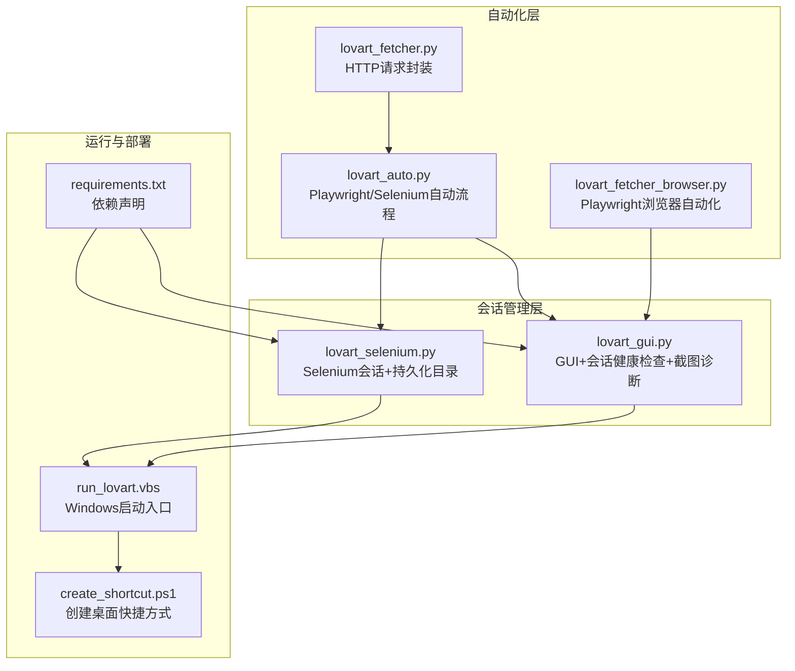
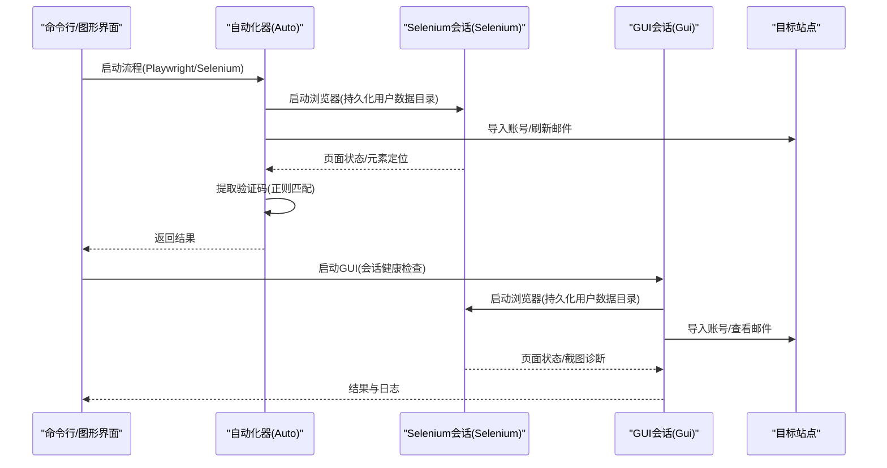
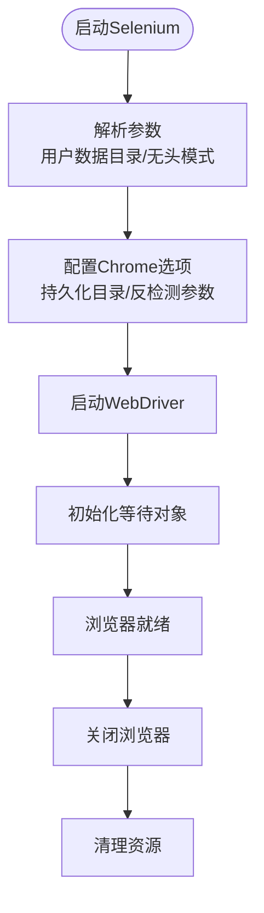
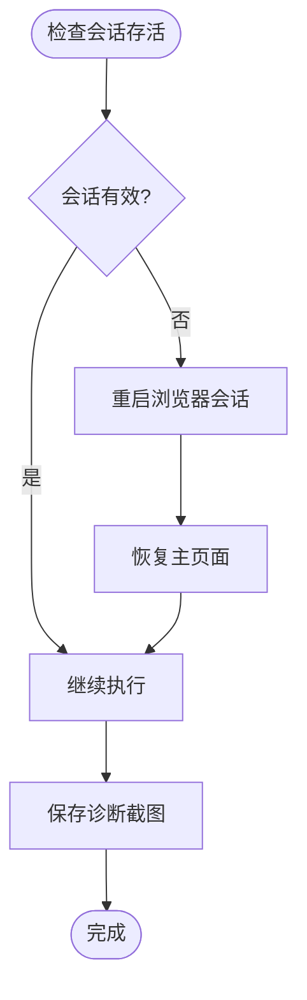
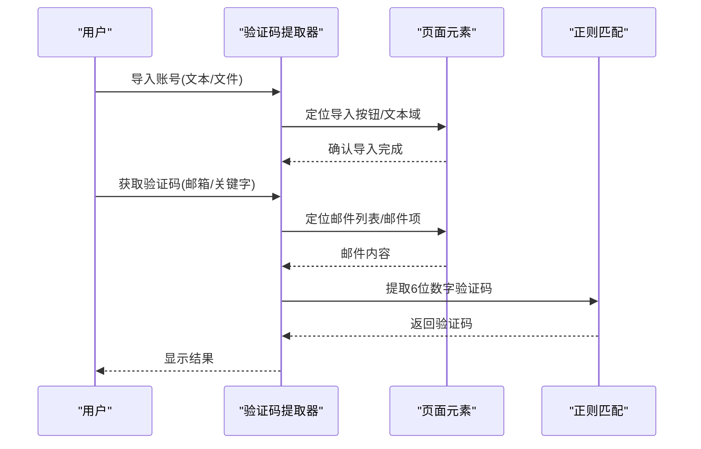
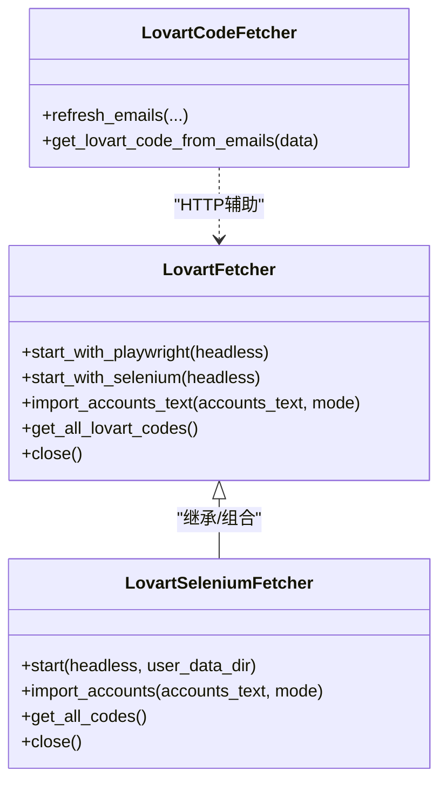
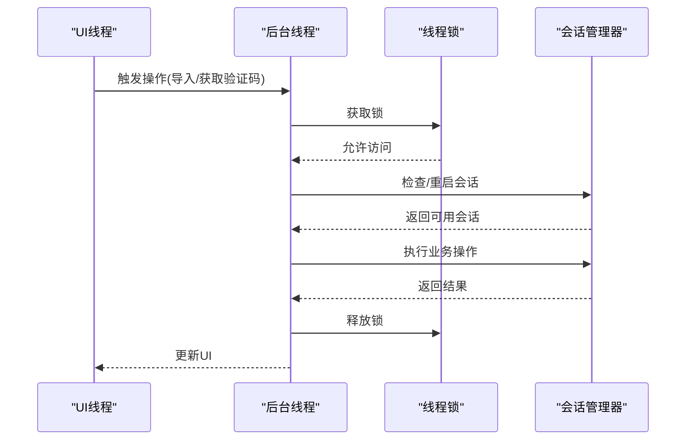
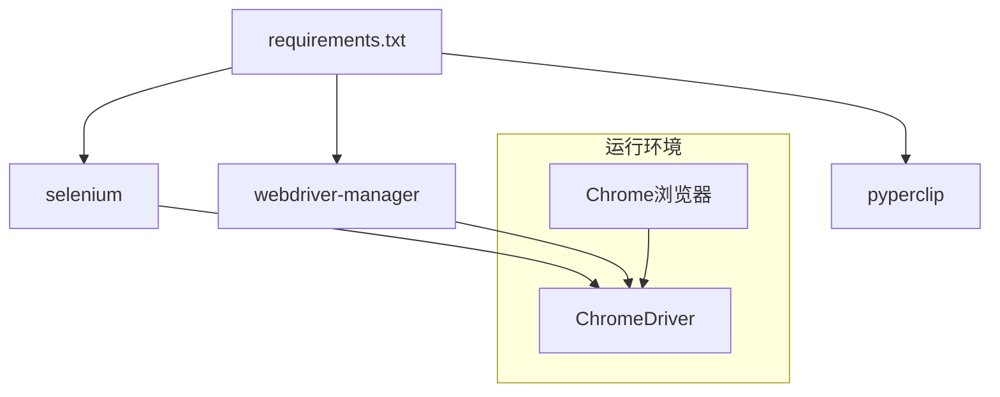

# 浏览器会话管理

<cite>
**本文引用的文件**
- [lovart_auto.py](file://lovart_auto.py)
- [lovart_fetcher.py](file://lovart_fetcher.py)
- [lovart_fetcher_browser.py](file://lovart_fetcher_browser.py)
- [lovart_selenium.py](file://lovart_selenium.py)
- [lovart_gui.py](file://lovart_gui.py)
- [requirements.txt](file://requirements.txt)
- [run_lovart.vbs](file://run_lovart.vbs)
- [create_shortcut.ps1](file://create_shortcut.ps1)
</cite>

## 目录
1. [简介](#简介)
2. [项目结构](#项目结构)
3. [核心组件](#核心组件)
4. [架构总览](#架构总览)
5. [详细组件分析](#详细组件分析)
6. [依赖关系分析](#依赖关系分析)
7. [性能考量](#性能考量)
8. [故障排查指南](#故障排查指南)
9. [结论](#结论)
10. [附录](#附录)

## 简介
本技术文档聚焦于浏览器会话管理与用户数据目录配置，围绕以下主题展开：
- 会话持久化机制：Cookie管理、LocalStorage处理、会话状态保持
- 用户数据目录配置：Chrome用户数据路径设置、配置文件管理、个性化设置保留
- 登录状态维护策略：认证令牌处理、会话重用、自动登录机制
- 跨进程会话管理：多实例协调、资源共享、状态同步
- 会话安全与隐私：反检测参数、会话隔离、敏感数据保护
- 故障恢复与清理：会话存活检测、锁定文件清理、异常恢复流程

本项目提供三种运行形态：命令行自动模式、浏览器自动化模式、图形界面模式，均围绕同一业务目标（从网站获取验证码）进行会话管理实践。

## 项目结构
项目采用模块化设计，按功能划分文件：
- 自动化脚本：lovart_auto.py（Playwright/Selenium双栈）
- 浏览器自动化：lovart_fetcher_browser.py（Playwright）
- HTTP接口封装：lovart_fetcher.py（requests）
- Selenium会话管理：lovart_selenium.py（持久化用户数据目录）
- GUI交互：lovart_gui.py（持久化用户数据目录、会话健康检查、截图诊断）
- 依赖声明：requirements.txt
- 启动脚本：run_lovart.vbs（Windows快捷方式入口）
- 快捷方式脚本：create_shortcut.ps1（PowerShell创建桌面快捷方式）

图表来源
- [lovart_auto.py:1-442](file://lovart_auto.py#L1-L442)
- [lovart_fetcher_browser.py:1-285](file://lovart_fetcher_browser.py#L1-L285)
- [lovart_fetcher.py:1-147](file://lovart_fetcher.py#L1-L147)
- [lovart_selenium.py:1-492](file://lovart_selenium.py#L1-L492)
- [lovart_gui.py:1-1275](file://lovart_gui.py#L1-L1275)
- [run_lovart.vbs:1-3](file://run_lovart.vbs#L1-L3)
- [create_shortcut.ps1:1-10](file://create_shortcut.ps1#L1-L10)
- [requirements.txt:1-3](file://requirements.txt#L1-L3)

章节来源
- [lovart_auto.py:1-442](file://lovart_auto.py#L1-L442)
- [lovart_fetcher_browser.py:1-285](file://lovart_fetcher_browser.py#L1-L285)
- [lovart_fetcher.py:1-147](file://lovart_fetcher.py#L1-L147)
- [lovart_selenium.py:1-492](file://lovart_selenium.py#L1-L492)
- [lovart_gui.py:1-1275](file://lovart_gui.py#L1-L1275)
- [run_lovart.vbs:1-3](file://run_lovart.vbs#L1-L3)
- [create_shortcut.ps1:1-10](file://create_shortcut.ps1#L1-L10)
- [requirements.txt:1-3](file://requirements.txt#L1-L3)

## 核心组件
- 会话持久化与用户数据目录
  - Selenium会话持久化：通过用户数据目录参数实现会话复用与个性化设置保留
  - GUI会话健康检查：会话存活检测、锁定文件清理、异常恢复
- 登录状态维护
  - 自动导入账号：统一账号格式，支持追加/覆盖导入
  - 验证码提取：基于邮件内容的6位数字验证码识别
- 跨进程协调
  - GUI线程锁：确保多线程操作浏览器驱动的安全性
  - 主窗口句柄：避免标签页切换导致的状态漂移
- 安全与隐私
  - 反检测参数：禁用自动化特征、沙箱与共享内存限制
  - 截图诊断：保存关键节点截图，便于问题定位

章节来源
- [lovart_selenium.py:54-113](file://lovart_selenium.py#L54-L113)
- [lovart_gui.py:77-125](file://lovart_gui.py#L77-L125)
- [lovart_gui.py:136-207](file://lovart_gui.py#L136-L207)
- [lovart_auto.py:95-134](file://lovart_auto.py#L95-L134)
- [lovart_auto.py:215-240](file://lovart_auto.py#L215-L240)

## 架构总览
整体架构由“自动化层”和“会话管理层”组成。自动化层负责业务流程编排（导入账号、刷新邮件、提取验证码），会话管理层负责浏览器生命周期与状态管理（持久化、健康检查、异常恢复）。

图表来源
- [lovart_auto.py:357-438](file://lovart_auto.py#L357-L438)
- [lovart_selenium.py:59-113](file://lovart_selenium.py#L59-L113)
- [lovart_gui.py:136-207](file://lovart_gui.py#L136-L207)

## 详细组件分析

### 组件A：Selenium会话持久化与用户数据目录
- 用户数据目录设置
  - 通过命令行参数指定用户数据目录，确保会话复用与个性化设置保留
  - 默认目录位于项目根目录下的子目录，便于本地化管理
- 反检测参数
  - 禁用自动化特征、沙箱、共享内存限制，提升稳定性
  - 移除navigator.webdriver特征，降低被识别概率
- 生命周期管理
  - 启动时设置超时与页面加载策略
  - 关闭时释放资源，避免残留进程占用

图表来源
- [lovart_selenium.py:59-113](file://lovart_selenium.py#L59-L113)
- [lovart_selenium.py:115-120](file://lovart_selenium.py#L115-L120)

章节来源
- [lovart_selenium.py:54-113](file://lovart_selenium.py#L54-L113)
- [lovart_selenium.py:115-120](file://lovart_selenium.py#L115-L120)

### 组件B：GUI会话健康检查与异常恢复
- 会话存活检测
  - 通过执行简单脚本判断浏览器会话是否可用
  - 若会话失效，自动重启并恢复到主页面
- 锁定文件清理
  - 清理用户数据目录中的锁定文件，必要时尝试结束残留进程
- 截图诊断
  - 在关键节点保存截图，辅助问题定位与回归测试

图表来源
- [lovart_gui.py:126-134](file://lovart_gui.py#L126-L134)
- [lovart_gui.py:100-125](file://lovart_gui.py#L100-L125)
- [lovart_gui.py:643-653](file://lovart_gui.py#L643-L653)

章节来源
- [lovart_gui.py:126-134](file://lovart_gui.py#L126-L134)
- [lovart_gui.py:100-125](file://lovart_gui.py#L100-L125)
- [lovart_gui.py:643-653](file://lovart_gui.py#L643-L653)

### 组件C：账号导入与验证码提取
- 账号导入
  - 支持Tab或特定分隔符，自动识别并导入账号
  - 支持追加/覆盖两种导入模式
- 验证码提取
  - 基于邮件来源或主题关键字筛选Lovart邮件
  - 使用正则表达式提取6位数字验证码
  - 兼容iframe场景与多种邮件列表结构

图表来源
- [lovart_auto.py:95-134](file://lovart_auto.py#L95-L134)
- [lovart_auto.py:215-240](file://lovart_auto.py#L215-L240)
- [lovart_selenium.py:132-193](file://lovart_selenium.py#L132-L193)
- [lovart_selenium.py:268-293](file://lovart_selenium.py#L268-L293)

章节来源
- [lovart_auto.py:95-134](file://lovart_auto.py#L95-L134)
- [lovart_auto.py:215-240](file://lovart_auto.py#L215-L240)
- [lovart_selenium.py:132-193](file://lovart_selenium.py#L132-L193)
- [lovart_selenium.py:268-293](file://lovart_selenium.py#L268-L293)

### 组件D：Playwright与Selenium双栈自动化
- Playwright路径
  - 启动Chromium上下文，新建页面访问目标站点
  - 通过选择器定位元素，执行导入与验证码提取
- Selenium路径
  - 启动Chrome，使用WebDriver等待与定位策略
  - 支持多种选择器与异常处理，增强鲁棒性

图表来源
- [lovart_auto.py:45-94](file://lovart_auto.py#L45-L94)
- [lovart_selenium.py:47-120](file://lovart_selenium.py#L47-L120)
- [lovart_fetcher.py:12-104](file://lovart_fetcher.py#L12-L104)

章节来源
- [lovart_auto.py:45-94](file://lovart_auto.py#L45-L94)
- [lovart_selenium.py:47-120](file://lovart_selenium.py#L47-L120)
- [lovart_fetcher.py:12-104](file://lovart_fetcher.py#L12-L104)

### 组件E：GUI应用与多线程会话管理
- GUI线程模型
  - 主线程负责UI更新，后台线程执行浏览器操作
  - 使用线程锁保证浏览器驱动的并发安全
- 会话恢复
  - 会话失效时自动重启，保持用户无感知体验
- 快捷方式与启动
  - Windows快捷方式入口，一键启动GUI

图表来源
- [lovart_gui.py:973-987](file://lovart_gui.py#L973-L987)
- [lovart_gui.py:1252-1264](file://lovart_gui.py#L1252-L1264)
- [run_lovart.vbs:1-3](file://run_lovart.vbs#L1-L3)

章节来源
- [lovart_gui.py:973-987](file://lovart_gui.py#L973-L987)
- [lovart_gui.py:1252-1264](file://lovart_gui.py#L1252-L1264)
- [run_lovart.vbs:1-3](file://run_lovart.vbs#L1-L3)

## 依赖关系分析
- 第三方库
  - selenium：浏览器驱动与自动化
  - webdriver-manager：自动下载与管理ChromeDriver
  - pyperclip：剪贴板操作（GUI）
- 运行时依赖
  - Chrome浏览器与驱动
  - Windows快捷方式（可选）

图表来源
- [requirements.txt:1-3](file://requirements.txt#L1-L3)

章节来源
- [requirements.txt:1-3](file://requirements.txt#L1-L3)

## 性能考量
- 启动参数优化
  - 禁用沙箱与共享内存限制，减少资源争用
  - 设置页面与脚本超时，避免长时间阻塞
- 等待策略
  - 使用WebDriver等待与固定延时相结合，平衡稳定性与效率
- 会话复用
  - 用户数据目录持久化减少重复登录成本
- 并发控制
  - GUI线程锁避免竞态条件，提高稳定性

[本节为通用指导，无需具体文件分析]

## 故障排查指南
- 启动失败
  - 检查Chrome与ChromeDriver版本兼容性
  - 确认未被其他Chrome实例占用用户数据目录
  - 清理锁定文件并重启
- 会话失效
  - 使用会话健康检查自动重启
  - 保存诊断截图定位问题
- 导入失败
  - 确认账号格式正确（Tab或特定分隔符）
  - 检查页面元素定位选择器是否适配当前UI
- 验证码未提取
  - 检查邮件列表结构变化
  - 调整正则匹配策略或选择器

章节来源
- [lovart_gui.py:100-125](file://lovart_gui.py#L100-L125)
- [lovart_gui.py:643-653](file://lovart_gui.py#L643-L653)
- [lovart_selenium.py:132-193](file://lovart_selenium.py#L132-L193)
- [lovart_auto.py:95-134](file://lovart_auto.py#L95-L134)

## 结论
本项目通过Selenium与GUI的会话持久化机制，结合Playwright/Selenium双栈自动化，实现了稳定的浏览器会话管理。用户数据目录配置确保了会话复用与个性化设置保留；会话健康检查与异常恢复提升了鲁棒性；多线程与锁机制保障了并发安全性。建议在生产环境中进一步完善：
- 会话隔离与多用户支持
- 令牌轮换与自动登录策略
- 跨进程状态同步与共享
- 更细粒度的日志与监控

[本节为总结，无需具体文件分析]

## 附录
- 快捷方式创建
  - PowerShell脚本创建桌面快捷方式，指向VBS启动器
- 启动器
  - VBS以隐藏方式启动GUI，便于桌面快捷方式使用

章节来源
- [create_shortcut.ps1:1-10](file://create_shortcut.ps1#L1-L10)
- [run_lovart.vbs:1-3](file://run_lovart.vbs#L1-L3)