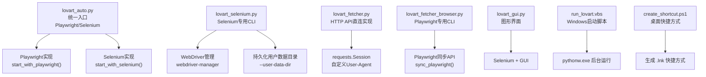
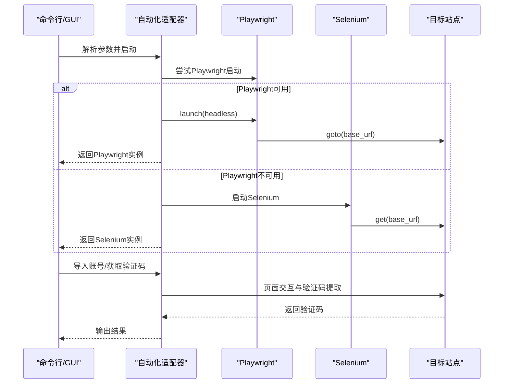
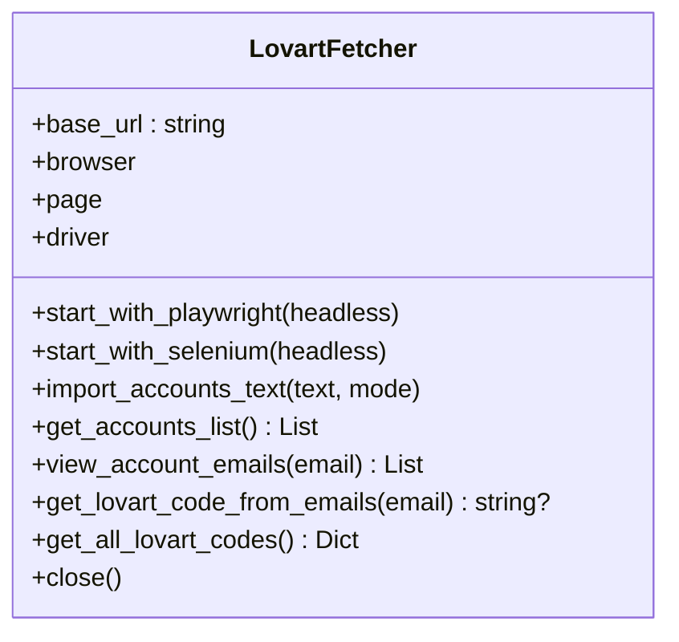
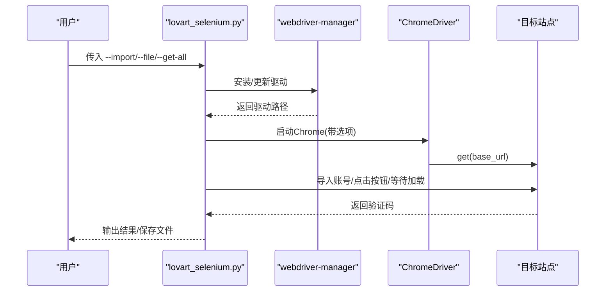
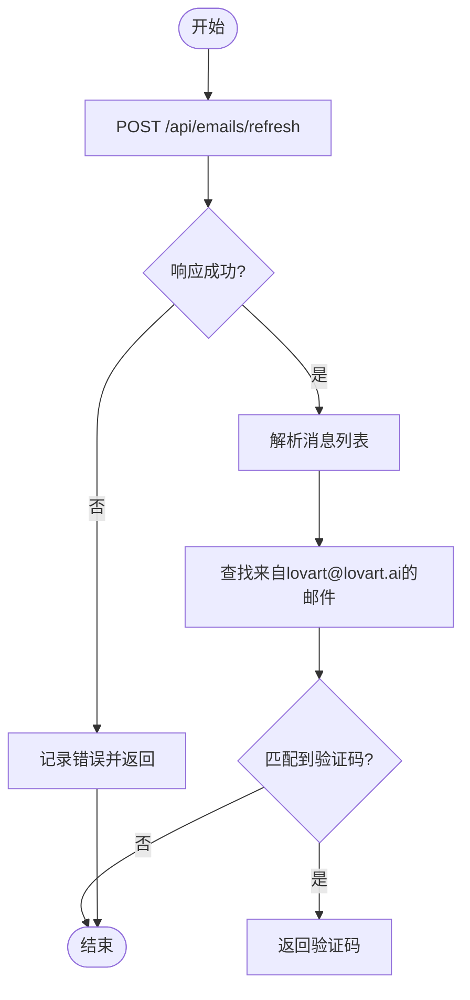
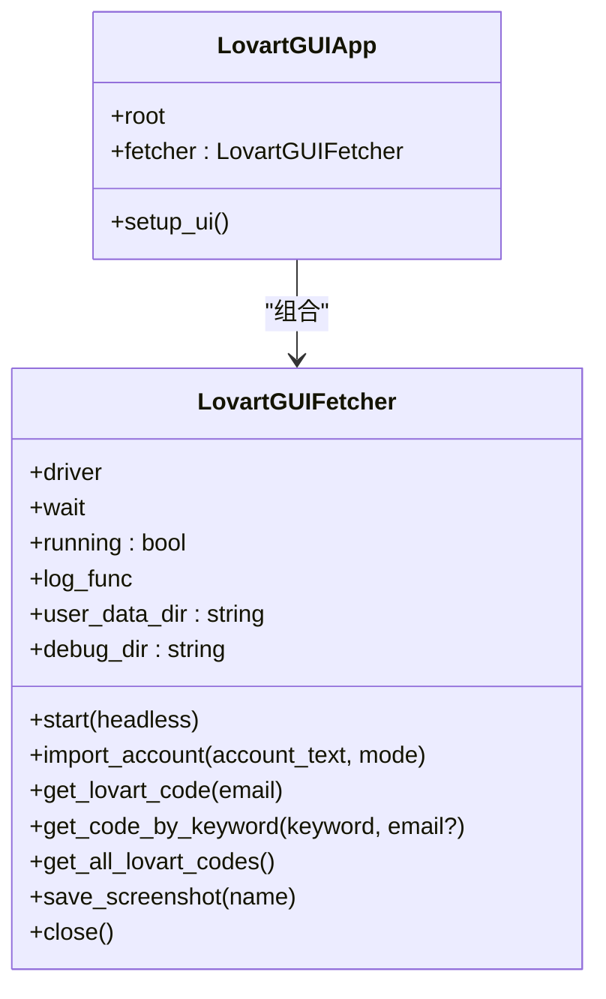
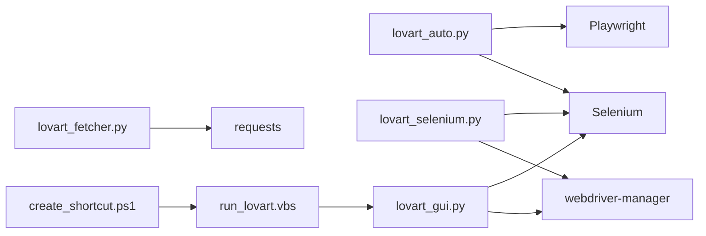

# 浏览器自动化技术

<cite>
**本文引用的文件**
- [lovart_auto.py](file://lovart_auto.py)
- [lovart_selenium.py](file://lovart_selenium.py)
- [lovart_fetcher.py](file://lovart_fetcher.py)
- [lovart_fetcher_browser.py](file://lovart_fetcher_browser.py)
- [lovart_gui.py](file://lovart_gui.py)
- [requirements.txt](file://requirements.txt)
- [run_lovart.vbs](file://run_lovart.vbs)
- [create_shortcut.ps1](file://create_shortcut.ps1)
</cite>

## 目录
1. [简介](#简介)
2. [项目结构](#项目结构)
3. [核心组件](#核心组件)
4. [架构总览](#架构总览)
5. [详细组件分析](#详细组件分析)
6. [依赖关系分析](#依赖关系分析)
7. [性能与兼容性](#性能与兼容性)
8. [故障排除指南](#故障排除指南)
9. [结论](#结论)
10. [附录](#附录)

## 简介
本项目围绕“Lovart验证码自动获取”任务，提供了基于Selenium与Playwright两种浏览器自动化框架的完整实现方案，并配套了图形界面版本与批处理/脚本部署工具。文档将系统阐述：
- Playwright与Selenium的技术特点与适用场景
- 浏览器会话管理（登录状态保持、Cookie处理、用户数据目录）
- 防检测机制（请求头伪装、行为模拟、反爬虫应对）
- 驱动自动管理（webdriver-manager）
- 跨浏览器兼容性与性能优化
- 故障排除与调试技巧

## 项目结构
项目采用多入口、多实现的模块化设计，分别提供命令行、图形界面与纯API封装，便于不同场景使用。

图表来源
- [lovart_auto.py:54-84](file://lovart_auto.py#L54-L84)
- [lovart_selenium.py:59-113](file://lovart_selenium.py#L59-L113)
- [lovart_fetcher.py:12-20](file://lovart_fetcher.py#L12-L20)
- [lovart_fetcher_browser.py:32-42](file://lovart_fetcher_browser.py#L32-L42)
- [lovart_gui.py:74-207](file://lovart_gui.py#L74-L207)
- [run_lovart.vbs:1-3](file://run_lovart.vbs#L1-L3)
- [create_shortcut.ps1:1-10](file://create_shortcut.ps1#L1-L10)

章节来源
- [lovart_auto.py:13-15](file://lovart_auto.py#L13-L15)
- [requirements.txt:1-3](file://requirements.txt#L1-L3)

## 核心组件
- 统一入口与双框架支持：在同一路由下同时支持Playwright与Selenium，自动降级并提示安装依赖。
- Selenium专用CLI：提供导入账号、获取验证码、批量处理等命令行能力，集成webdriver-manager自动驱动管理。
- HTTP API直连实现：通过requests.Session直接调用后端接口，适合无需真实浏览器渲染的场景。
- Playwright专用CLI：以Playwright同步API实现相同业务流程，强调稳定性与可扩展性。
- 图形界面：提供可视化操作，内置截图诊断、会话保活、持久化用户数据目录等高级特性。
- 部署脚本：Windows下通过VBS与PowerShell脚本实现后台启动与桌面快捷方式创建。

章节来源
- [lovart_auto.py:45-94](file://lovart_auto.py#L45-L94)
- [lovart_selenium.py:47-120](file://lovart_selenium.py#L47-L120)
- [lovart_fetcher.py:12-20](file://lovart_fetcher.py#L12-L20)
- [lovart_fetcher_browser.py:25-50](file://lovart_fetcher_browser.py#L25-L50)
- [lovart_gui.py:74-207](file://lovart_gui.py#L74-L207)
- [run_lovart.vbs:1-3](file://run_lovart.vbs#L1-L3)
- [create_shortcut.ps1:1-10](file://create_shortcut.ps1#L1-L10)

## 架构总览
整体架构分为三层：
- 应用层：CLI与GUI入口，负责参数解析、流程编排与结果输出。
- 自动化层：Selenium与Playwright实现，负责页面交互、元素定位、验证码提取。
- 驱动与会话层：webdriver-manager、持久化用户数据目录、CDP注入、会话保活。

图表来源
- [lovart_auto.py:394-404](file://lovart_auto.py#L394-L404)
- [lovart_selenium.py:437-438](file://lovart_selenium.py#L437-L438)
- [lovart_fetcher_browser.py:234-281](file://lovart_fetcher_browser.py#L234-L281)

## 详细组件分析

### 组件A：统一自动化适配器（Playwright/Selenium）
- 功能要点
  - 自动检测Playwright/Selenium可用性，优先使用Playwright；若不可用则降级到Selenium。
  - 提供导入账号、获取验证码、遍历账号等通用能力。
  - 统一封装页面交互与异常处理，屏蔽框架差异。
- 技术细节
  - Playwright：使用同步API，新建上下文与页面，设置视口尺寸，访问目标URL。
  - Selenium：启用headless模式、禁用自动化特征、使用webdriver-manager自动下载驱动、注入CDP移除webdriver标志。
- 适用场景
  - 需要快速切换框架或在不同环境中稳定运行的场景。
  - 对页面渲染要求较高且希望减少反爬虫干扰的任务。

图表来源
- [lovart_auto.py:45-94](file://lovart_auto.py#L45-L94)
- [lovart_auto.py:95-166](file://lovart_auto.py#L95-L166)
- [lovart_auto.py:215-283](file://lovart_auto.py#L215-L283)

章节来源
- [lovart_auto.py:54-84](file://lovart_auto.py#L54-L84)
- [lovart_auto.py:95-166](file://lovart_auto.py#L95-L166)
- [lovart_auto.py:215-283](file://lovart_auto.py#L215-L283)

### 组件B：Selenium专用CLI（含webdriver-manager）
- 功能要点
  - 命令行参数解析：导入账号、从文件导入、获取单个/全部验证码、无头模式、输出文件等。
  - 自动驱动管理：优先使用webdriver-manager安装ChromeDriver；失败时回退到本地驱动。
  - 持久化用户数据目录：通过--user-data-dir与--profile-directory实现登录状态复用。
  - 防检测：禁用自动化特征、注入CDP移除navigator.webdriver标志。
- 技术细节
  - 等待策略：使用WebDriverWait与EC条件等待元素可点击/可见，提升稳定性。
  - 定位策略：多选择器容错，覆盖“导入邮箱”“追加导入/覆盖导入”等按钮。
  - iframe处理：在邮件详情可能位于iframe中时进行frame切换。
- 适用场景
  - 需要CLI批处理、自动化调度与稳定运行的场景。
  - 对驱动版本管理有强需求的团队。

图表来源
- [lovart_selenium.py:415-488](file://lovart_selenium.py#L415-L488)
- [lovart_selenium.py:59-113](file://lovart_selenium.py#L59-L113)
- [requirements.txt:1-3](file://requirements.txt#L1-L3)

章节来源
- [lovart_selenium.py:47-120](file://lovart_selenium.py#L47-L120)
- [lovart_selenium.py:132-193](file://lovart_selenium.py#L132-L193)
- [lovart_selenium.py:268-331](file://lovart_selenium.py#L268-L331)
- [requirements.txt:1-3](file://requirements.txt#L1-L3)

### 组件C：HTTP API直连实现（requests.Session）
- 功能要点
  - 通过POST请求刷新邮件、检测权限，再从返回数据中提取Lovart验证码。
  - 自定义User-Agent与Content-Type，降低被识别风险。
- 适用场景
  - 不需要真实浏览器渲染、仅需稳定网络请求的场景。
  - 对性能敏感、并发量大的批量任务。

图表来源
- [lovart_fetcher.py:21-52](file://lovart_fetcher.py#L21-L52)
- [lovart_fetcher.py:78-103](file://lovart_fetcher.py#L78-L103)

章节来源
- [lovart_fetcher.py:12-20](file://lovart_fetcher.py#L12-L20)
- [lovart_fetcher.py:21-52](file://lovart_fetcher.py#L21-L52)
- [lovart_fetcher.py:78-103](file://lovart_fetcher.py#L78-L103)

### 组件D：Playwright专用CLI
- 功能要点
  - 与统一适配器类似，但专为Playwright优化，强调同步API与上下文管理。
  - 导入账号、获取邮件列表、提取验证码、批量处理。
- 适用场景
  - 对Playwright生态更熟悉的团队，或需要更强的上下文控制与稳定性保证。

章节来源
- [lovart_fetcher_browser.py:25-50](file://lovart_fetcher_browser.py#L25-L50)
- [lovart_fetcher_browser.py:50-79](file://lovart_fetcher_browser.py#L50-L79)
- [lovart_fetcher_browser.py:135-204](file://lovart_fetcher_browser.py#L135-L204)

### 组件E：图形界面（GUI）
- 功能要点
  - 提供可视化操作，支持导入账号、获取验证码、按关键字检索、截图诊断等。
  - 内置会话保活检查、主窗口句柄维护、持久化用户数据目录清理与恢复。
  - 支持静默/显式两种运行模式，自动清理Chrome锁文件与残留进程。
- 适用场景
  - 非技术用户或需要可视化反馈与调试的场景。

图表来源
- [lovart_gui.py:74-207](file://lovart_gui.py#L74-L207)
- [lovart_gui.py:209-255](file://lovart_gui.py#L209-L255)
- [lovart_gui.py:356-431](file://lovart_gui.py#L356-L431)
- [lovart_gui.py:751-795](file://lovart_gui.py#L751-L795)

章节来源
- [lovart_gui.py:74-207](file://lovart_gui.py#L74-L207)
- [lovart_gui.py:209-255](file://lovart_gui.py#L209-L255)
- [lovart_gui.py:356-431](file://lovart_gui.py#L356-L431)
- [lovart_gui.py:751-795](file://lovart_gui.py#L751-L795)

## 依赖关系分析
- 模块耦合
  - 统一适配器与Selenium/Playwright实现相互独立，通过条件导入与异常处理解耦。
  - GUI模块依赖Selenium，提供更高层的封装与用户体验。
- 外部依赖
  - Selenium与webdriver-manager：驱动自动管理与稳定性保障。
  - requests：HTTP API直连实现。
  - tkinter：GUI界面基础。
- 循环依赖
  - 未发现循环导入；各模块职责清晰，边界明确。

图表来源
- [lovart_auto.py:25-42](file://lovart_auto.py#L25-L42)
- [lovart_selenium.py:31-44](file://lovart_selenium.py#L31-L44)
- [lovart_fetcher.py:6](file://lovart_fetcher.py#L6)
- [lovart_gui.py:41-64](file://lovart_gui.py#L41-L64)
- [run_lovart.vbs:1-3](file://run_lovart.vbs#L1-L3)
- [create_shortcut.ps1:1-10](file://create_shortcut.ps1#L1-L10)

章节来源
- [lovart_auto.py:25-42](file://lovart_auto.py#L25-L42)
- [lovart_selenium.py:31-44](file://lovart_selenium.py#L31-L44)
- [lovart_fetcher.py:6](file://lovart_fetcher.py#L6)
- [lovart_gui.py:41-64](file://lovart_gui.py#L41-L64)
- [run_lovart.vbs:1-3](file://run_lovart.vbs#L1-L3)
- [create_shortcut.ps1:1-10](file://create_shortcut.ps1#L1-L10)

## 性能与兼容性
- 性能优化建议
  - 减少不必要的页面等待：使用WebDriverWait精准等待元素出现，避免固定sleep。
  - 复用浏览器上下文：在GUI与Selenium实现中均使用持久化用户数据目录，避免重复登录。
  - 控制并发与资源：GUI中使用线程锁与会话保活检查，避免多线程竞争与无效操作。
  - CDN与网络优化：HTTP API直连实现中自定义User-Agent，减少被限速风险。
- 跨浏览器兼容性
  - Selenium：通过options参数统一设置，兼容不同操作系统与Chrome版本。
  - Playwright：同步API与上下文管理，减少跨平台差异带来的问题。
- 驱动管理
  - 优先使用webdriver-manager自动下载与更新驱动，失败时回退到本地驱动。
  - 在Windows环境下，注意清理Chrome锁文件与残留进程，避免驱动冲突。

章节来源
- [lovart_selenium.py:59-113](file://lovart_selenium.py#L59-L113)
- [lovart_gui.py:100-125](file://lovart_gui.py#L100-L125)
- [lovart_fetcher.py:16-19](file://lovart_fetcher.py#L16-L19)

## 故障排除指南
- 启动失败
  - Playwright/Selenium未安装：根据提示安装相应依赖。
  - 驱动冲突：清理用户数据目录锁文件，结束残留Chrome/Chromedriver进程。
  - 会话失效：GUI中提供会话保活检查与主窗口句柄维护，必要时重新启动。
- 页面元素定位失败
  - 使用多选择器容错，覆盖“导入邮箱”“追加导入/覆盖导入”等按钮。
  - 在邮件列表可能位于iframe时，先切换frame再定位元素。
- 验证码提取失败
  - 通过截图保存与全页文本正则兜底，提高提取成功率。
  - 对于特殊布局，增加更多CSS选择器与正则表达式变体。
- 无头模式问题
  - 在Windows下使用--headless=new，避免某些旧版headless模式的兼容性问题。
  - 适当增大等待时间，确保页面完全加载。

章节来源
- [lovart_selenium.py:121-131](file://lovart_selenium.py#L121-L131)
- [lovart_selenium.py:333-376](file://lovart_selenium.py#L333-L376)
- [lovart_gui.py:100-125](file://lovart_gui.py#L100-L125)
- [lovart_gui.py:643-653](file://lovart_gui.py#L643-L653)

## 结论
本项目通过统一适配器与多实现方案，兼顾了Playwright与Selenium的优势，既能在复杂页面渲染场景下稳定运行，又能在CLI与GUI环境中灵活部署。结合持久化用户数据目录、CDP注入与webdriver-manager自动驱动管理，有效降低了反爬虫与环境差异带来的挑战。建议在生产环境中优先采用Selenium+webdriver-manager方案，配合GUI进行可视化运维与故障排查。

## 附录
- 部署与快捷方式
  - Windows下可通过VBS与PowerShell脚本实现后台启动与桌面快捷方式创建。
- 依赖清单
  - Selenium、webdriver-manager、pyperclip等第三方库。

章节来源
- [run_lovart.vbs:1-3](file://run_lovart.vbs#L1-L3)
- [create_shortcut.ps1:1-10](file://create_shortcut.ps1#L1-L10)
- [requirements.txt:1-3](file://requirements.txt#L1-L3)