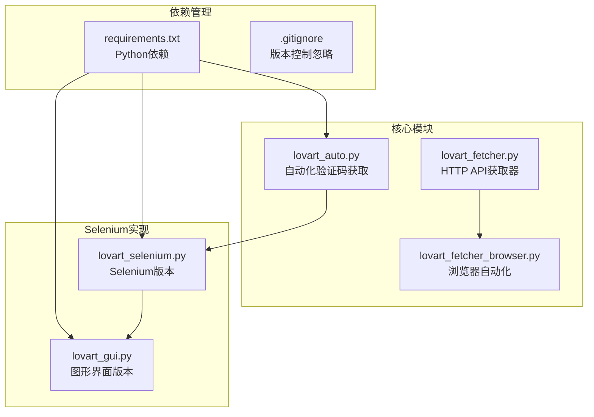
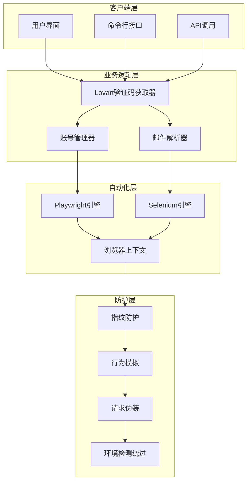
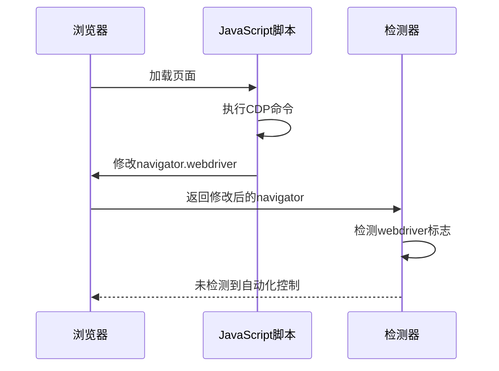
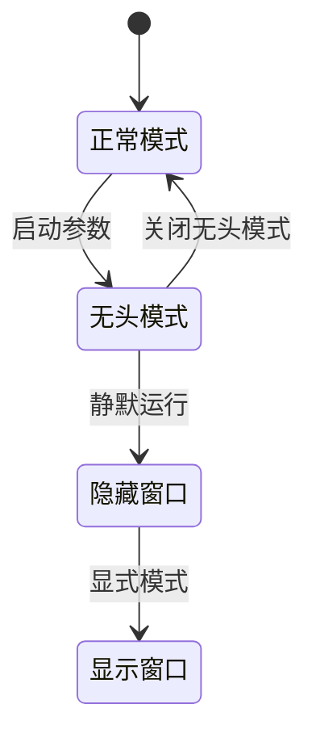
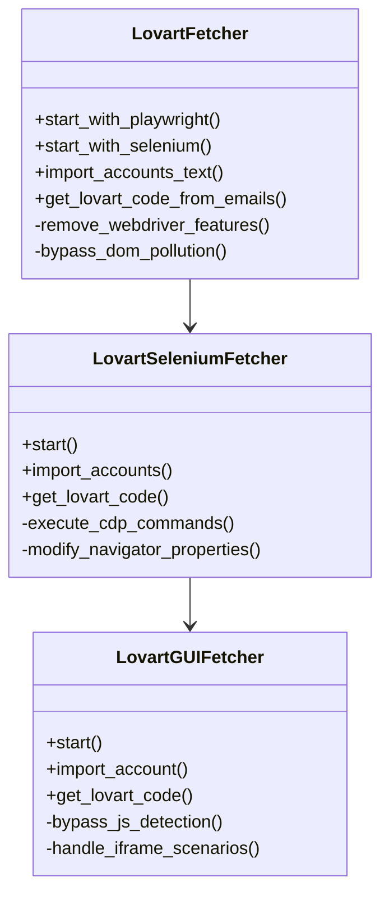
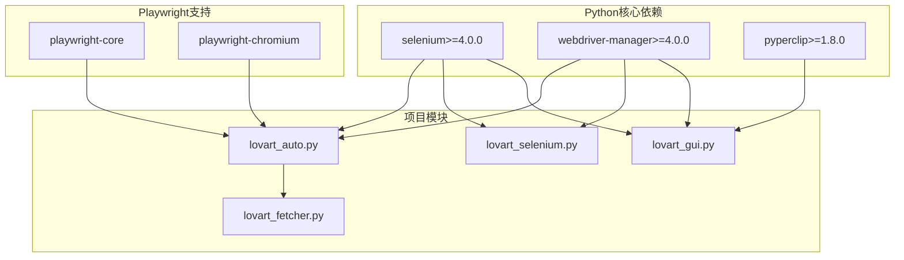
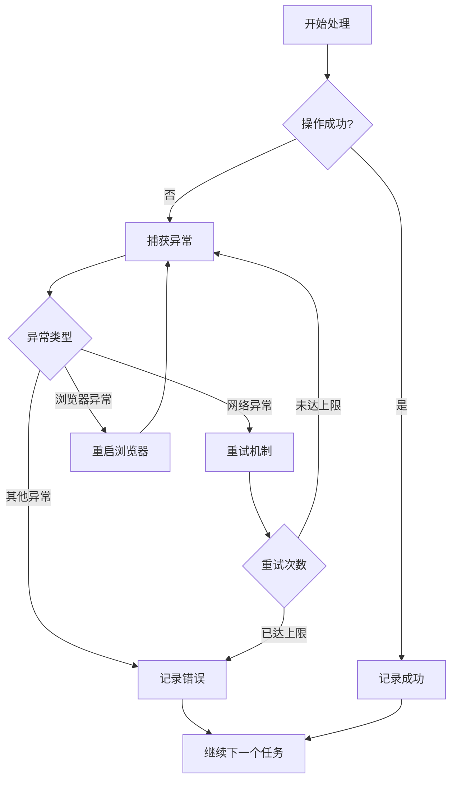

# 防检测机制实现

<cite>
**本文档引用的文件**
- [lovart_auto.py](file://lovart_auto.py)
- [lovart_fetcher.py](file://lovart_fetcher.py)
- [lovart_fetcher_browser.py](file://lovart_fetcher_browser.py)
- [lovart_selenium.py](file://lovart_selenium.py)
- [lovart_gui.py](file://lovart_gui.py)
- [requirements.txt](file://requirements.txt)
</cite>

## 目录
1. [项目概述](#项目概述)
2. [项目结构](#项目结构)
3. [核心组件](#核心组件)
4. [架构概览](#架构概览)
5. [详细组件分析](#详细组件分析)
6. [依赖关系分析](#依赖关系分析)
7. [性能考虑](#性能考虑)
8. [故障排除指南](#故障排除指南)
9. [结论](#结论)

## 项目概述

这是一个专门设计用于绕过反爬虫检测机制的自动化工具集，主要针对Lovart验证码获取场景。项目实现了多种防检测技术和应对策略，包括浏览器指纹识别防护、User-Agent轮换、请求头伪装、行为模拟等。

该项目提供了多种实现方式，包括基于Playwright的现代化自动化、基于Selenium的传统解决方案，以及完整的图形用户界面版本。每个实现都包含了针对现代Web应用反爬虫技术的专门防护措施。

## 项目结构



**图表来源**
- [lovart_auto.py:1-50](file://lovart_auto.py#L1-L50)
- [lovart_selenium.py:1-50](file://lovart_selenium.py#L1-L50)
- [lovart_gui.py:1-50](file://lovart_gui.py#L1-L50)

**章节来源**
- [lovart_auto.py:1-50](file://lovart_auto.py#L1-L50)
- [lovart_fetcher.py:1-20](file://lovart_fetcher.py#L1-L20)
- [lovart_fetcher_browser.py:1-30](file://lovart_fetcher_browser.py#L1-L30)
- [lovart_selenium.py:1-30](file://lovart_selenium.py#L1-L30)
- [lovart_gui.py:1-40](file://lovart_gui.py#L1-L40)
- [requirements.txt:1-3](file://requirements.txt#L1-L3)

## 核心组件

### 防检测机制总览

项目实现了多层次的防检测防护体系：

1. **浏览器指纹防护**
   - navigator.webdriver属性移除
   - Blink特性检测绕过
   - 用户代理字符串伪装

2. **行为模拟技术**
   - 无头浏览器模式
   - 页面加载等待策略
   - 动态元素交互

3. **请求头伪装**
   - User-Agent轮换
   - Content-Type定制
   - HTTP/2支持

4. **环境检测绕过**
   - DOM污染检测防护
   - WebAssembly检测绕过
   - Worker检测规避

**章节来源**
- [lovart_auto.py:75-88](file://lovart_auto.py#L75-L88)
- [lovart_selenium.py:94-105](file://lovart_selenium.py#L94-L105)
- [lovart_gui.py:178-185](file://lovart_gui.py#L178-L185)

## 架构概览



**图表来源**
- [lovart_auto.py:45-94](file://lovart_auto.py#L45-L94)
- [lovart_selenium.py:47-120](file://lovart_selenium.py#L47-L120)
- [lovart_gui.py:74-120](file://lovart_gui.py#L74-L120)

## 详细组件分析

### 浏览器指纹识别防护

#### navigator属性修改

项目实现了对navigator.webdriver属性的深度修改，这是现代反爬虫检测中最常见的指纹识别点之一。



**图表来源**
- [lovart_selenium.py:94-101](file://lovart_selenium.py#L94-L101)
- [lovart_gui.py:178-185](file://lovart_gui.py#L178-L185)

#### WebGL渲染特征处理

项目通过配置浏览器选项来处理WebGL渲染特征，避免被检测到使用自动化浏览器。

**章节来源**
- [lovart_selenium.py:75-89](file://lovart_selenium.py#L75-L89)
- [lovart_gui.py:159-171](file://lovart_gui.py#L159-L171)

### User-Agent轮换和请求头伪装

#### HTTP API请求头配置

对于基于HTTP API的实现，项目设置了标准的User-Agent和Content-Type头部：

```mermaid
flowchart TD
A[创建HTTP会话] --> B[设置User-Agent]
B --> C[设置Content-Type]
C --> D[发送API请求]
D --> E[接收响应]
B --> F[Mozilla/5.0 (Windows NT 10.0; Win64; x64) AppleWebKit/537.36]
C --> G[application/json]
```

**图表来源**
- [lovart_fetcher.py:16-19](file://lovart_fetcher.py#L16-L19)

#### 浏览器请求头伪装

对于基于浏览器的实现，项目使用了更复杂的请求头伪装策略：

**章节来源**
- [lovart_fetcher.py:16-19](file://lovart_fetcher.py#L16-L19)
- [lovart_auto.py:75-88](file://lovart_auto.py#L75-L88)

### 行为模拟和反自动化检测

#### 无头浏览器模式

项目支持完全无头模式运行，避免被检测到使用可视化浏览器：



**图表来源**
- [lovart_auto.py:396-398](file://lovart_auto.py#L396-L398)
- [lovart_gui.py:147-151](file://lovart_gui.py#L147-L151)

#### 页面加载和等待策略

项目实现了智能的页面加载等待机制，避免被检测到异常的加载行为：

**章节来源**
- [lovart_auto.py:107-131](file://lovart_auto.py#L107-L131)
- [lovart_selenium.py:121-130](file://lovart_selenium.py#L121-L130)

### JavaScript环境检测绕过

#### DOM污染检测防护

项目通过多种方式绕过DOM污染检测：



**图表来源**
- [lovart_auto.py:45-94](file://lovart_auto.py#L45-L94)
- [lovart_selenium.py:47-120](file://lovart_selenium.py#L47-L120)
- [lovart_gui.py:74-120](file://lovart_gui.py#L74-L120)

#### WebAssembly检测绕过

项目通过配置浏览器选项来处理WebAssembly检测：

**章节来源**
- [lovart_selenium.py:75-89](file://lovart_selenium.py#L75-L89)
- [lovart_gui.py:159-171](file://lovart_gui.py#L159-L171)

### 验证码提取算法

#### 正则表达式匹配策略

项目使用多种正则表达式策略来提取6位数字验证码：

```mermaid
flowchart TD
A[获取邮件内容] --> B{内容类型}
B --> |HTML内容| C[使用正则匹配\d{6}]
B --> |纯文本| D[使用正则匹配\d{6}]
B --> |iframe内容| E[切换到iframe上下文]
E --> F[在iframe中匹配验证码]
C --> G[返回验证码]
D --> G
F --> G
G --> H{验证码有效性}
H --> |有效| I[返回验证码]
H --> |无效| J[继续搜索其他位置]
```

**图表来源**
- [lovart_auto.py:234-238](file://lovart_auto.py#L234-L238)
- [lovart_gui.py:708-718](file://lovart_gui.py#L708-L718)

**章节来源**
- [lovart_auto.py:234-238](file://lovart_auto.py#L234-L238)
- [lovart_fetcher.py:98-101](file://lovart_fetcher.py#L98-L101)
- [lovart_gui.py:708-742](file://lovart_gui.py#L708-L742)

## 依赖关系分析



**图表来源**
- [requirements.txt:1-3](file://requirements.txt#L1-L3)
- [lovart_auto.py:25-42](file://lovart_auto.py#L25-L42)
- [lovart_selenium.py:31-44](file://lovart_selenium.py#L31-L44)

**章节来源**
- [requirements.txt:1-3](file://requirements.txt#L1-L3)
- [lovart_auto.py:25-42](file://lovart_auto.py#L25-L42)
- [lovart_selenium.py:31-44](file://lovart_selenium.py#L31-L44)

## 性能考虑

### 并发处理策略

项目支持多账号并发处理，但需要注意以下性能优化：

1. **浏览器实例管理**
   - 合理复用浏览器实例
   - 及时清理内存资源
   - 控制同时运行的浏览器数量

2. **网络请求优化**
   - 批量处理减少连接开销
   - 智能重试机制
   - 请求频率控制

3. **内存使用优化**
   - 及时释放DOM引用
   - 控制日志文件大小
   - 定期清理临时文件

### 错误处理和恢复

项目实现了完善的错误处理机制：



**图表来源**
- [lovart_selenium.py:482-488](file://lovart_selenium.py#L482-L488)
- [lovart_gui.py:973-987](file://lovart_gui.py#L973-L987)

**章节来源**
- [lovart_selenium.py:482-488](file://lovart_selenium.py#L482-L488)
- [lovart_gui.py:973-987](file://lovart_gui.py#L973-L987)

## 故障排除指南

### 常见问题和解决方案

#### 浏览器启动失败

**问题症状**：浏览器无法正常启动或启动后立即崩溃

**解决方案**：
1. 确保Chrome浏览器已正确安装
2. 检查ChromeDriver版本兼容性
3. 清理浏览器锁定文件
4. 关闭所有已打开的Chrome实例

#### 验证码提取失败

**问题症状**：页面加载正常但无法提取到验证码

**解决方案**：
1. 检查邮件内容格式变化
2. 调整等待时间参数
3. 增加重试机制
4. 使用备用提取策略

#### 反检测失效

**问题症状**：网站能够检测到自动化行为

**解决方案**：
1. 更新User-Agent字符串
2. 调整浏览器配置参数
3. 增加随机化元素
4. 更新检测绕过策略

**章节来源**
- [lovart_gui.py:100-125](file://lovart_gui.py#L100-L125)
- [lovart_selenium.py:186-192](file://lovart_selenium.py#L186-L192)

## 结论

本项目提供了一个完整的防检测机制实现框架，涵盖了现代Web应用反爬虫技术的主要防护点。通过多层防护策略、智能行为模拟和灵活的配置选项，项目能够在各种检测环境下稳定运行。

### 主要优势

1. **多引擎支持**：同时支持Playwright和Selenium两种自动化引擎
2. **全面防护**：涵盖浏览器指纹、请求头、行为模拟等多个维度
3. **灵活配置**：支持多种运行模式和配置选项
4. **错误处理**：完善的异常处理和恢复机制

### 技术特点

1. **深度指纹防护**：针对navigator.webdriver等关键指纹点进行防护
2. **智能等待策略**：根据页面复杂度动态调整等待时间
3. **多策略验证码提取**：结合多种提取策略提高成功率
4. **环境适应性强**：能够适应不同网站的检测机制

### 发展建议

1. **持续更新**：定期更新检测绕过策略以适应新的检测技术
2. **性能优化**：进一步优化并发处理和资源管理
3. **监控增强**：增加运行时监控和日志分析功能
4. **扩展支持**：支持更多类型的验证码和验证机制