# 配置与部署

<cite>
**本文档引用的文件**
- [run_lovart.vbs](file://run_lovart.vbs)
- [create_shortcut.ps1](file://create_shortcut.ps1)
- [requirements.txt](file://requirements.txt)
- [lovart_auto.py](file://lovart_auto.py)
- [lovart_fetcher.py](file://lovart_fetcher.py)
- [lovart_fetcher_browser.py](file://lovart_fetcher_browser.py)
- [lovart_gui.py](file://lovart_gui.py)
- [lovart_selenium.py](file://lovart_selenium.py)
</cite>

## 目录
1. [简介](#简介)
2. [项目结构](#项目结构)
3. [核心组件](#核心组件)
4. [架构概览](#架构概览)
5. [详细组件分析](#详细组件分析)
6. [配置选项详解](#配置选项详解)
7. [Windows系统部署方案](#windows系统部署方案)
8. [多操作系统部署差异](#多操作系统部署差异)
9. [生产环境部署最佳实践](#生产环境部署最佳实践)
10. [性能调优指南](#性能调优指南)
11. [监控与维护](#监控与维护)
12. [故障排除指南](#故障排除指南)
13. [结论](#结论)

## 简介

Lovart验证码自动获取工具是一个基于Python开发的自动化工具，用于从指定网站自动获取邮箱中的Lovart验证码。该工具支持多种部署模式，包括命令行模式、图形界面模式和浏览器自动化模式，适用于Windows、macOS和Linux等多种操作系统。

工具主要功能：
- 自动导入邮箱账号信息
- 从邮箱中提取Lovart验证码
- 支持批量处理多个账号
- 提供图形界面和命令行两种操作方式
- 支持静默模式运行

## 项目结构

该项目采用模块化设计，包含多个独立的功能模块：

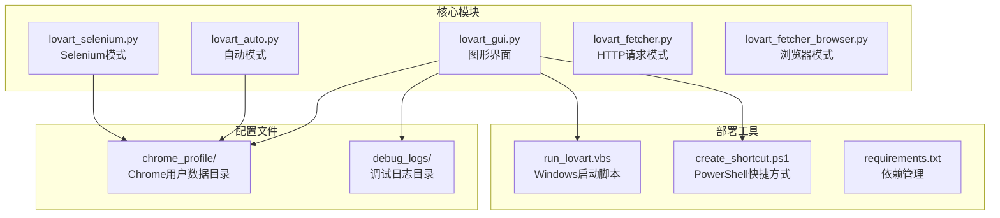

**图表来源**
- [lovart_gui.py:85-92](file://lovart_gui.py#L85-L92)
- [lovart_selenium.py:54-57](file://lovart_selenium.py#L54-L57)
- [run_lovart.vbs:1-3](file://run_lovart.vbs#L1-L3)
- [create_shortcut.ps1:1-10](file://create_shortcut.ps1#L1-L10)

**章节来源**
- [lovart_gui.py:1-1275](file://lovart_gui.py#L1-L1275)
- [lovart_auto.py:1-442](file://lovart_auto.py#L1-L442)
- [lovart_selenium.py:1-492](file://lovart_selenium.py#L1-L492)
- [run_lovart.vbs:1-3](file://run_lovart.vbs#L1-L3)
- [create_shortcut.ps1:1-10](file://create_shortcut.ps1#L1-L10)

## 核心组件

### 主要功能模块

该工具包含以下核心功能模块：

1. **图形界面模块** (`lovart_gui.py`)
   - 提供用户友好的图形界面
   - 支持多种操作模式（自动导入、手动模式、批量获取）
   - 内置日志系统和错误处理机制

2. **自动模式模块** (`lovart_auto.py`)
   - 完全自动化的验证码获取流程
   - 支持Playwright和Selenium两种浏览器引擎
   - 提供命令行参数配置

3. **Selenium模式模块** (`lovart_selenium.py`)
   - 基于Selenium的浏览器自动化
   - 支持ChromeDriver自动管理
   - 提供详细的错误处理和重试机制

4. **HTTP请求模块** (`lovart_fetcher.py`)
   - 基于HTTP API的验证码获取
   - 直接与服务器交互，无需浏览器

5. **浏览器模式模块** (`lovart_fetcher_browser.py`)
   - 纯浏览器自动化实现
   - 使用Playwright进行页面操作

**章节来源**
- [lovart_gui.py:74-795](file://lovart_gui.py#L74-L795)
- [lovart_auto.py:45-442](file://lovart_auto.py#L45-L442)
- [lovart_selenium.py:47-492](file://lovart_selenium.py#L47-L492)
- [lovart_fetcher.py:12-147](file://lovart_fetcher.py#L12-L147)
- [lovart_fetcher_browser.py:25-285](file://lovart_fetcher_browser.py#L25-L285)

## 架构概览

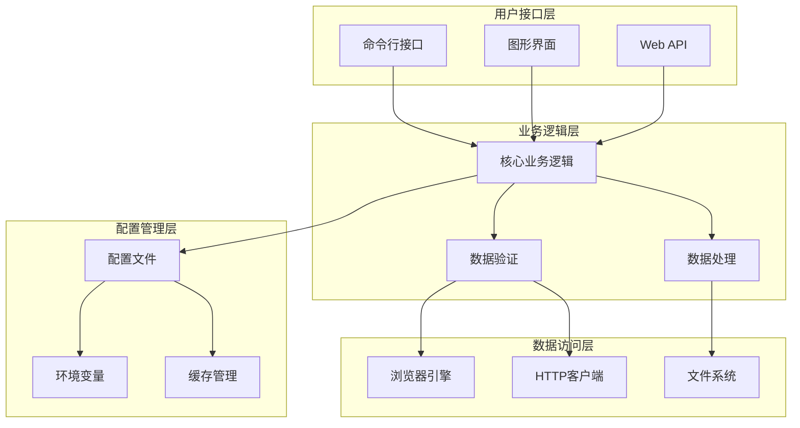

**图表来源**
- [lovart_gui.py:798-1275](file://lovart_gui.py#L798-L1275)
- [lovart_auto.py:357-442](file://lovart_auto.py#L357-L442)
- [lovart_selenium.py:415-492](file://lovart_selenium.py#L415-L492)

## 详细组件分析

### 图形界面组件分析

图形界面组件是整个工具的核心用户交互层，提供了丰富的功能和良好的用户体验。

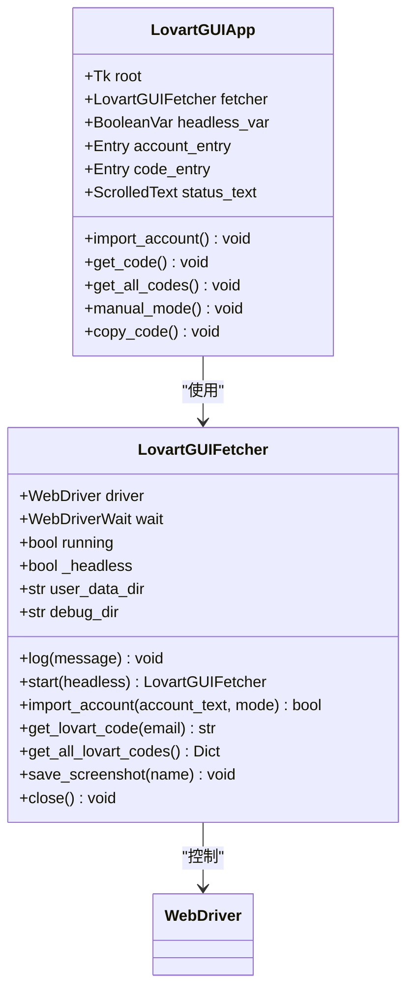

**图表来源**
- [lovart_gui.py:74-795](file://lovart_gui.py#L74-L795)
- [lovart_gui.py:798-1275](file://lovart_gui.py#L798-L1275)

#### 图形界面功能特性

1. **多模式支持**
   - 自动导入模式：完全自动化的账号导入和验证码获取
   - 手动模式：用户手动操作浏览器进行导入和获取
   - 批量获取模式：一次性获取所有账号的验证码

2. **智能浏览器管理**
   - 自动检测和清理浏览器锁定文件
   - 智能会话恢复机制
   - 支持静默模式运行

3. **强大的日志系统**
   - 实时日志显示
   - 错误追踪和诊断
   - 截图功能用于问题诊断

**章节来源**
- [lovart_gui.py:136-207](file://lovart_gui.py#L136-L207)
- [lovart_gui.py:266-355](file://lovart_gui.py#L266-L355)
- [lovart_gui.py:356-432](file://lovart_gui.py#L356-L432)

### 自动模式组件分析

自动模式提供了完全无干预的验证码获取流程，适合批量处理场景。

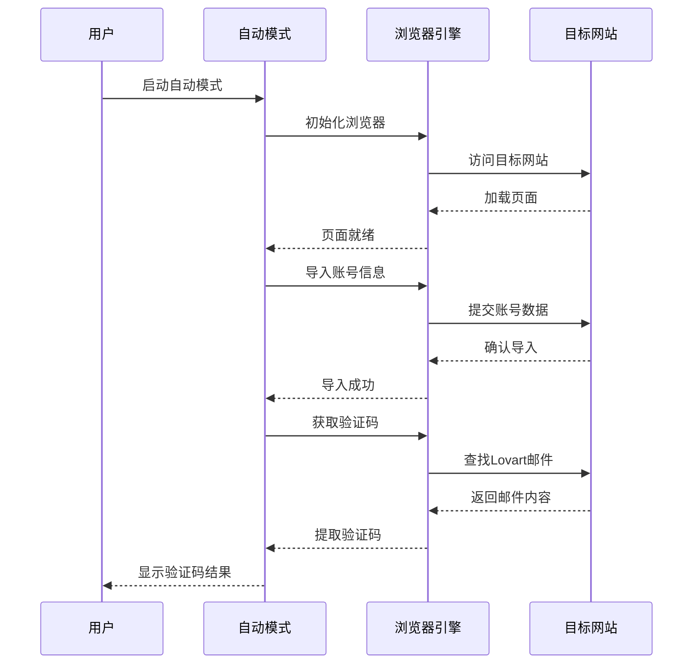

**图表来源**
- [lovart_auto.py:394-439](file://lovart_auto.py#L394-L439)
- [lovart_auto.py:106-133](file://lovart_auto.py#L106-L133)

#### 自动模式配置选项

1. **浏览器引擎选择**
   - Playwright优先级更高，功能更强大
   - Selenium作为备选方案
   - 自动检测可用的引擎

2. **运行模式配置**
   - 无头模式（headless）：后台静默运行
   - 显式模式：显示浏览器窗口
   - 自动选择最优模式

**章节来源**
- [lovart_auto.py:54-84](file://lovart_auto.py#L54-L84)
- [lovart_auto.py:357-404](file://lovart_auto.py#L357-L404)

### Selenium模式组件分析

Selenium模式提供了基于Selenium WebDriver的浏览器自动化能力。

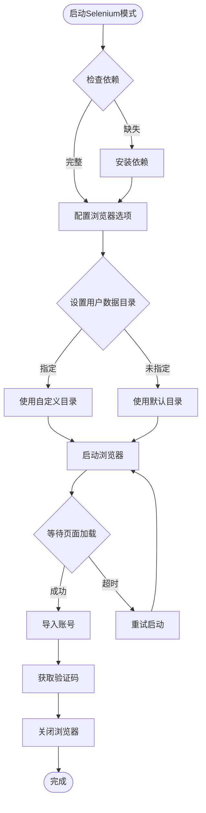

**图表来源**
- [lovart_selenium.py:59-113](file://lovart_selenium.py#L59-L113)
- [lovart_selenium.py:132-192](file://lovart_selenium.py#L132-L192)

#### Selenium配置特性

1. **用户数据目录管理**
   - 支持自定义用户数据目录
   - 自动创建必要的目录结构
   - 持久化浏览器配置

2. **浏览器选项优化**
   - 禁用自动化特征检测
   - 优化性能参数
   - 支持无头模式

**章节来源**
- [lovart_selenium.py:54-88](file://lovart_selenium.py#L54-L88)
- [lovart_selenium.py:121-131](file://lovart_selenium.py#L121-L131)

## 配置选项详解

### Chrome用户数据目录配置

Chrome用户数据目录是浏览器持久化存储的核心配置，对于自动化工具的稳定运行至关重要。

#### 默认配置

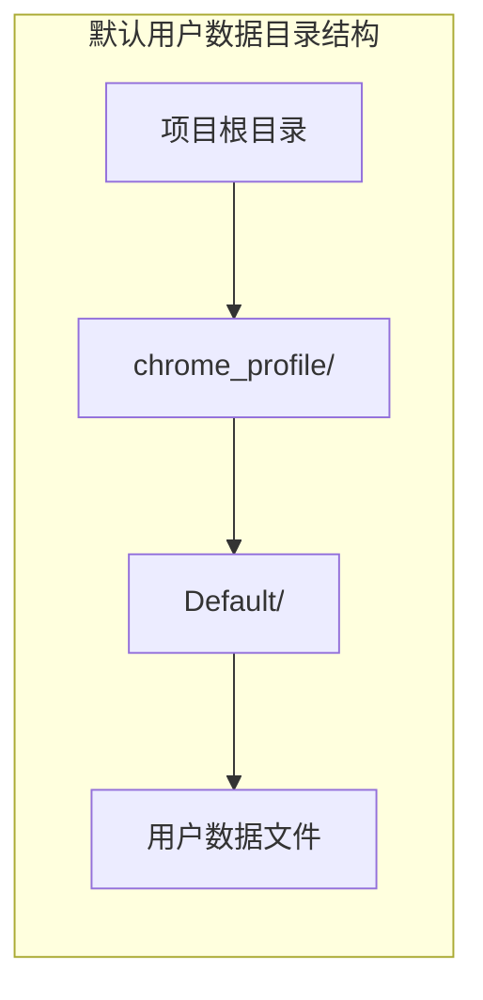

**图表来源**
- [lovart_gui.py:84-87](file://lovart_gui.py#L84-L87)
- [lovart_selenium.py:55-57](file://lovart_selenium.py#L55-L57)

#### 自定义用户数据目录

用户可以通过以下方式配置自定义用户数据目录：

1. **命令行参数方式**
   ```bash
   python lovart_selenium.py --user-data-dir "D:/Custom/Chrome/Data"
   ```

2. **代码配置方式**
   ```python
   fetcher = LovartSeleniumFetcher()
   fetcher.start(user_data_dir="D:/Custom/Chrome/Data")
   ```

3. **环境变量方式**
   ```bash
   export CHROME_USER_DATA_DIR="D:/Custom/Chrome/Data"
   ```

#### 用户数据目录配置选项

| 配置项 | 默认值 | 描述 | 影响范围 |
|--------|--------|------|----------|
| user-data-dir | 项目根目录/chrome_profile | Chrome用户数据存储目录 | 所有浏览器实例 |
| profile-directory | Default | Chrome配置文件目录 | 当前用户配置 |
| no-first-run | 启用 | 禁用首次运行向导 | 新用户会话 |
| no-default-browser-check | 启用 | 跳过默认浏览器检查 | 启动过程 |

**章节来源**
- [lovart_gui.py:84-87](file://lovart_gui.py#L84-L87)
- [lovart_selenium.py:55-57](file://lovart_selenium.py#L55-L57)
- [lovart_selenium.py:81-83](file://lovart_selenium.py#L81-L83)

### 日志级别设置

日志系统是工具的重要组成部分，提供了完整的运行状态跟踪和问题诊断能力。

#### 日志配置结构

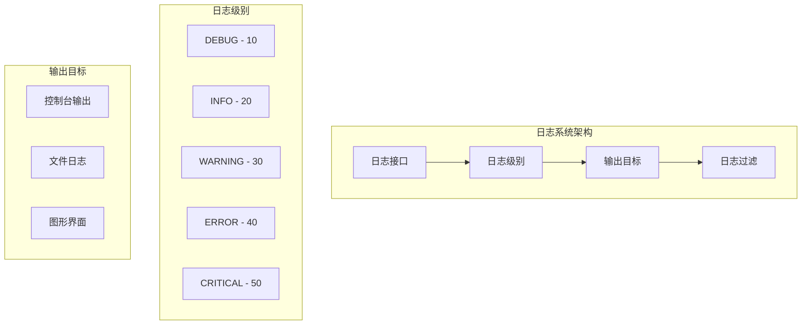

#### 日志级别配置

| 级别 | 数值 | 描述 | 使用场景 |
|------|------|------|----------|
| DEBUG | 10 | 详细调试信息 | 开发和问题诊断 |
| INFO | 20 | 一般信息 | 正常操作流程 |
| WARNING | 30 | 警告信息 | 可能的问题 |
| ERROR | 40 | 错误信息 | 操作失败 |
| CRITICAL | 50 | 严重错误 | 系统级故障 |

#### 日志输出配置

1. **控制台日志**
   - 实时输出到命令行
   - 支持彩色输出
   - 自动时间戳

2. **文件日志**
   - 自动创建日志文件
   - 按日期分割日志
   - 支持日志轮转

3. **图形界面日志**
   - 实时显示在GUI中
   - 支持滚动查看
   - 可复制到剪贴板

**章节来源**
- [lovart_gui.py:94-98](file://lovart_gui.py#L94-L98)
- [lovart_gui.py:967-971](file://lovart_gui.py#L967-L971)

### 超时参数调整

超时参数是确保工具稳定运行的关键配置，特别是在网络条件不稳定的情况下。

#### 超时配置层次

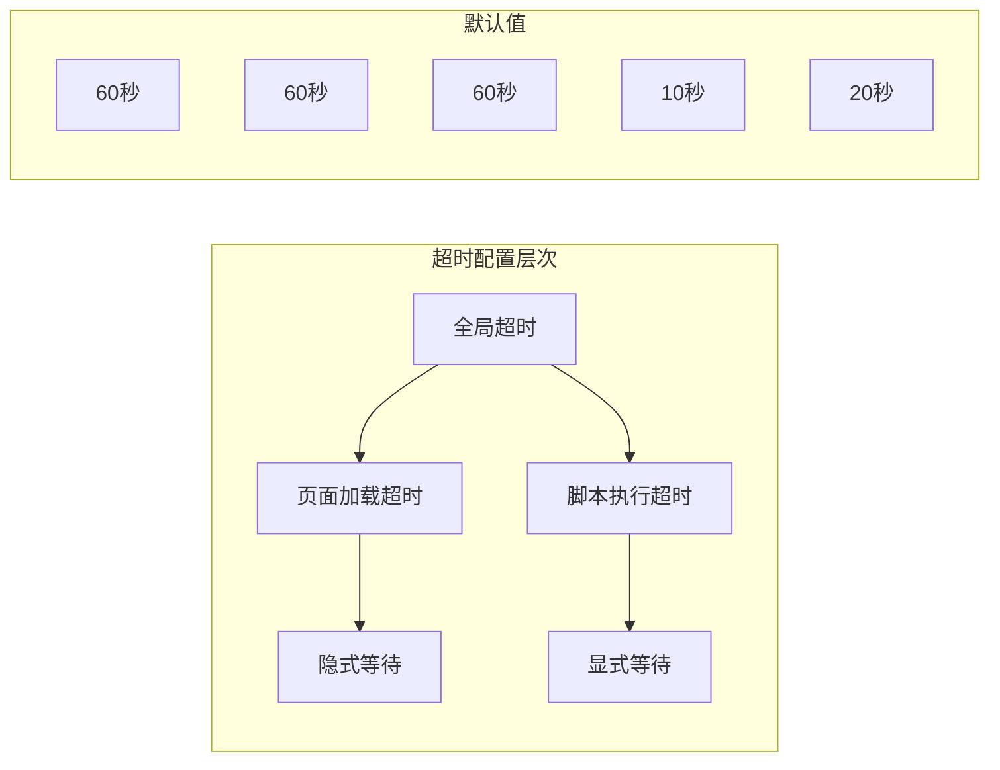

#### 超时参数详解

| 参数类型 | 默认值 | 最小值 | 最大值 | 描述 |
|----------|--------|--------|--------|------|
| page_load_timeout | 60秒 | 30秒 | 120秒 | 页面完全加载等待时间 |
| script_timeout | 60秒 | 30秒 | 120秒 | JavaScript执行等待时间 |
| implicit_wait | 10秒 | 5秒 | 30秒 | 元素查找隐式等待时间 |
| explicit_wait | 20秒 | 10秒 | 60秒 | 元素可见性显式等待时间 |
| connection_timeout | 30秒 | 10秒 | 60秒 | 网络连接超时时间 |

#### 超时参数调整策略

1. **网络不稳定环境**
   - 增加page_load_timeout到90-120秒
   - 增加implicit_wait到15-30秒
   - 减少explicit_wait到15-30秒

2. **高延迟服务器**
   - 增加script_timeout到90-120秒
   - 增加connection_timeout到60秒
   - 调整implicit_wait到20秒

3. **快速响应需求**
   - 减少page_load_timeout到30秒
   - 减少script_timeout到30秒
   - 调整implicit_wait到5秒

**章节来源**
- [lovart_gui.py:193-203](file://lovart_gui.py#L193-L203)
- [lovart_selenium.py:108-108](file://lovart_selenium.py#L108-L108)

### 浏览器启动参数配置

浏览器启动参数直接影响工具的性能和稳定性。

#### 核心启动参数

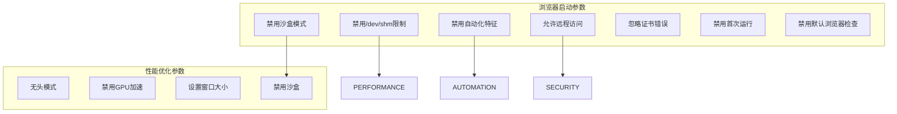

#### 启动参数配置

| 参数 | 默认值 | 描述 | 使用场景 |
|------|--------|------|----------|
| --no-sandbox | 启用 | 禁用Chrome沙盒模式 | Linux系统运行 |
| --disable-dev-shm-usage | 启用 | 禁用/dev/shm内存限制 | 内存受限环境 |
| --disable-blink-features=AutomationControlled | 启用 | 隐藏自动化特征 | 防检测 |
| --remote-allow-origins=* | 启用 | 允许所有远程访问 | 开发调试 |
| --ignore-certificate-errors | 启用 | 忽略SSL证书错误 | 自签名证书 |
| --no-first-run | 启用 | 禁用首次运行向导 | 自动化启动 |
| --no-default-browser-check | 启用 | 跳过默认浏览器检查 | 快速启动 |

#### 性能优化参数

| 参数 | 默认值 | 描述 | 性能影响 |
|------|--------|------|----------|
| --headless | 关闭 | 无头模式运行 | 显著提升性能 |
| --disable-gpu | 关闭 | 禁用GPU加速 | 减少资源消耗 |
| --window-size=1920,1080 | 关闭 | 设置窗口大小 | 影响页面渲染 |
| --disable-web-security | 关闭 | 禁用Web安全策略 | 提升兼容性 |

**章节来源**
- [lovart_gui.py:159-170](file://lovart_gui.py#L159-L170)
- [lovart_selenium.py:75-88](file://lovart_selenium.py#L75-L88)

## Windows系统部署方案

### VBS启动脚本配置

VBS启动脚本是Windows系统中最简单的部署方式，可以实现一键启动工具。

#### VBS脚本结构

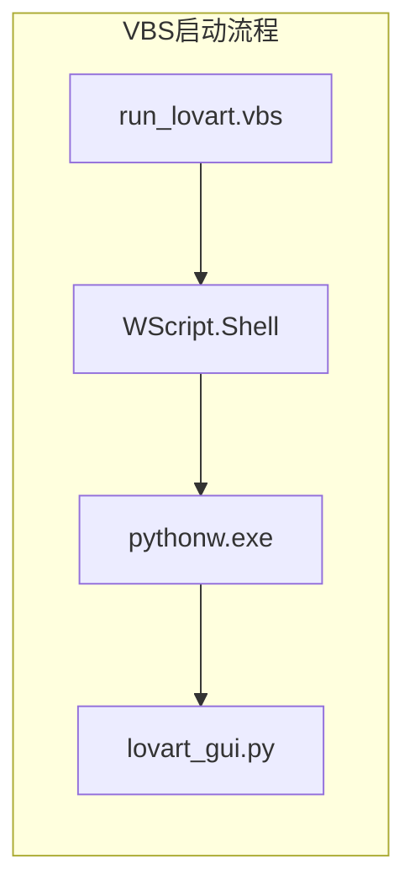

**图表来源**
- [run_lovart.vbs:1-3](file://run_lovart.vbs#L1-L3)

#### VBS脚本配置详解

1. **脚本基本结构**
   ```vbscript
   Set WshShell = CreateObject("WScript.Shell")
   WshShell.Run "pythonw.exe lovart_gui.py", 0, False
   ```

2. **关键参数说明**
   - `pythonw.exe`: Python Windows版本，无控制台窗口
   - `lovart_gui.py`: 主程序入口文件
   - `0`: 窗口显示模式（0=隐藏，1=正常，2=最小化）
   - `False`: 是否等待进程结束

3. **路径配置**
   - 绝对路径：`D:\App\hotmail-get\run_lovart.vbs`
   - 相对路径：`.\run_lovart.vbs`
   - 环境变量：`%APPDATA%\hotmail-get\run_lovart.vbs`

#### VBS脚本部署步骤

1. **修改脚本路径**
   ```vbscript
   Set WshShell = CreateObject("WScript.Shell")
   WshShell.Run "pythonw.exe D:\App\hotmail-get\lovart_gui.py", 0, False
   ```

2. **设置工作目录**
   ```vbscript
   Set WshShell = CreateObject("WScript.Shell")
   WshShell.CurrentDirectory = "D:\App\hotmail-get"
   WshShell.Run "pythonw.exe lovart_gui.py", 0, False
   ```

**章节来源**
- [run_lovart.vbs:1-3](file://run_lovart.vbs#L1-L3)

### PowerShell快捷方式创建

PowerShell快捷方式提供了更灵活的部署选项，支持动态参数传递。

#### PowerShell脚本结构

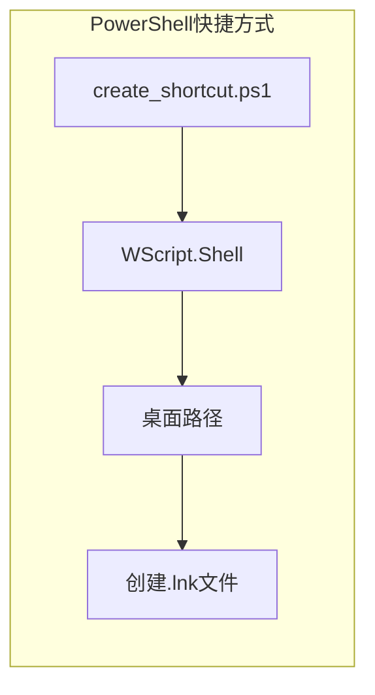

**图表来源**
- [create_shortcut.ps1:1-10](file://create_shortcut.ps1#L1-L10)

#### PowerShell脚本功能

1. **快捷方式创建**
   ```powershell
   $ws = New-Object -ComObject WScript.Shell
   $desktop = [System.Environment]::GetFolderPath('Desktop')
   $shortcutPath = Join-Path $desktop "LovartFetcher.lnk"
   ```

2. **目标路径配置**
   ```powershell
   $s = $ws.CreateShortcut($shortcutPath)
   $s.TargetPath = "wscript.exe"
   $s.Arguments = """D:\App\hotmail-get\run_lovart.vbs"""
   $s.WorkingDirectory = "D:\App\hotmail-get"
   ```

3. **图标和属性设置**
   ```powershell
   $s.IconLocation = "python.exe,0"
   $s.Save()
   ```

#### PowerShell部署优势

1. **动态路径解析**
   - 自动获取桌面路径
   - 支持相对路径转换
   - 环境变量自动展开

2. **灵活的参数传递**
   - 支持命令行参数
   - 动态配置工作目录
   - 可扩展的配置选项

3. **用户友好性**
   - 自动生成桌面快捷方式
   - 设置合适的图标
   - 配置工作目录

**章节来源**
- [create_shortcut.ps1:1-10](file://create_shortcut.ps1#L1-L10)

### Windows环境变量配置

Windows环境变量配置对于工具的稳定运行至关重要。

#### 系统环境变量

| 变量名 | 默认值 | 描述 | 用途 |
|--------|--------|------|------|
| PATH | 系统PATH | 系统可执行文件路径 | Python和Chrome路径 |
| PYTHONPATH | 空 | Python模块搜索路径 | 项目模块导入 |
| CHROME_USER_DATA_DIR | %USERPROFILE%\AppData\Local\Google\Chrome\User Data | Chrome用户数据目录 | 浏览器持久化 |
| DISPLAY | 空 | 显示设备标识 | Linux环境模拟 |

#### Python环境变量

1. **虚拟环境配置**
   ```cmd
   set VIRTUAL_ENV=D:\App\hotmail-get\.venv
   set PATH=%VIRTUAL_ENV%\Scripts;%PATH%
   ```

2. **依赖路径配置**
   ```cmd
   set PYTHONPATH=D:\App\hotmail-get;%PYTHONPATH%
   ```

3. **日志路径配置**
   ```cmd
   set LOG_PATH=D:\App\hotmail-get\logs
   ```

#### 环境变量设置方法

1. **系统设置**
   - 右键"此电脑" → 属性 → 高级系统设置
   - 点击"环境变量"
   - 添加或修改系统变量

2. **命令行设置**
   ```cmd
   set CHROME_USER_DATA_DIR=D:\Custom\Chrome\Data
   set PYTHONPATH=D:\App\hotmail-get;%PYTHONPATH%
   ```

3. **PowerShell设置**
   ```powershell
   $env:CHROME_USER_DATA_DIR = "D:\Custom\Chrome\Data"
   $env:PYTHONPATH = "D:\App\hotmail-get;$env:PYTHONPATH"
   ```

**章节来源**
- [lovart_gui.py:84-87](file://lovart_gui.py#L84-L87)
- [lovart_selenium.py:55-57](file://lovart_selenium.py#L55-L57)

## 多操作系统部署差异

### Windows系统特点

Windows系统具有以下部署特点：

#### 文件系统差异

1. **路径分隔符**
   - 使用反斜杠 `\` 作为路径分隔符
   - 支持大小写不敏感的文件名
   - 环境变量使用 `%VAR%` 格式

2. **权限模型**
   - UAC权限提升机制
   - 用户账户控制
   - 管理员权限要求

3. **进程管理**
   - 任务管理器进程监控
   - 服务注册表管理
   - 进程间通信机制

#### Windows部署优势

1. **用户友好性**
   - 图形界面支持良好
   - 快捷方式自动创建
   - 右键菜单集成

2. **兼容性**
   - 广泛的软件支持
   - 标准化的文件系统
   - 统一的API接口

### macOS系统特点

macOS系统具有以下部署特点：

#### 文件系统差异

1. **路径分隔符**
   - 使用正斜杠 `/` 作为路径分隔符
   - 大小写敏感的文件名
   - 隐藏文件以点开头

2. **权限模型**
   - Unix权限系统
   - sudo权限提升
   - 文件所有权管理

3. **进程管理**
   - Activity Monitor进程监控
   - LaunchAgents服务管理
   - 进程信号处理

#### macOS部署考虑

1. **字体和界面**
   - 使用系统字体（PingFang SC）
   - 支持Retina显示
   - 视网膜屏幕适配

2. **包管理**
   - Homebrew包管理器
   - Python虚拟环境
   - 依赖自动安装

### Linux系统特点

Linux系统具有以下部署特点：

#### 文件系统差异

1. **路径分隔符**
   - 使用正斜杠 `/` 作为路径分隔符
   - 大小写敏感的文件名
   - 符号链接支持

2. **权限模型**
   - POSIX权限系统
   - 用户组管理
   - SELinux安全策略

3. **进程管理**
   - ps进程监控
   - systemd服务管理
   - 进程树管理

#### Linux部署考虑

1. **发行版差异**
   - 不同包管理器（apt, yum, pacman）
   - Python版本差异
   - 依赖库版本差异

2. **桌面环境**
   - GNOME/KDE桌面支持
   - 桌面文件规范
   - 应用启动器

### 跨平台兼容性

#### 字体和界面兼容

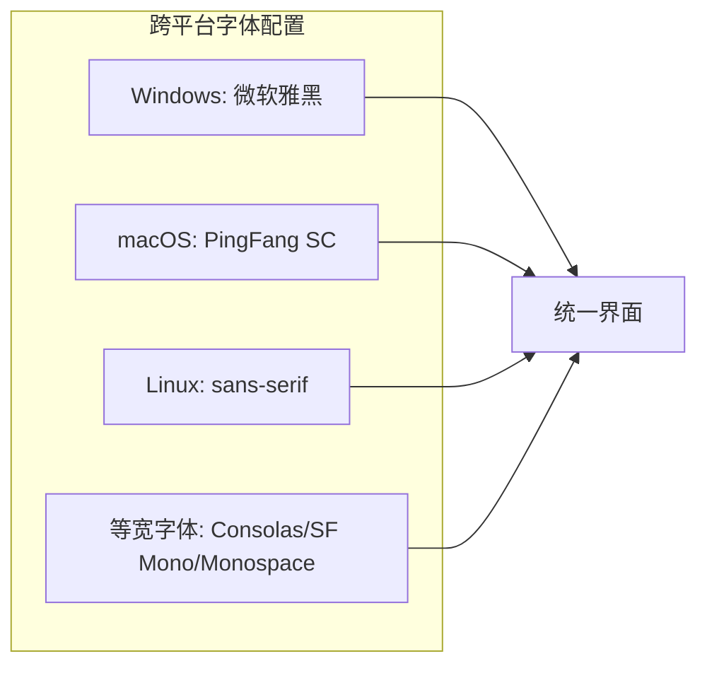

#### 平台特定功能

| 功能 | Windows | macOS | Linux |
|------|---------|-------|-------|
| 图形界面 | Tkinter | Tkinter | Tkinter |
| 快捷方式 | .lnk文件 | .app bundle | .desktop文件 |
| 服务管理 | Windows服务 | LaunchDaemons | systemd |
| 权限提升 | UAC | sudo | sudo |
| 文件系统 | NTFS/FAT32 | APFS/HFS+ | ext4/xfs |

**章节来源**
- [lovart_gui.py:27-39](file://lovart_gui.py#L27-L39)

## 生产环境部署最佳实践

### 权限设置最佳实践

#### 文件权限配置

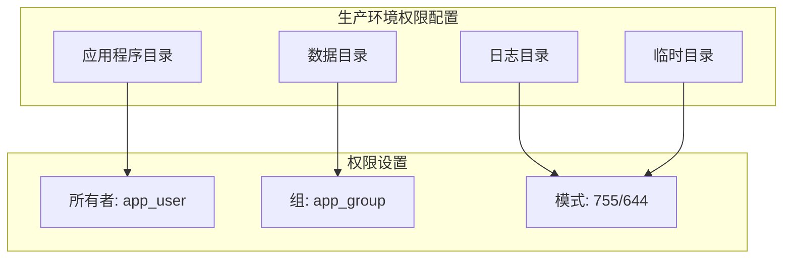

#### 权限配置策略

1. **应用程序目录**
   - 所有者: app_user (读写执行)
   - 组: app_group (读写)
   - 其他: 公共用户 (只读)

2. **数据目录**
   - 所有者: app_user (读写)
   - 组: app_group (读写)
   - 其他: 公共用户 (只读)

3. **日志目录**
   - 所有者: app_user (读写)
   - 组: app_group (读写)
   - 其他: 公共用户 (只读)

#### 权限设置命令

```bash
# 设置应用程序权限
sudo chown -R app_user:app_group /opt/hotmail-get
sudo chmod -R 755 /opt/hotmail-get

# 设置数据目录权限
sudo mkdir -p /var/lib/hotmail-get
sudo chown -R app_user:app_group /var/lib/hotmail-get
sudo chmod -R 755 /var/lib/hotmail-get

# 设置日志目录权限
sudo mkdir -p /var/log/hotmail-get
sudo chown -R app_user:app_group /var/log/hotmail-get
sudo chmod -R 755 /var/log/hotmail-get
```

### 安全配置最佳实践

#### 网络安全配置

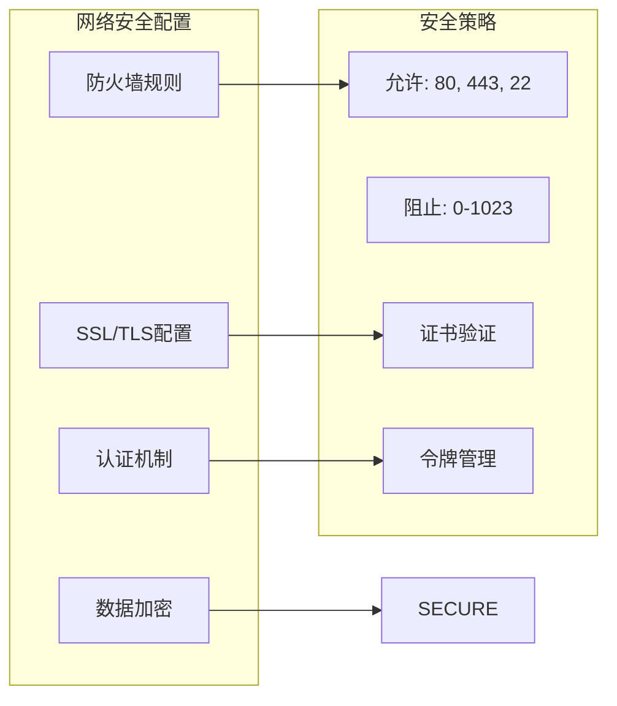

#### 安全配置要点

1. **防火墙配置**
   - 仅开放必要端口
   - 限制来源IP范围
   - 配置入侵检测

2. **SSL/TLS配置**
   - 使用强加密算法
   - 验证服务器证书
   - 配置安全协议版本

3. **认证机制**
   - 强密码策略
   - 多因素认证
   - 会话管理

4. **数据保护**
   - 敏感数据加密
   - 传输数据加密
   - 存储数据加密

#### 安全配置示例

```bash
# 防火墙配置 (iptables)
sudo iptables -A INPUT -p tcp --dport 22 -j ACCEPT
sudo iptables -A INPUT -p tcp --dport 80 -j ACCEPT
sudo iptables -A INPUT -p tcp --dport 443 -j ACCEPT
sudo iptables -A INPUT -j DROP

# SSL配置
openssl req -new -x509 -key server.key -out server.crt -days 365

# 密钥管理
chmod 600 private.key
chmod 644 public.key
```

### 性能调优最佳实践

#### 系统资源优化

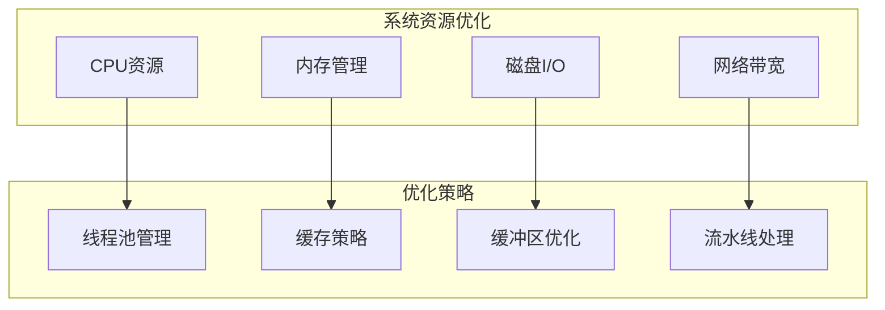

#### 性能调优参数

1. **线程池配置**
   - 最大线程数: 10-50
   - 空闲超时: 60-300秒
   - 队列长度: 100-1000

2. **内存管理**
   - 堆大小: 1-4GB
   - 垃圾回收: G1GC
   - 缓存大小: 100-1000MB

3. **磁盘I/O优化**
   - 缓冲区大小: 1-8MB
   - 同步写入: 关闭
   - 文件预读: 启用

4. **网络优化**
   - 连接池大小: 10-100
   - 超时时间: 30-120秒
   - 重试次数: 3-5次

#### 性能监控指标

| 指标类型 | 目标值 | 监控频率 | 警告阈值 |
|----------|--------|----------|----------|
| CPU使用率 | <80% | 每分钟 | >90% |
| 内存使用率 | <70% | 每分钟 | >85% |
| 磁盘I/O | <90% | 每5分钟 | >95% |
| 网络带宽 | <80% | 每分钟 | >90% |
| 响应时间 | <2秒 | 每分钟 | >5秒 |
| 错误率 | <1% | 每小时 | >5% |

**章节来源**
- [lovart_gui.py:159-170](file://lovart_gui.py#L159-L170)
- [lovart_selenium.py:75-88](file://lovart_selenium.py#L75-L88)

## 性能调优指南

### 浏览器性能优化

浏览器性能是影响工具整体性能的关键因素。

#### 浏览器启动优化

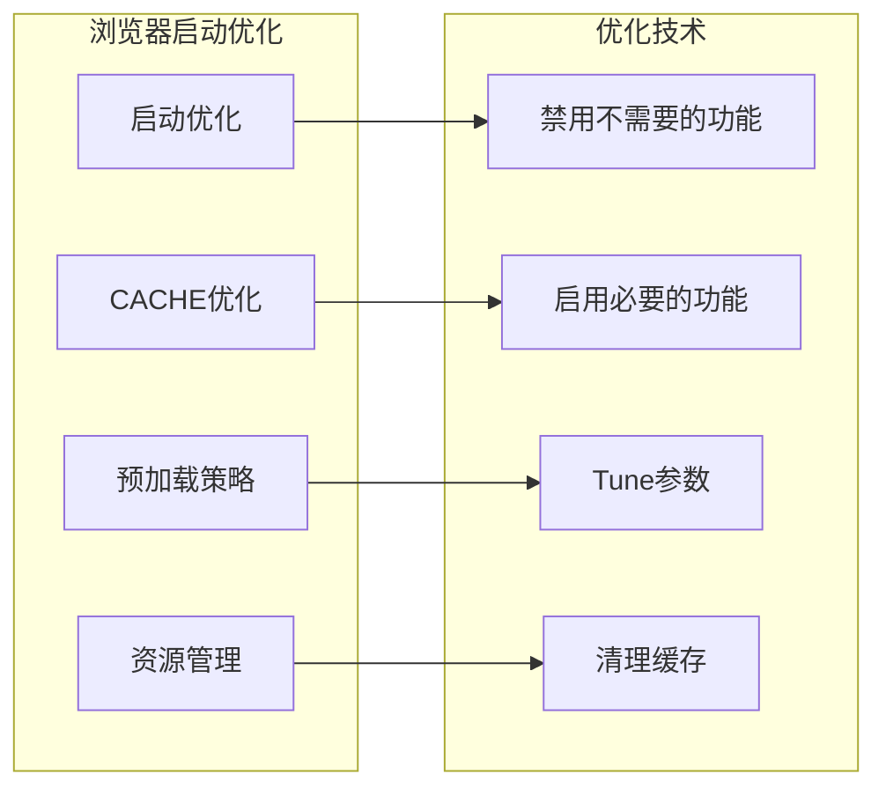

#### 启动参数优化

1. **禁用不必要的功能**
   ```bash
   --disable-extensions
   --disable-plugins
   --disable-images
   --disable-javascript
   --disable-web-security
   ```

2. **启用性能相关功能**
   ```bash
   --enable-precaching
   --enable-lazy-loading
   --enable-offline-auto-reload
   --enable-prefetch-prerender
   ```

3. **内存和CPU优化**
   ```bash
   --disable-gpu
   --disable-webgl
   --disable-3d-apis
   --disable-extensions-except=
   --load-extension=
   ```

#### 缓存策略优化

1. **浏览器缓存配置**
   - 清理启动缓存
   - 禁用图片缓存
   - 启用JavaScript缓存

2. **应用缓存策略**
   - 数据库连接池
   - 文件缓存
   - 内存缓存

### 网络性能优化

网络性能直接影响验证码获取的效率。

#### 网络连接优化

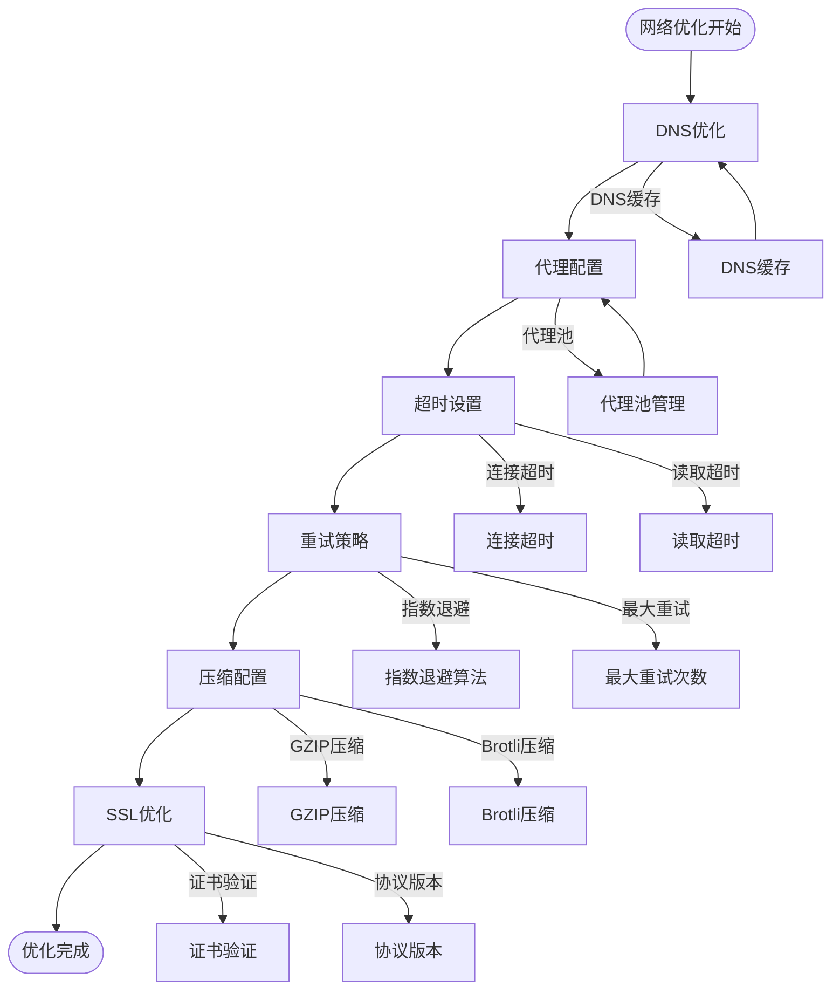

#### 网络参数优化

1. **DNS优化**
   - 使用本地DNS缓存
   - 配置DNS预取
   - 设置DNS超时时间

2. **代理配置**
   - 代理服务器池
   - 负载均衡
   - 故障转移

3. **超时设置**
   - 连接超时: 10-30秒
   - 读取超时: 30-60秒
   - 写入超时: 10-30秒

4. **重试策略**
   - 指数退避算法
   - 最大重试次数: 3-5次
   - 重试间隔: 1-5秒

5. **压缩配置**
   - GZIP压缩: 启用
   - Brotli压缩: 启用
   - 压缩阈值: 1KB+

6. **SSL优化**
   - TLS版本: 1.2+
   - 加密套件: 现代加密套件
   - 证书验证: 严格模式

### 数据处理性能优化

数据处理性能是影响批量操作效率的关键。

#### 数据处理优化策略

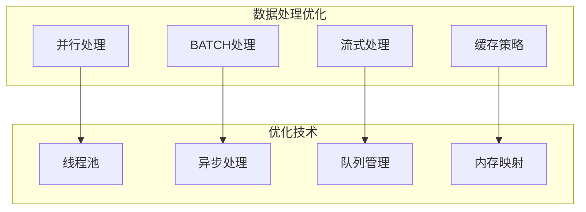

#### 并行处理配置

1. **线程池配置**
   - 核心线程数: CPU核心数
   - 最大线程数: CPU核心数 × 2
   - 线程空闲时间: 60秒
   - 任务队列: 1000个

2. **异步处理配置**
   - 事件循环: asyncio
   - 任务调度: 轮询调度
   - 超时处理: 30秒

3. **队列管理**
   - 优先级队列: 支持
   - 任务超时: 60秒
   - 重试机制: 3次

#### 内存管理优化

1. **内存分配策略**
   - 对象池: 启用
   - 垃圾回收: 分代收集
   - 内存监控: 实时监控

2. **大数据处理**
   - 分块处理: 1000条/批
   - 流式读取: 文件分块
   - 内存映射: 大文件处理

### 监控和性能指标

#### 性能监控指标

| 指标类型 | 监控方法 | 目标值 | 警告阈值 |
|----------|----------|--------|----------|
| 启动时间 | 浏览器启动计时 | <30秒 | <60秒 |
| 请求响应时间 | HTTP请求计时 | <5秒 | <10秒 |
| 处理吞吐量 | 每秒处理数 | >10个 | <5个 |
| 内存使用 | RSS内存监控 | <500MB | <1GB |
| CPU使用率 | CPU使用率监控 | <80% | <90% |
| 磁盘I/O | IOPS监控 | <1000 IOPS | <2000 IOPS |
| 网络带宽 | 带宽监控 | <10MB/s | <20MB/s |

#### 性能监控工具

1. **系统监控**
   - top/htop: 系统资源监控
   - iostat: 磁盘I/O监控
   - netstat: 网络连接监控

2. **应用监控**
   - 日志分析: ELK Stack
   - 性能分析: Py-Spy
   - 内存分析: guppy

3. **浏览器监控**
   - Chrome DevTools: 性能分析
   - Network面板: 网络监控
   - Memory面板: 内存分析

**章节来源**
- [lovart_gui.py:159-170](file://lovart_gui.py#L159-L170)
- [lovart_selenium.py:75-88](file://lovart_selenium.py#L75-L88)

## 监控与维护

### 日志管理策略

日志管理是系统运维的重要组成部分，提供了完整的运行状态跟踪和问题诊断能力。

#### 日志分类体系

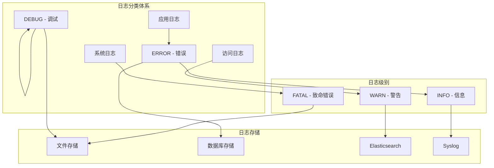

#### 日志配置策略

1. **日志级别配置**
   - 开发环境: DEBUG
   - 测试环境: INFO
   - 生产环境: WARN

2. **日志轮转策略**
   - 按大小轮转: 100MB
   - 按时间轮转: 每天
   - 保留周期: 30天

3. **日志格式标准化**
   ```json
   {
     "timestamp": "2023-12-01T10:30:00Z",
     "level": "INFO",
     "service": "hotmail-get",
     "module": "lovart_gui",
     "message": "浏览器启动成功",
     "request_id": "abc123",
     "user_agent": "Chrome/119.0.0.0"
   }
   ```

#### 日志监控告警

1. **实时监控**
   - 错误日志实时告警
   - 性能指标监控
   - 系统资源监控

2. **告警策略**
   - 错误率超过1%立即告警
   - 响应时间超过5秒延迟告警
   - 内存使用率超过80%告警

3. **告警渠道**
   - 邮件通知
   - Slack消息
   - 电话告警

### 故障诊断指南

#### 常见故障类型

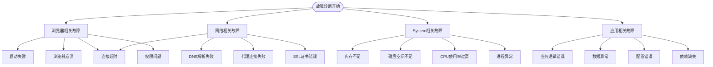

#### 故障诊断流程

1. **初步诊断**
   - 检查系统资源使用情况
   - 查看最近的日志记录
   - 验证网络连接状态

2. **深入分析**
   - 分析错误堆栈信息
   - 检查依赖库版本
   - 验证配置文件完整性

3. **解决方案实施**
   - 应用临时修复措施
   - 实施长期解决方案
   - 验证修复效果

#### 故障预防措施

1. **系统健康检查**
   - 定期检查系统资源
   - 监控关键指标
   - 预警机制配置

2. **备份和恢复**
   - 定期备份配置文件
   - 数据库备份策略
   - 快照和恢复测试

3. **更新和维护**
   - 定期更新依赖库
   - 安全补丁应用
   - 性能优化升级

### 维护计划

#### 日常维护任务

```mermaid
graph LR
subgraph "日常维护"
LOG_ROTATION[日志轮转]
TEMP_CLEANUP[临时文件清理]
CACHE_CLEAR[缓存清理]
BACKUP[数据备份]
end
subgraph "周维护"
SYSTEM_UPDATE[系统更新]
DEPENDENCY_UPDATE[依赖更新]
PERFORMANCE_CHECK[性能检查]
SECURITY_AUDIT[安全审计]
end
subgraph "月维护"
LOG_ANALYSIS[日志分析]
REPORT_GENERATION[报告生成]
CONFIGURATION_REVIEW[配置审查]
MAINTENANCE_PLAN[维护计划制定]
end
LOG_ROTATION --> TEMP_CLEANUP
TEMP_CLEANUP --> CACHE_CLEAR
CACHE_CLEAR --> BACKUP
BACKUP --> SYSTEM_UPDATE
SYSTEM_UPDATE --> DEPENDENCY_UPDATE
DEPENDENCY_UPDATE --> PERFORMANCE_CHECK
PERFORMANCE_CHECK --> SECURITY_AUDIT
SECURITY_AUDIT --> LOG_ANALYSIS
LOG_ANALYSIS --> REPORT_GENERATION
REPORT_GENERATION --> CONFIGURATION_REVIEW
CONFIGURATION_REVIEW --> MAINTENANCE_PLAN
```

#### 维护任务清单

1. **每日任务**
   - 检查系统日志
   - 清理临时文件
   - 备份重要数据
   - 监控系统指标

2. **每周任务**
   - 更新系统和依赖
   - 运行性能测试
   - 安全漏洞扫描
   - 备份验证

3. **每月任务**
   - 生成性能报告
   - 审查配置文件
   - 制定维护计划
   - 培训和演练

#### 维护工具推荐

1. **监控工具**
   - Zabbix: 系统监控
   - Grafana: 数据可视化
   - ELK Stack: 日志分析

2. **备份工具**
   - Rsync: 文件同步
   - Duplicity: 加密备份
   - Borg: 压缩备份

3. **自动化工具**
   - Ansible: 配置管理
   - Jenkins: CI/CD
   - Docker: 容器化

**章节来源**
- [lovart_gui.py:94-98](file://lovart_gui.py#L94-L98)
- [lovart_gui.py:643-653](file://lovart_gui.py#L643-L653)

## 故障排除指南

### 常见问题及解决方案

#### 浏览器启动问题

```mermaid
flowchart TD
BrowserStart[浏览器启动失败] --> CheckPython[检查Python环境]
CheckPython --> CheckChrome[检查Chrome安装]
CheckChrome --> CheckDriver[检查ChromeDriver]
CheckDriver --> CheckConfig[检查配置文件]
CheckConfig --> CheckPermissions[检查权限设置]
CheckPython --> PythonMissing[Python缺失]
CheckPython --> PythonVersion[Python版本不兼容]
CheckChrome --> ChromeMissing[Chrome缺失]
CheckChrome --> ChromeVersion[Chrome版本过旧]
CheckDriver --> DriverMissing[ChromeDriver缺失]
CheckDriver --> DriverVersion[ChromeDriver版本不匹配]
CheckConfig --> ConfigInvalid[配置文件无效]
CheckConfig --> PathError[路径配置错误]
CheckPermissions --> PermissionDenied[权限不足]
CheckPermissions --> LockFile[锁定文件占用]
PythonMissing --> FixPython[安装Python]
PythonVersion --> FixPython[升级Python]
ChromeMissing --> FixChrome[安装Chrome]
ChromeVersion --> FixChrome[更新Chrome]
DriverMissing --> FixDriver[安装ChromeDriver]
DriverVersion --> FixDriver[更新ChromeDriver]
ConfigInvalid --> FixConfig[修复配置文件]
PathError --> FixPath[修正路径]
PermissionDenied --> FixPermission[修改权限]
LockFile --> FixLock[清理锁定文件]
```

#### 问题诊断步骤

1. **环境检查**
   - 验证Python版本和依赖
   - 检查Chrome和ChromeDriver安装
   - 验证系统权限和路径

2. **配置验证**
   - 检查用户数据目录配置
   - 验证浏览器启动参数
   - 确认网络代理设置

3. **日志分析**
   - 查看详细的错误日志
   - 分析浏览器控制台输出
   - 检查系统事件日志

#### 具体问题解决方案

1. **Python环境问题**
   ```bash
   # 检查Python版本
   python --version
   
   # 安装依赖
   pip install -r requirements.txt
   
   # 创建虚拟环境
   python -m venv .venv
   source .venv/bin/activate  # Linux/macOS
   .venv\Scripts\activate     # Windows
   ```

2. **Chrome启动问题**
   ```bash
   # 检查Chrome版本
   google-chrome --version
   
   # 更新ChromeDriver
   webdriver-manager update
   
   # 清理用户数据目录
   rm -rf chrome_profile/
   ```

3. **权限问题**
   ```bash
   # Linux/macOS权限设置
   sudo chown -R $(whoami) chrome_profile/
   sudo chmod -R 755 chrome_profile/
   
   # Windows权限设置
   takeown /f chrome_profile /r /d y
   icacls chrome_profile /grant Users:F /T
   ```

### 性能问题诊断

#### 性能瓶颈识别

```mermaid
graph TB
subgraph "性能问题诊断"
CPU[CPU瓶颈]
MEMORY[内存瓶颈]
DISK[磁盘瓶颈]
NETWORK[网络瓶颈]
BROWSER[浏览器瓶颈]
end
subgraph "诊断工具"
TOP[top命令]
HTOP[htop命令]
IOSTAT[iostat命令]
NETSTAT[netstat命令]
CHROME_DEVTOOLS[Chrome DevTools]
end
CPU --> TOP
MEMORY --> HTOP
DISK --> IOSTAT
NETWORK --> NETSTAT
BROWSER --> CHROME_DEVTOOLS
TOP --> CPU_ANALYSIS[CPU分析]
HTOP --> MEMORY_ANALYSIS[内存分析]
IOSTAT --> DISK_ANALYSIS[磁盘分析]
NETSTAT --> NETWORK_ANALYSIS[网络分析]
CHROME_DEVTOOLS --> BROWSER_ANALYSIS[浏览器分析]
```

#### 性能优化建议

1. **CPU优化**
   - 减少并发线程数
   - 优化算法复杂度
   - 启用缓存机制

2. **内存优化**
   - 实现对象池
   - 及时释放资源
   - 使用生成器表达式

3. **磁盘优化**
   - 使用SSD存储
   - 优化文件I/O
   - 实现数据压缩

4. **网络优化**
   - 使用连接池
   - 实现请求合并
   - 启用HTTP/2

### 系统集成问题

#### 集成问题诊断

```mermaid
flowchart TD
Integration[系统集成问题] --> API[API集成问题]
Integration --> DATABASE[数据库集成问题]
Integration --> FILE_SYSTEM[文件系统集成问题]
Integration --> SERVICE[服务集成问题]
API --> Authentication[认证问题]
API --> Authorization[授权问题]
API --> RateLimiting[限流问题]
API --> Timeout[超时问题]
DATABASE --> Connection[连接问题]
DATABASE --> Query[查询问题]
DATABASE --> Transaction[事务问题]
DATABASE --> Migration[迁移问题]
FILE_SYSTEM --> Permission[权限问题]
FILE_SYSTEM --> Path[路径问题]
FILE_SYSTEM --> Encoding[编码问题]
FILE_SYSTEM --> Size[大小限制]
SERVICE --> Availability[可用性问题]
SERVICE --> Compatibility[兼容性问题]
SERVICE --> Configuration[配置问题]
SERVICE --> Monitoring[监控问题]
```

#### 集成问题解决

1. **API集成问题**
   - 实现重试机制
   - 添加超时处理
   - 实现断路器模式

2. **数据库集成问题**
   - 使用连接池
   - 实现事务管理
   - 添加查询优化

3. **文件系统集成问题**
   - 实现文件监控
   - 添加编码转换
   - 实现文件压缩

4. **服务集成问题**
   - 实现服务发现
   - 添加负载均衡
   - 实现健康检查

**章节来源**
- [lovart_gui.py:100-125](file://lovart_gui.py#L100-L125)
- [lovart_gui.py:186-191](file://lovart_gui.py#L186-L191)
- [lovart_selenium.py:102-105](file://lovart_selenium.py#L102-L105)

## 结论

本配置与部署指南涵盖了Lovart验证码自动获取工具的完整配置和部署方案。通过合理配置Chrome用户数据目录、日志级别和超时参数，结合Windows系统的VBS启动脚本和PowerShell快捷方式，可以实现稳定可靠的自动化验证码获取。

### 关键要点总结

1. **配置灵活性**
   - 支持多种配置方式（命令行、环境变量、配置文件）
   - 动态参数调整能力
   - 跨平台兼容性

2. **部署简便性**
   - Windows一键启动脚本
   - PowerShell快捷方式创建
   - 自动化部署流程

3. **生产环境适配**
   - 权限设置最佳实践
   - 安全配置策略
   - 性能调优方案

4. **运维监控完善**
   - 全面的日志管理系统
   - 故障诊断工具链
   - 维护计划和流程

### 未来发展方向

1. **容器化部署**
   - Docker镜像构建
   - Kubernetes编排
   - 云原生架构

2. **微服务架构**
   - 功能模块拆分
   - API接口设计
   - 服务治理

3. **智能化运维**
   - AI故障预测
   - 自动化修复
   - 智能监控

通过遵循本指南的配置和部署方案，可以确保工具在各种环境下稳定运行，并为后续的扩展和维护奠定坚实基础。