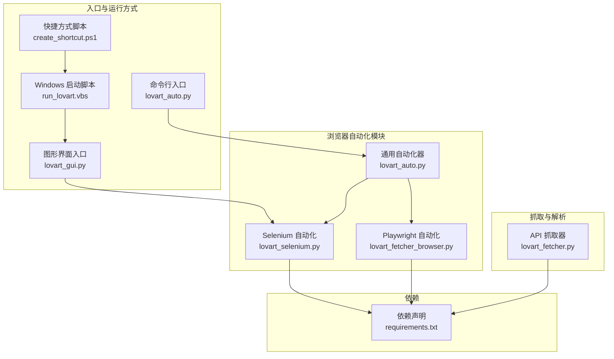
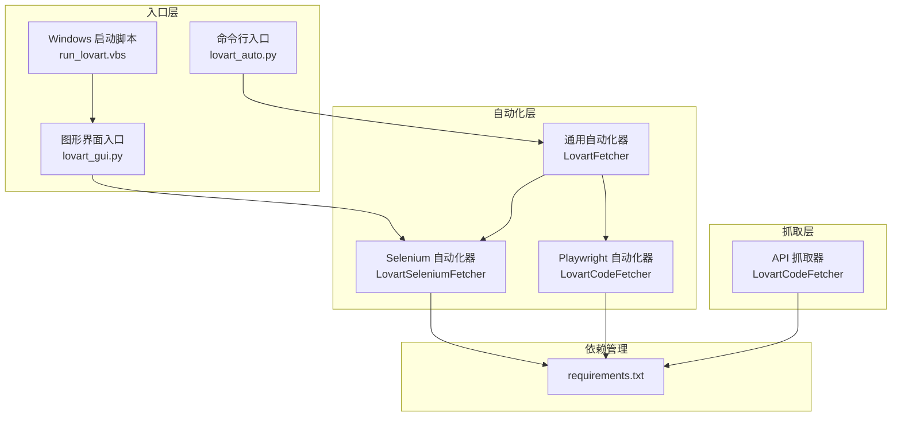
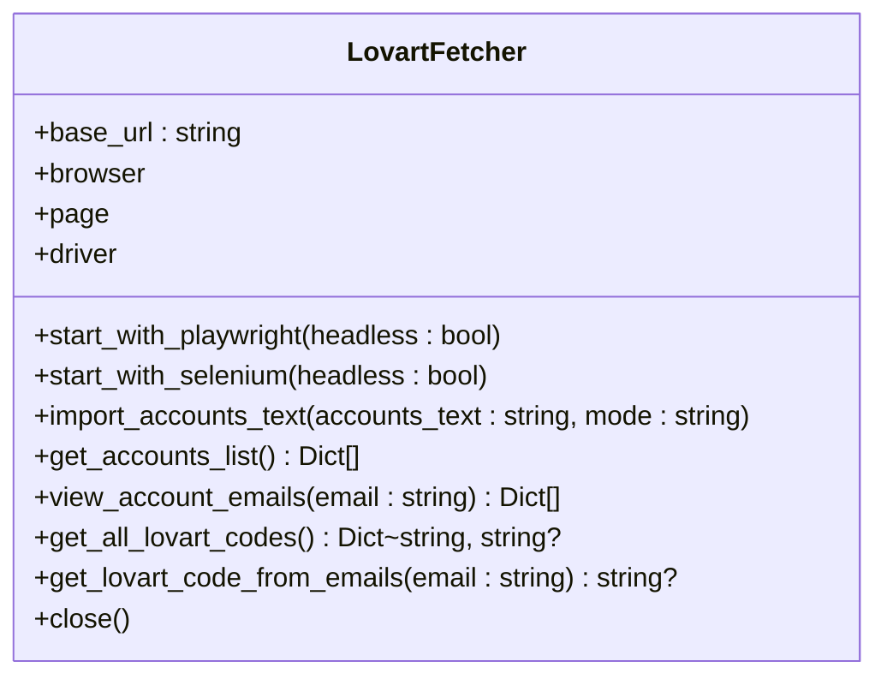
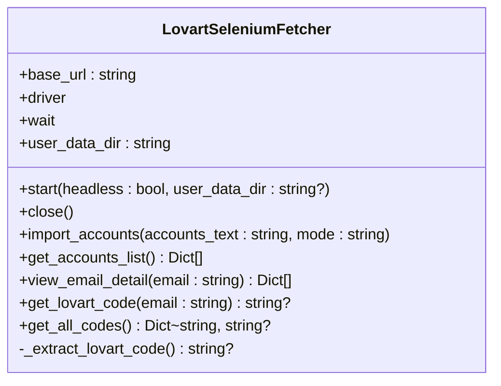
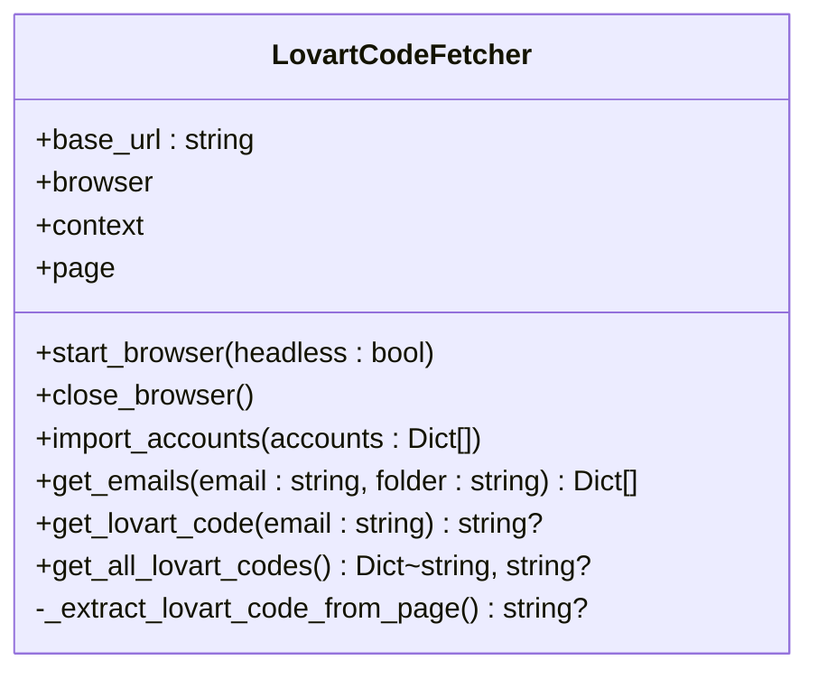
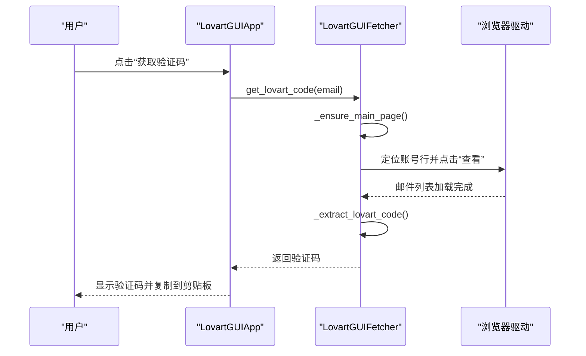
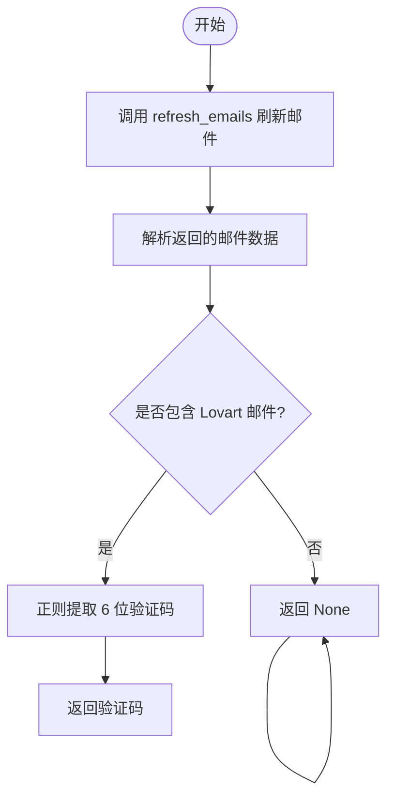
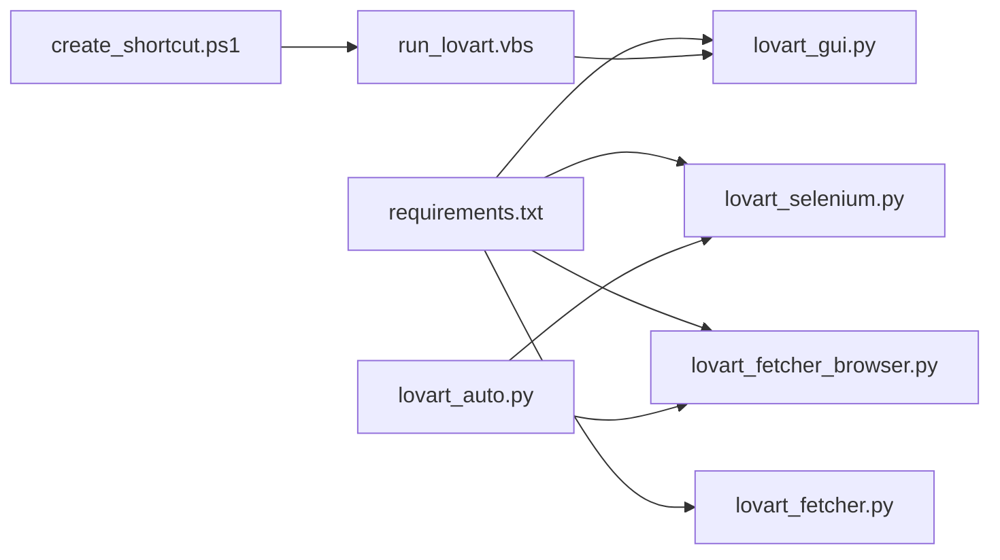

# 项目概述

<cite>
**本文档引用的文件**
- [lovart_auto.py](file://lovart_auto.py)
- [lovart_fetcher.py](file://lovart_fetcher.py)
- [lovart_fetcher_browser.py](file://lovart_fetcher_browser.py)
- [lovart_gui.py](file://lovart_gui.py)
- [lovart_selenium.py](file://lovart_selenium.py)
- [requirements.txt](file://requirements.txt)
- [run_lovart.vbs](file://run_lovart.vbs)
- [create_shortcut.ps1](file://create_shortcut.ps1)
</cite>

## 目录
1. [简介](#简介)
2. [项目结构](#项目结构)
3. [核心组件](#核心组件)
4. [架构总览](#架构总览)
5. [详细组件分析](#详细组件分析)
6. [依赖关系分析](#依赖关系分析)
7. [性能考量](#性能考量)
8. [故障排除指南](#故障排除指南)
9. [结论](#结论)
10. [附录](#附录)

## 简介
Hotmail-Get 是一个专注于自动化获取邮箱验证码（特别是 Lovart 平台）的工具集。项目围绕「自动化获取邮箱验证码」这一核心目标，提供多浏览器支持（Selenium 与 Playwright）、多种使用方式（命令行、图形界面、纯代码）、以及批量账号处理能力。其设计强调模块化与面向对象，通过浏览器抽象层屏蔽底层差异，使上层逻辑统一；同时提供 GUI 与 CLI 两种入口，满足不同用户的使用场景。

## 项目结构
项目采用按功能模块划分的文件组织方式：
- 命令行入口与自动化流程：lovart_auto.py
- 纯浏览器自动化（Playwright）：lovart_fetcher_browser.py
- 纯浏览器自动化（Selenium）：lovart_selenium.py
- 图形界面入口：lovart_gui.py
- API/HTTP 抓取（基于网站接口）：lovart_fetcher.py
- 依赖声明：requirements.txt
- Windows 快捷方式与启动脚本：run_lovart.vbs、create_shortcut.ps1

图表来源
- [lovart_auto.py](file://lovart_auto.py)
- [lovart_fetcher_browser.py](file://lovart_fetcher_browser.py)
- [lovart_selenium.py](file://lovart_selenium.py)
- [lovart_gui.py](file://lovart_gui.py)
- [lovart_fetcher.py](file://lovart_fetcher.py)
- [requirements.txt](file://requirements.txt)
- [run_lovart.vbs](file://run_lovart.vbs)
- [create_shortcut.ps1](file://create_shortcut.ps1)

章节来源
- [lovart_auto.py](file://lovart_auto.py)
- [lovart_fetcher_browser.py](file://lovart_fetcher_browser.py)
- [lovart_selenium.py](file://lovart_selenium.py)
- [lovart_gui.py](file://lovart_gui.py)
- [lovart_fetcher.py](file://lovart_fetcher.py)
- [requirements.txt](file://requirements.txt)
- [run_lovart.vbs](file://run_lovart.vbs)
- [create_shortcut.ps1](file://create_shortcut.ps1)

## 核心组件
- 通用自动化器（LovartFetcher）
  - 统一的浏览器抽象层，支持 Playwright 与 Selenium 后端
  - 提供账号导入、邮件列表浏览、验证码提取等核心能力
  - 支持批量处理与结果导出
- Selenium 自动化器（LovartSeleniumFetcher）
  - 专注使用 Selenium 的自动化流程，适合更广泛的环境与兼容性需求
  - 提供命令行入口与丰富的 CLI 参数
- Playwright 自动化器（LovartCodeFetcher）
  - 专注使用 Playwright 的自动化流程，具备更强的稳定性与性能
  - 提供独立的浏览器自动化入口
- 图形界面（LovartGUIApp + LovartGUIFetcher）
  - 提供可视化交互，支持自动导入、手动模式、按行号/关键字查询、批量获取等功能
  - 内置日志、截图诊断、剪贴板集成
- API 抓取器（LovartCodeFetcher）
  - 基于网站 API 的非浏览器抓取方式，便于在无浏览器环境下使用
  - 提供权限检测、邮件刷新、验证码提取等能力

章节来源
- [lovart_auto.py](file://lovart_auto.py)
- [lovart_selenium.py](file://lovart_selenium.py)
- [lovart_fetcher_browser.py](file://lovart_fetcher_browser.py)
- [lovart_gui.py](file://lovart_gui.py)
- [lovart_fetcher.py](file://lovart_fetcher.py)

## 架构总览
项目采用「入口层 + 自动化层 + 抓取层 + 依赖管理」的分层架构：
- 入口层：CLI、GUI、Windows 启动脚本
- 自动化层：Selenium 与 Playwright 两套浏览器自动化实现，统一由通用自动化器协调
- 抓取层：API 抓取器与浏览器抓取器并存，满足不同部署与性能需求
- 依赖管理：集中于 requirements.txt，确保环境一致性

图表来源
- [lovart_auto.py](file://lovart_auto.py)
- [lovart_selenium.py](file://lovart_selenium.py)
- [lovart_fetcher_browser.py](file://lovart_fetcher_browser.py)
- [lovart_gui.py](file://lovart_gui.py)
- [lovart_fetcher.py](file://lovart_fetcher.py)
- [requirements.txt](file://requirements.txt)
- [run_lovart.vbs](file://run_lovart.vbs)

## 详细组件分析

### 通用自动化器（LovartFetcher）
- 角色与职责
  - 统一浏览器启动与关闭流程
  - 账号导入、账号列表获取、邮件列表浏览、验证码提取
  - 支持 Playwright 与 Selenium 两种后端，自动选择可用实现
- 关键方法
  - 启动：start_with_playwright、start_with_selenium
  - 账号导入：import_accounts_text
  - 列表与提取：get_accounts_list、view_account_emails、get_all_lovart_codes、get_lovart_code_from_emails
  - 资源管理：close
- 设计要点
  - 通过条件导入与异常处理实现后端切换
  - 对外暴露一致的 API，内部区分 Playwright/Selenium 的 DOM/元素定位策略
  - 使用正则表达式提取 6 位数字验证码，增强鲁棒性

图表来源
- [lovart_auto.py](file://lovart_auto.py)

章节来源
- [lovart_auto.py](file://lovart_auto.py)

### Selenium 自动化器（LovartSeleniumFetcher）
- 角色与职责
  - 以 Selenium 为核心的自动化流程，提供 CLI 入口与完整功能
  - 支持持久化用户数据目录、无头模式、防检测参数
- 关键方法
  - 启动与关闭：start、close
  - 账号导入：import_accounts
  - 邮件浏览与验证码提取：view_email_detail、get_lovart_code、get_all_codes、_extract_lovart_code
- 设计要点
  - 使用 WebDriverWait 与显式等待提升稳定性
  - 多种选择器策略应对页面变化
  - 支持 iframe 内容提取与兜底正则匹配

图表来源
- [lovart_selenium.py](file://lovart_selenium.py)

章节来源
- [lovart_selenium.py](file://lovart_selenium.py)

### Playwright 自动化器（LovartCodeFetcher）
- 角色与职责
  - 以 Playwright 为核心的自动化流程，提供独立入口
  - 支持账号导入、邮件列表浏览、验证码提取
- 关键方法
  - 启动与关闭：start_browser、close_browser
  - 账号导入：import_accounts
  - 邮件浏览与验证码提取：get_emails、get_lovart_code、get_all_lovart_codes、_extract_lovart_code_from_page
- 设计要点
  - 使用同步 Playwright API，简化并发控制
  - 通过类名与选择器组合定位邮件项，增强适配性

图表来源
- [lovart_fetcher_browser.py](file://lovart_fetcher_browser.py)

章节来源
- [lovart_fetcher_browser.py](file://lovart_fetcher_browser.py)

### 图形界面（LovartGUIApp + LovartGUIFetcher）
- 角色与职责
  - 提供可视化交互，支持自动导入、手动模式、按行号/关键字查询、批量获取
  - 内置日志、截图诊断、剪贴板集成
- 关键功能
  - 自动导入：支持 Tab 或 ---- 分隔的账号格式
  - 手动模式：启动显式浏览器，允许用户手动操作
  - 查询能力：按行号获取账号、按关键字查找验证码
  - 批量获取：遍历账号列表并提取验证码
  - 安全与健壮性：会话存活检测、锁文件清理、异常捕获与日志输出
- 设计要点
  - 多线程后台任务，避免 UI 阻塞
  - 跨平台 UI 字体与按钮样式适配
  - 截图与日志目录分离，便于问题排查

图表来源
- [lovart_gui.py](file://lovart_gui.py)

章节来源
- [lovart_gui.py](file://lovart_gui.py)

### API 抓取器（LovartCodeFetcher）
- 角色与职责
  - 基于网站 API 的非浏览器抓取方式，适合无浏览器环境
  - 提供邮件刷新、权限检测、验证码提取等能力
- 关键方法
  - 邮件刷新：refresh_emails
  - 权限检测：detect_permission
  - 验证码提取：get_lovart_code_from_emails
- 设计要点
  - 使用 requests 会话，统一请求头
  - 异常捕获与错误返回，便于上层处理

图表来源
- [lovart_fetcher.py](file://lovart_fetcher.py)

章节来源
- [lovart_fetcher.py](file://lovart_fetcher.py)

## 依赖关系分析
- 依赖声明
  - selenium>=4.0.0
  - webdriver-manager>=4.0.0
  - pyperclip>=1.8.0
- 运行方式
  - CLI：通过命令行参数传入账号与模式，自动选择 Playwright 或 Selenium 后端
  - GUI：启动 Tkinter 界面，后台线程执行自动化任务
  - Windows：通过 VBScript 与 PowerShell 脚本创建桌面快捷方式，一键启动 GUI

图表来源
- [requirements.txt](file://requirements.txt)
- [lovart_selenium.py](file://lovart_selenium.py)
- [lovart_gui.py](file://lovart_gui.py)
- [lovart_fetcher_browser.py](file://lovart_fetcher_browser.py)
- [lovart_fetcher.py](file://lovart_fetcher.py)
- [run_lovart.vbs](file://run_lovart.vbs)
- [create_shortcut.ps1](file://create_shortcut.ps1)

章节来源
- [requirements.txt](file://requirements.txt)
- [run_lovart.vbs](file://run_lovart.vbs)
- [create_shortcut.ps1](file://create_shortcut.ps1)

## 性能考量
- 浏览器选择
  - Playwright：同步 API、更强稳定性与性能，适合高并发与复杂页面
  - Selenium：生态成熟、兼容性广，适合多样化部署环境
- 等待策略
  - 显式等待（WebDriverWait）与隐式等待结合，减少资源浪费
  - 适当增加等待时间，避免页面未完全加载导致的定位失败
- 资源管理
  - 会话复用与持久化用户数据目录，减少重复启动成本
  - 锁文件清理与进程终止策略，降低浏览器残留影响
- 正则提取
  - 使用正则匹配 6 位数字验证码，兼顾准确性与鲁棒性

## 故障排除指南
- 浏览器启动失败
  - 确认已安装 selenium 与 webdriver-manager，并正确配置 ChromeDriver
  - 清理浏览器锁定文件，必要时手动关闭 Chrome 进程
- 页面元素定位失败
  - 使用多种选择器策略，或启用截图诊断定位问题
  - 检查页面加载状态与网络延迟
- 验证码未找到
  - 确认账号已成功导入且邮件已刷新
  - 使用关键字查询或按行号定位特定账号
- GUI 启动异常
  - 检查 Python 环境与依赖安装
  - 使用 Windows 快捷方式脚本启动，避免路径问题

章节来源
- [lovart_gui.py](file://lovart_gui.py)
- [lovart_selenium.py](file://lovart_selenium.py)
- [lovart_fetcher_browser.py](file://lovart_fetcher_browser.py)
- [lovart_auto.py](file://lovart_auto.py)

## 结论
Hotmail-Get 通过模块化设计与面向对象的浏览器抽象层，实现了对多浏览器后端的统一支持，并提供了 CLI、GUI、纯代码等多种使用方式。其核心价值在于：在保证易用性的同时，兼顾稳定性与可扩展性，能够高效地批量处理邮箱验证码提取任务，满足不同用户群体与应用场景的需求。

## 附录
- 目标用户
  - 需要自动化获取邮箱验证码的开发者与测试工程师
  - 需要批量处理账号的运营与运维人员
  - 希望以图形界面快速上手的非技术用户
- 应用场景
  - 注册流程自动化、二次验证处理
  - 账号批量导入与状态监控
  - 与 CI/CD 集成的自动化测试与部署